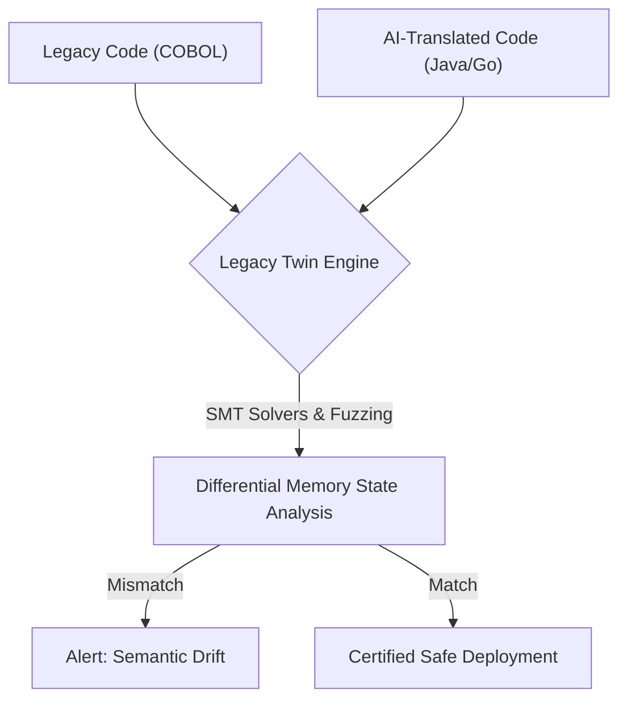
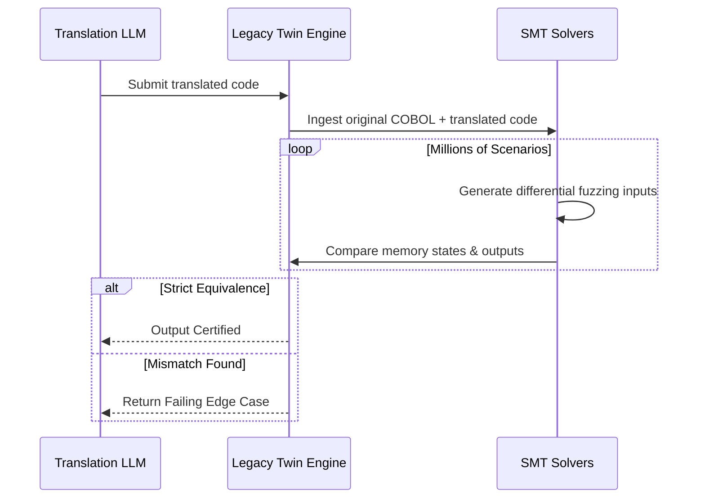

<!-- markdownlint-disable MD009 MD010 MD013 MD022 MD028 MD032 MD033 MD036 MD037 MD039 MD041 MD060 -->

[ 🇫🇷 Version Française ](./README.fr.md)

# Legacy Twin

> **Executive Summary:** A differential fuzzing and symbolic execution engine that mathematically proves strict semantic equivalence between legacy COBOL/Fortran code and AI-translated modern code.

---

## 1. Visual Overview

## 2. Contrarian Thesis (Peter Thiel Style)

- **Popular Belief:** Large Language Models are amazing at translating legacy code like COBOL to Java, thus solving the legacy migration problem.
- **Hidden Truth:** Generating translated code is the easy part. The real bottleneck is proving that the new code perfectly replicates 40 years of undocumented edge cases. Manual testing takes longer than the translation itself, and enterprises won't deploy AI-generated code without formal mathematical proof of equivalence.

## 3. Problem & Target Market

- **Business Model:** B2B
- **Target Audience:** CIOs, Cloud Architects, and IT Modernization teams in large enterprises (banks, insurance, institutions) migrating Legacy systems.
- **Urgent Pain Point:** AI is used to massively translate Legacy code, but enterprises don't dare deploy it because it's impossible to guarantee it reproduces the exact same complex business logic. Manual validation is prohibitively expensive.

## 4. Technical Architecture & Infrastructure

## 5. Business Model & Financial Viability

| Metric                 | Value                                     |
| ---------------------- | ----------------------------------------- |
| Pricing Structure      | Per Application / Lines of Code Certified |
| 12-Month Target        | 20 Major Enterprise Migrations            |
| Revenue Formula        | 20 \* €50,000 per migration = 1.0M€       |
| Estimated Gross Margin | 80%                                       |

## 6. Distribution Engine & Moat

- **Acquisition Strategy:** High-ticket B2B sales in partnership with cloud providers (AWS Mainframe Modernization, Azure) and Global System Integrators handling legacy migrations.
- **Moat (Defensibility):** Proving state equivalence requires deterministic mathematical solvers (SMT) and a complex differential fuzzing infrastructure, which a probabilistic text-based model cannot accomplish on its own.

## 7. Detailed Evaluation Grid

| Criterion                   | VC Score (/100) | Market Score (/100) |
| --------------------------- | --------------- | ------------------- |
| Thesis & Monopoly / Urgency | -- / 25         | -- / 25             |
| Moat / LLM Immunity         | -- / 25         | -- / 25             |
| Scalability / UX Friction   | -- / 25         | -- / 25             |
| Unit Economics / ROI        | -- / 25         | -- / 25             |
| **TOTAL**                   | **-- / 100**    | **-- / 100**        |

> **VC Verdict:** Pending evaluation.

> **Market Verdict:** Pending evaluation.
