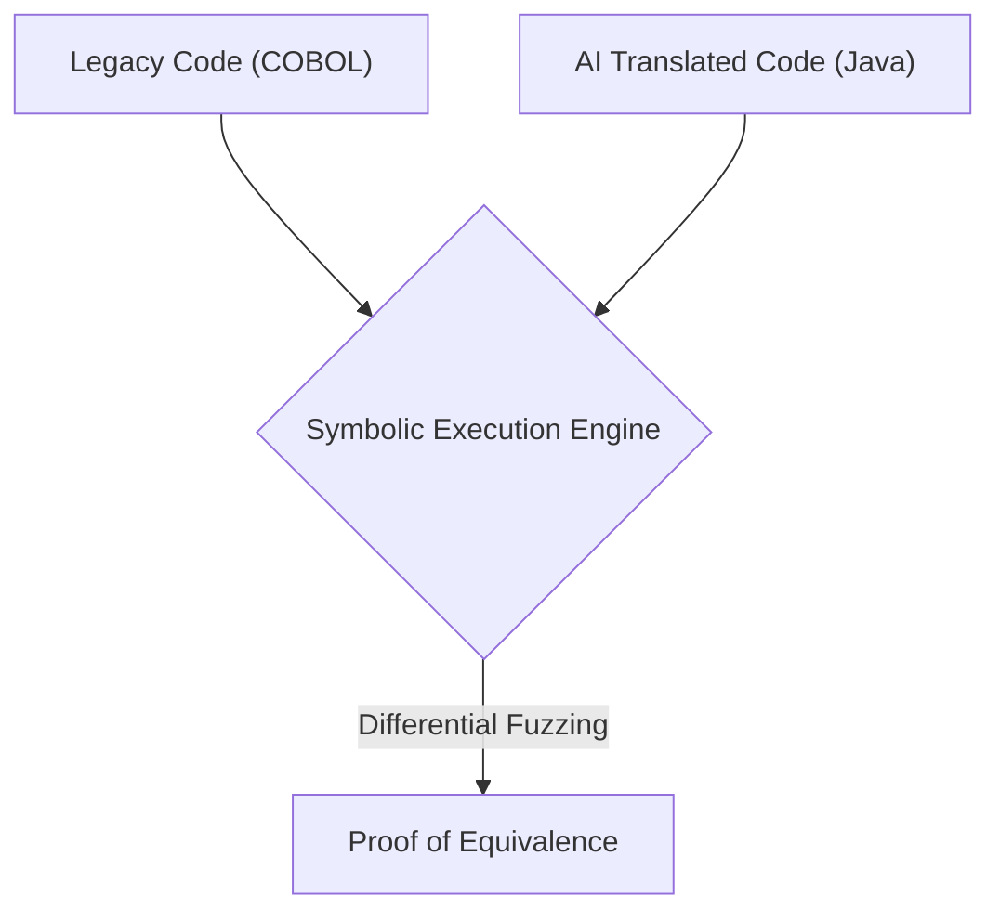
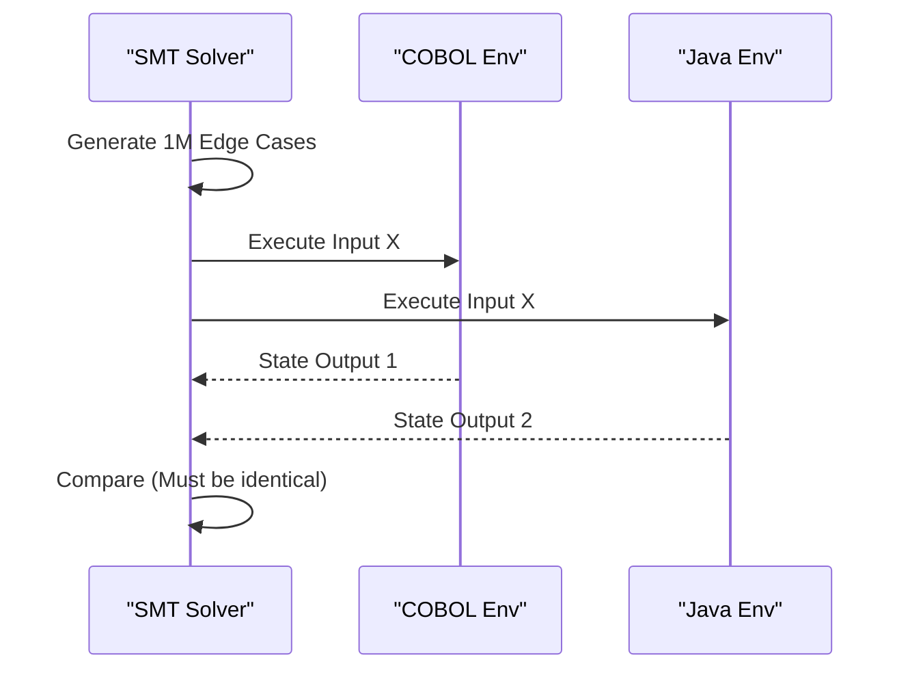

<!-- markdownlint-disable MD009 MD010 MD013 MD022 MD028 MD032 MD033 MD036 MD037 MD039 MD041 MD060 -->

[ 🇫🇷 Version Française ](./README.fr.md)

# Legacy Twin

> **Executive Summary:** A differential fuzzing and symbolic execution engine that mathematically guarantees AI-translated modern code behaves exactly like the original legacy system.

---

## 1. Visual Overview & Wow Effect

```mermaid
graph TD
    %% Architecture
    A["Legacy Code (COBOL)"] --> C{"Symbolic Execution Engine"}
    B["AI Translated Code (Java)"] --> C
    C -->|Differential Fuzzing| D["Proof of Equivalence"]
```

## 2. Contrarian Thesis (Peter Thiel Style)

**Popular Belief:** AI can instantly translate COBOL to Java, solving the legacy modernization crisis.

**Hidden Truth:** Translation is easy; proving semantic equivalence is the hard, unsolved problem preventing actual deployment.

## 3. Problem & Target Market

**Business Model:** B2B
**Target Audience:** CIOs, cloud architects, and IT modernization teams migrating Legacy systems (COBOL, Fortran) in large institutions.
**Urgent Pain Point:** AI is used to translate code, but manual validation testing costs more and takes longer than the translation itself due to fear of edge-case failures.

## 4. Technical Architecture & Infrastructure

**Technical Approach:** Differential fuzzing and symbolic execution engine. Ingests legacy and translated code, generates millions of test scenarios via SMT solvers, and strictly compares memory states and outputs.

```mermaid
sequenceDiagram
    participant SMT as "SMT Solver"
    participant Legacy as "COBOL Env"
    participant Mod as "Java Env"
    SMT->>SMT: Generate 1M Edge Cases
    SMT->>Legacy: Execute Input X
    SMT->>Mod: Execute Input X
    Legacy-->>SMT: State Output 1
    Mod-->>SMT: State Output 2
    SMT->>SMT: Compare (Must be identical)
```

## 5. Business Model & Financial Viability

| Metric                     | Value                                             |
| :------------------------- | :------------------------------------------------ |
| **Pricing Structure**      | Per Line of Code Evaluated / Project Basis        |
| **12-Month Target**        | 10 Major Migration Projects                       |
| **Revenue Formula**        | 10 projects \* $120k/year = $1.2M/year ($100k/mo) |
| **Estimated Gross Margin** | 90%                                               |

## 6. Distribution Engine & Moat

**Acquisition Strategy:** Partnerships with major cloud providers (AWS, Azure) and global system integrators (Accenture, Capgemini).

**Moat (Defensibility):** LLMs can translate syntax but cannot execute code or formally prove state equivalence. Requires deterministic mathematical solvers (SMT) and complex fuzzing infrastructure.

## 7. Detailed Evaluation Grid

| Criterion                   | VC Score (/100) | Market Score (/100) |
| --------------------------- | --------------- | ------------------- |
| Thesis & Monopoly / Urgency | 25 / 25         | 21 / 25             |
| Moat / LLM Immunity         | 24 / 25         | 24 / 25             |
| Scalability / UX Friction   | 20 / 25         | 16 / 25             |
| Unit Economics / ROI        | 22 / 25         | 23 / 25             |
| **TOTAL**                   | **91 / 100**    | **84 / 100**        |

> **VC Verdict:** Legacy Twin tackles the trillion-dollar modernization backlog by replacing blind trust in LLMs with irrefutable mathematical proof of equivalence. This hardcore technical moat makes it indispensable for risk-averse institutions like banks and governments. While the market is specialized, the immense value unlocked per transaction supports incredibly lucrative enterprise pricing.

> **Market Verdict:** Addresses the lack of trust in AI-translated legacy code. High immunity to LLMs as it relies on formal verification, but selling to risk-averse enterprise IT is inherently slow.
