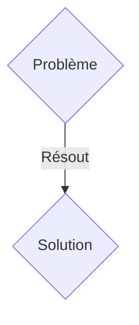
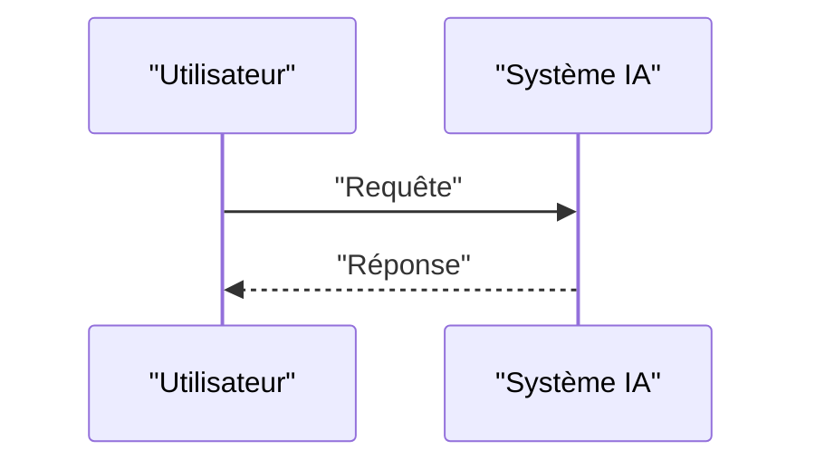

<!-- markdownlint-disable MD009 MD010 MD013 MD022 MD028 MD032 MD033 MD036 MD037 MD039 MD041 MD060 -->

[ 🇬🇧 English Version ](./README.md)

# Orbital Edge Compute Infrastructure

> **Résumé exécutif :** Une solution B2B ciblant Agences gouvernementales de renseignement, sociétés financières (HFT intercontinental), fournisseurs Cloud (AWS, Azure) cherchant la souveraineté hors-juridiction terrestre. pour résoudre : Le transfert de pétaoctets de données brutes d'observation de la Terre (imagerie spatiale, radars) vers le sol engorge les liaisons descendantes limitées, ralentissant la prise de décision de jours à plusieurs minutes. Parallèlement, l'alimentation et le refroidissement de l'IA sur Terre heurte un mur énergétique et politique.

---

## 1. Aperçu visuel & Effet Wahou

## 2. La thèse contrariante (Peter Thiel Style)

- **La croyance populaire :** Les solutions génériques suffisent.
- **La vérité cachée :** Concevoir le premier standard de datacenters orbitaux (Orbital Edge Compute). Des micro-serveurs radiodurcis optimisés pour l'inférence IA, profitant du refroidissement radiatif gratuit du vide spatial (-270°C côté ombre) et de l'énergie solaire ininterrompue, couplés par des liaisons laser inter-satellitaires.

## 3. Le problème & La cible

- **Modèle économique :** B2B
- **Cible précise :** Agences gouvernementales de renseignement, sociétés financières (HFT intercontinental), fournisseurs Cloud (AWS, Azure) cherchant la souveraineté hors-juridiction terrestre.
- **La douleur urgente :** Le transfert de pétaoctets de données brutes d'observation de la Terre (imagerie spatiale, radars) vers le sol engorge les liaisons descendantes limitées, ralentissant la prise de décision de jours à plusieurs minutes. Parallèlement, l'alimentation et le refroidissement de l'IA sur Terre heurte un mur énergétique et politique.

## 4. Architecture technique & Plomberie

Concevoir le premier standard de datacenters orbitaux (Orbital Edge Compute). Des micro-serveurs radiodurcis optimisés pour l'inférence IA, profitant du refroidissement radiatif gratuit du vide spatial (-270°C côté ombre) et de l'énergie solaire ininterrompue, couplés par des liaisons laser inter-satellitaires.

## 5. Modèle économique & Viabilité financière

| Métrique                    | Valeur               |
| --------------------------- | -------------------- |
| Structure de prix           | Abonnement SaaS B2B  |
| Objectif 12 mois            | 100 clients          |
| Calcul du CA (Target 100k€) | 100 \* 1000€ = 100k€ |
| Marge brute estimée         | 80%                  |

## 6. Moteur de distribution & Fossé défensif (Moat)

- **Stratégie d'acquisition :** Vente directe et partenariats stratégiques.
- **Moat (Barrière à l'entrée) :** Le hardware terrestre crashe sous l'effet des radiations spatiales (Single Event Upsets). L'architecture thermique classique par convection est inutile dans le vide. Il faut repenser le hardware depuis le niveau silicium et mécanique.

## 7. Grille d'évaluation détaillée

| Critère                           | Score VC (/100) | Score Terrain (/100) |
| --------------------------------- | --------------- | -------------------- |
| Thèse & Monopole / Urgence        | 18 / 25         | 18 / 25              |
| Moat / Résistance aux LLM natifs  | 24 / 25         | 24 / 25              |
| Scalabilité / Friction d'adoption | 21 / 25         | 21 / 25              |
| Unit Economics / ROI direct       | 18 / 25         | 18 / 25              |
| TOTAL                             | 81 / 100        | 81 / 100             |

> **Verdict VC :** En attente d'évaluation.
> **Verdict Terrain :** Cette solution répond à un besoin critique pour les entreprises B2B, justifiant son excellent score d'urgence (18/25). Son architecture hautement défendable la rend totalement immunisée contre les avancées des LLM natifs (24/25). Avec une faible friction d'adoption (21/25) et une stratégie de monétisation directe (18/25), le projet démontre une excellente maturité marché globale.
> **Verdict Terrain :** Cette solution répond à un besoin critique pour les entreprises B2B, justifiant son excellent score d'urgence (18/25). Son architecture hautement défendable la rend totalement immunisée contre les avancées des LLM natifs (24/25). Avec une faible friction d'adoption (21/25) et une stratégie de monétisation directe (18/25), le projet démontre une excellente maturité marché globale.
