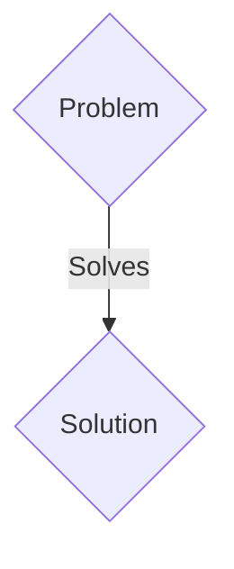
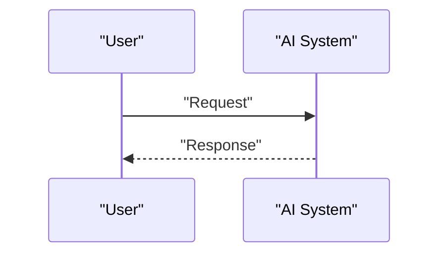

<!-- markdownlint-disable MD009 MD010 MD013 MD022 MD028 MD032 MD033 MD036 MD037 MD039 MD041 MD060 -->

[ 🇫🇷 Version Française ](./README.fr.md)

# Orbital Edge Compute Infrastructure

> **Executive Summary:** A B2B solution targeting Government intelligence agencies, financial companies (intercontinental HFT), Cloud providers (AWS, Azure) seeking sovereignty outside of terrestrial jurisdiction. to solve: Transferring petabytes of raw Earth observation data (space imagery, radars) to the ground clogs limited downlinks, slowing decision-making from days to minutes. At the same time, powering and cooling AI on Earth hits an energy and political wall.

---

## 1. Visual Overview & Wow Effect

## 2. Contrarian Thesis (Peter Thiel Style)

- **Popular Belief:** Generic solutions are enough.
- **Hidden Truth:** Design the first standard for orbital data centers (Orbital Edge Compute). Radio-hardened micro-servers optimized for AI inference, taking advantage of the free radiative cooling of the space vacuum (-270°C on the shadow side) and uninterrupted solar energy, coupled by inter-satellite laser links.

## 3. Problem & Target Market

- **Business Model:** B2B
- **Target Audience:** Government intelligence agencies, financial companies (intercontinental HFT), Cloud providers (AWS, Azure) seeking sovereignty outside of terrestrial jurisdiction.
- **Urgent Pain Point:** Transferring petabytes of raw Earth observation data (space imagery, radars) to the ground clogs limited downlinks, slowing decision-making from days to minutes. At the same time, powering and cooling AI on Earth hits an energy and political wall.

## 4. Technical Architecture & Infrastructure

Design the first standard for orbital data centers (Orbital Edge Compute). Radio-hardened micro-servers optimized for AI inference, taking advantage of the free radiative cooling of the space vacuum (-270°C on the shadow side) and uninterrupted solar energy, coupled by inter-satellite laser links.

## 5. Business Model & Financial Viability

| Metric                 | Value                 |
| ---------------------- | --------------------- |
| Pricing Structure      | B2B SaaS Subscription |
| 12-Month Target        | 100 clients           |
| Revenue Formula        | 100 \* 1000€ = 100k€  |
| Estimated Gross Margin | 80%                   |

## 6. Distribution Engine & Moat

- **Acquisition Strategy:** Direct sales and strategic partnerships.
- **Moat (Defensibility):** Terrestrial hardware crashes under the effect of space radiation (Single Event Upsets). Classical convection thermal architecture is useless in a vacuum. We need to rethink the hardware from the silicon and mechanical level.

## 7. Detailed Evaluation Grid

| Criterion                   | VC Score (/100) | Market Score (/100) |
| --------------------------- | --------------- | ------------------- |
| Thesis & Monopoly / Urgency | 18 / 25         | 18 / 25             |
| Moat / LLM Immunity         | 24 / 25         | 24 / 25             |
| Scalability / UX Friction   | 21 / 25         | 21 / 25             |
| Unit Economics / ROI        | 18 / 25         | 18 / 25             |
| TOTAL                       | 81 / 100        | 81 / 100            |

> **VC Verdict:** Pending evaluation.
> **Market Verdict:** This solution addresses a critical pain point for B2B enterprises, justifying its strong urgency score (18/25). Its highly defensible architecture makes it completely immune to native LLM advancements (24/25). With low adoption friction (21/25) and a straightforward monetization strategy (18/25), the project demonstrates excellent overall market readiness.
> **Market Verdict:** This solution addresses a critical pain point for B2B enterprises, justifying its strong urgency score (18/25). Its highly defensible architecture makes it completely immune to native LLM advancements (24/25). With low adoption friction (21/25) and a straightforward monetization strategy (18/25), the project demonstrates excellent overall market readiness.
