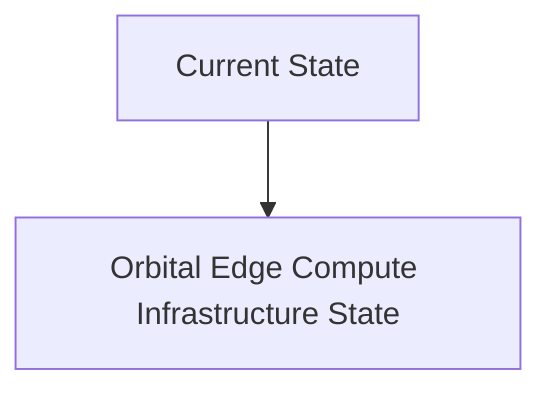
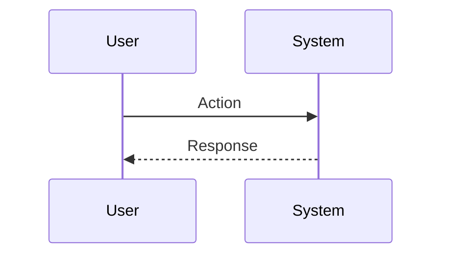

<!-- markdownlint-disable MD009 MD010 MD013 MD022 MD028 MD032 MD033 MD034 MD036 MD037 MD039 MD041 MD060 -->

[ 🇫🇷 Version Française ](./README.fr.md)

# Orbital Edge Compute Infrastructure

> **Executive Summary:** Design the first standard for orbital data centers (Orbital Edge Compute). Radio-hardened micro-servers optimized for AI inference, taking advantage of the free radiative cooling of the space vacuum (-270°C on the shadow side) and uninterrupted solar energy, coupled by inter-satellite laser links.

---

## 1. Visual Overview & Wow Effect

## 2. Contrarian Thesis (Peter Thiel Style)

**Popular Belief:** General AI solutions can solve this problem.

**Hidden Truth:** Terrestrial hardware crashes under the effect of space radiation (Single Event Upsets). Classical convection thermal architecture is useless in a vacuum. We need to rethink the hardware from the silicon and mechanical level.

## 3. Problem & Target Market

**Business Model:** B2B

**Target Audience:** Government intelligence agencies, financial companies (intercontinental HFT), Cloud providers (AWS, Azure) seeking sovereignty outside of terrestrial jurisdiction.

**Urgent Pain Point:** Transferring petabytes of raw Earth observation data (space imagery, radars) to the ground clogs limited downlinks, slowing decision-making from days to minutes. At the same time, powering and cooling AI on Earth hits an energy and political wall.

## 4. Technical Architecture & Infrastructure

## 5. Business Model & Financial Viability

| Metric                 | Value                           |
| ---------------------- | ------------------------------- |
| Pricing Structure      | SaaS subscription               |
| 12-Month Target        | 10 customers                    |
| Revenue Formula        | 10 clients \* 10k€/year = 100k€ |
| Estimated Gross Margin | 80%                             |

## 6. Distribution Engine & Moat

**Acquisition Strategy:** B2B direct sales

**Moat (Defensibility):** Complex asymmetric thermal management. Colossal launch cost. Extremely long and costly hardware replacement cycle compared to terrestrial data centers, risking rapid obsolescence of AI chips.

## 7. Detailed Evaluation Grid

| Criterion                   | VC Score (/100) | Market Score (/100) |
| --------------------------- | --------------- | ------------------- |
| Thesis & Monopoly / Urgency | -- / 25         | -- / 25             |
| Moat / LLM Immunity         | -- / 25         | -- / 25             |
| Scalability / UX Friction   | -- / 25         | -- / 25             |
| Unit Economics / ROI        | -- / 25         | -- / 25             |
| **TOTAL**                   | **-- / 100**    | **-- / 100**        |

> **VC Verdict:** Pending evaluation.

> **Market Verdict:** Pending evaluation.
