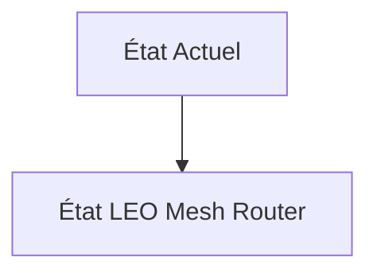
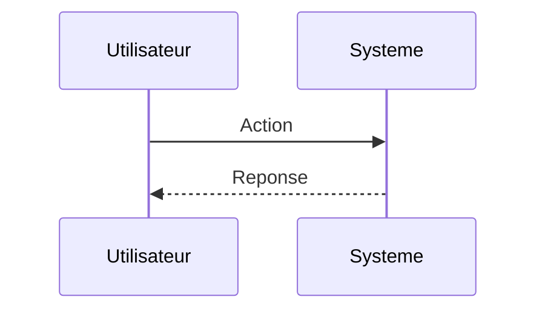

<!-- markdownlint-disable MD009 MD010 MD013 MD022 MD028 MD032 MD033 MD034 MD036 MD037 MD039 MD041 MD060 -->

[ 🇬🇧 English Version ](./README.md)

# LEO Mesh Router

> **Résumé exécutif :** Un système de routage IP/MPLS embarqué et distribué (Software-Defined Space Networking), conçu pour fonctionner sur des processeurs spatiaux durcis (radiation-hardened). Ce routeur logiciel orchestre dynamiquement les liens laser (Optical Intersatellite Links) en temps réel, calculant les chemins optimaux dans une topologie de réseau qui change constamment et à très grande vitesse.

---

## 1. Aperçu visuel & Effet Wahou

## 2. La thèse contrariante (Peter Thiel Style)

**La croyance populaire :** Les solutions généralistes IA peuvent résoudre ce problème.

**La vérité cachée :** Les protocoles de routage terrestres (BGP, OSPF) sont conçus pour des topologies fixes. Dans l'espace, la topologie entière change en quelques minutes. Cela nécessite de redévelopper des protocoles réseau ad-hoc tolérants aux délais et aux perturbations (DTN - Delay-Tolerant Networking) capables de tourner avec des ressources calculatoires limitées dans l'espace, hors de portée d'un simple overlay SaaS.

## 3. Le problème & La cible

**Modèle économique :** B2B / M2M

**Cible précise :** Opérateurs de méga-constellations (SpaceX, Kuiper, OneWeb), agences spatiales, fournisseurs cloud (Azure Space, AWS Ground Station).

**La douleur urgente :** Les satellites en orbite basse (LEO) actuels opèrent majoritairement en architecture "bent-pipe" (relai stupide) ou dépendent de stations au sol pour router les données. Avec l'explosion du nombre de satellites, l'absence de véritable routage dynamique inter-satellites (Inter-Satellite Links - ISL) au niveau spatial crée des goulots d'étranglement massifs, augmente la latence globale et limite la résilience du réseau en cas de perte d'une station sol.

## 4. Architecture technique & Plomberie

## 5. Modèle économique & Viabilité financière

| Métrique                    | Valeur                        |
| --------------------------- | ----------------------------- |
| Structure de prix           | Abonnement SaaS               |
| Objectif 12 mois            | 10 clients                    |
| Calcul du CA (Target 100k€) | 10 clients \* 10k€/an = 100k€ |
| Marge brute estimée         | 80%                           |

## 6. Moteur de distribution & Fossé défensif (Moat)

**Stratégie d'acquisition :** Vente directe B2B

**Moat (Barrière à l'entrée) :** Adoption complexe (les constructeurs de satellites développent souvent leurs solutions réseau propriétaires en silo), barrière à l'entrée très haute nécessitant des qualifications spatiales strictes (TRL), et dépendance au rythme de déploiement des lasers de communication.

## 7. Grille d'évaluation détaillée

| Critère                           | Score VC (/100) | Score Terrain (/100) |
| --------------------------------- | --------------- | -------------------- |
| Thèse & Monopole / Urgence        | -- / 25         | -- / 25              |
| Moat / Résistance aux LLM natifs  | -- / 25         | -- / 25              |
| Scalabilité / Friction d'adoption | -- / 25         | -- / 25              |
| Unit Economics / ROI direct       | -- / 25         | -- / 25              |
| **TOTAL**                         | **-- / 100**    | **-- / 100**         |

> **Verdict VC :** En attente d'évaluation.

> **Verdict Terrain :** En attente d'évaluation.
