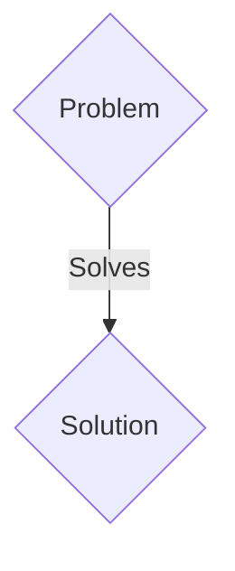
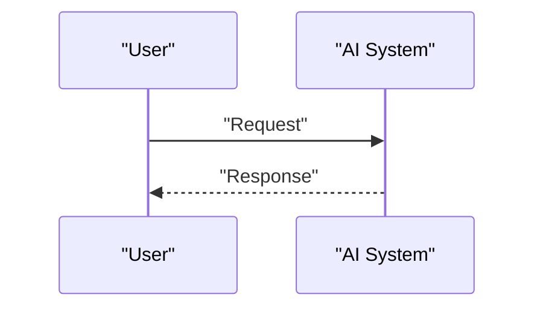

<!-- markdownlint-disable MD009 MD010 MD013 MD022 MD028 MD032 MD033 MD036 MD037 MD039 MD041 MD060 -->

[ 🇫🇷 Version Française ](./README.fr.md)

# LEO Mesh Router

> **Executive Summary:** A B2B / M2M solution targeting Mega-constellation operators (SpaceX, Kuiper, OneWeb), space agencies, cloud providers (Azure Space, AWS Ground Station). to solve: Current low-orbit (LEO) satellites mostly operate in "bent-pipe" architecture or depend on ground stations to route data. With the explosion in the number of satellites, the lack of true dynamic Inter-Satellite Links (ISL) routing at the spatial level creates massive bottlenecks, increases overall latency and limits network resilience in the event of the loss of a ground station.

---

## 1. Visual Overview & Wow Effect

## 2. Contrarian Thesis (Peter Thiel Style)

- **Popular Belief:** Generic solutions are enough.
- **Hidden Truth:** An embedded, distributed IP/MPLS routing system (Software-Defined Space Networking), designed to run on radiation-hardened space processors. This software router dynamically orchestrates laser links (Optical Intersatellite Links) in real time, calculating optimal paths in a network topology that is constantly changing and at very high speed.

## 3. Problem & Target Market

- **Business Model:** B2B / M2M
- **Target Audience:** Mega-constellation operators (SpaceX, Kuiper, OneWeb), space agencies, cloud providers (Azure Space, AWS Ground Station).
- **Urgent Pain Point:** Current low-orbit (LEO) satellites mostly operate in "bent-pipe" architecture or depend on ground stations to route data. With the explosion in the number of satellites, the lack of true dynamic Inter-Satellite Links (ISL) routing at the spatial level creates massive bottlenecks, increases overall latency and limits network resilience in the event of the loss of a ground station.

## 4. Technical Architecture & Infrastructure

An embedded, distributed IP/MPLS routing system (Software-Defined Space Networking), designed to run on radiation-hardened space processors. This software router dynamically orchestrates laser links (Optical Intersatellite Links) in real time, calculating optimal paths in a network topology that is constantly changing and at very high speed.

## 5. Business Model & Financial Viability

| Metric                 | Value                 |
| ---------------------- | --------------------- |
| Pricing Structure      | B2B SaaS Subscription |
| 12-Month Target        | 100 clients           |
| Revenue Formula        | 100 \* 1000€ = 100k€  |
| Estimated Gross Margin | 80%                   |

## 6. Distribution Engine & Moat

- **Acquisition Strategy:** Direct sales and strategic partnerships.
- **Moat (Defensibility):** Terrestrial routing protocols (BGP, OSPF) are designed for fixed topologies. In space, the entire topology changes within minutes. This requires redeveloping ad-hoc network protocols tolerant to delays and disturbances (DTN - Delay-Tolerant Networking) capable of running with spatially limited computational resources, beyond the reach of a simple SaaS overlay.

## 7. Detailed Evaluation Grid

| Criterion                   | VC Score (/100) | Market Score (/100) |
| --------------------------- | --------------- | ------------------- |
| Thesis & Monopoly / Urgency | -- / 25         | -- / 25             |
| Moat / LLM Immunity         | -- / 25         | -- / 25             |
| Scalability / UX Friction   | -- / 25         | -- / 25             |
| Unit Economics / ROI        | -- / 25         | -- / 25             |
| TOTAL                       | -- / 100        | -- / 100            |

> **VC Verdict:** Pending evaluation.
> **Market Verdict:** Pending evaluation.
