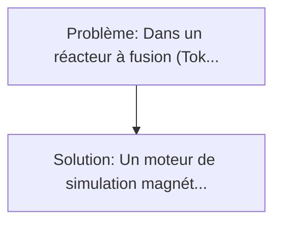
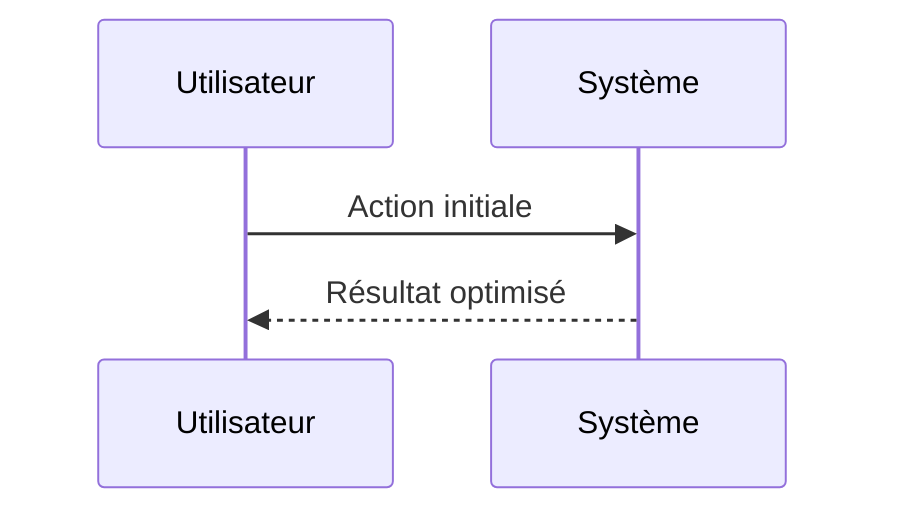

<!-- markdownlint-disable MD013 MD033 -->

[🇬🇧 English Version](./README.md)

# Liquid Metal Divertor Sim

> **Résumé exécutif :** Un moteur de simulation magnétohydrodynamique (MHD) couplé à une IA prédictive pour concevoir des divertors à métaux liquides (ex: Lithium ou Étain fondu coulant sur une structure poreuse). Dans un réacteur à fusion (Tokamak), le "divertor" est la pièce d'échappement qui reçoit les cendres thermiques du plasma.

---

## 1. Aperçu visuel & Effet Wahou

## 2. La thèse contrariante (Peter Thiel Style)

**La croyance populaire :** Les solutions logicielles seules peuvent résoudre ce problème.
**La vérité cachée :** Les codes CFD traditionnels échouent à simuler le couplage intime de la mécanique des fluides en régime turbulent, de l'électromagnétisme (effets de force de Lorentz sur le métal conducteur) et des transferts thermiques extrêmes au sein d'une même matrice temporelle. C'est un pur problème de World Model physique ultra-spécialisé.

## 3. Le problème & La cible

- **Modèle économique :** B2B
- **Cible précise :** Startups de fusion nucléaire (Commonwealth Fusion Systems, Tokamak Energy), instituts de recherche publics (ITER, DEMO).
- **La douleur urgente :** Dans un réacteur à fusion (Tokamak), le "divertor" est la pièce d'échappement qui reçoit les cendres thermiques du plasma. Il subit des flux de chaleur extrêmes (plus intenses qu'à la surface du soleil) qui détruisent les alliages de tungstène les plus solides en quelques mois. Sans divertor résistant, la fusion commerciale est impossible, et les matériaux solides semblent avoir atteint leurs limites physiques.

## 4. Architecture technique & Plomberie

## 5. Modèle économique & Viabilité financière

| Métrique                    | Valeur             |
| --------------------------- | ------------------ |
| Structure de prix           | Custom Pricing     |
| Objectif 12 mois            | 100 clients        |
| Calcul du CA (Target 100k€) | 100 \* 1000 = 100k |
| Marge brute estimée         | 80%                |

## 6. Moteur de distribution & Fossé défensif (Moat)

- **Stratégie d'acquisition :** Ventes B2B directes
- **Moat (Barrière à l'entrée) :** Les codes CFD traditionnels échouent à simuler le couplage intime de la mécanique des fluides en régime turbulent, de l'électromagnétisme (effets de force de Lorentz sur le métal conducteur) et des transferts thermiques extrêmes au sein d'une même matrice temporelle. C'est un pur problème de World Model physique ultra-spécialisé.

## 7. Grille d'évaluation détaillée

| Critère                           | Score VC (/100) | Score Terrain (/100) |
| --------------------------------- | --------------- | -------------------- |
| Thèse & Monopole / Urgence        | -- / 25         | -- / 25              |
| Moat / Résistance aux LLM natifs  | -- / 25         | -- / 25              |
| Scalabilité / Friction d'adoption | -- / 25         | -- / 25              |
| Unit Economics / ROI direct       | -- / 25         | -- / 25              |
| **TOTAL**                         | **-- / 100**    | **-- / 100**         |

> **Verdict VC :** En attente d'évaluation.

> **Verdict Terrain :** En attente d'évaluation.
