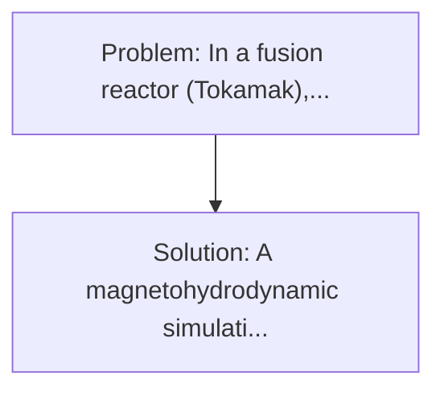
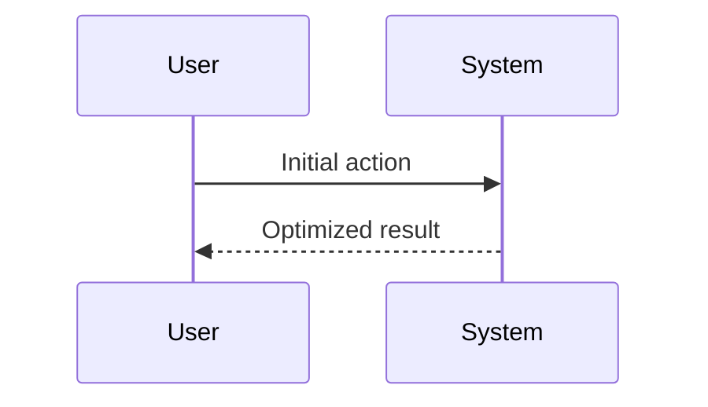

<!-- markdownlint-disable MD013 MD033 -->

[🇫🇷 Version Française](./README.fr.md)

# Liquid Metal Divertor Sim

> **Executive Summary:** A magnetohydrodynamic simulation engine (MHD) coupled with a predictive AI to design liquid metal dippers (e. In a fusion reactor (Tokamak), the "divertor" is the exhaust part that receives thermal ash from the plasma.

---

## 1. Visual Overview & Wow Effect

## 2. Contrarian Thesis (Peter Thiel Style)

**Popular Belief:** Generic software solutions can solve this.
**Hidden Truth:** Traditional CFD codes fail to simulate the intimate coupling of turbulent fluid mechanics, electromagnetism (Lorentz force effects on the conductive metal) and extreme thermal transfer within the same time matrix. It is a pure problem of the ultra-specialized physical World Model.

## 3. Problem & Target Market

- **Business Model:** B2B
- **Target Audience:** Nuclear fusion startups (Commonwealth Fusion Systems, Tokamak Energy), public research institutes (ITER, DEMO).
- **Urgent Pain Point:** In a fusion reactor (Tokamak), the "divertor" is the exhaust part that receives thermal ash from the plasma. It undergoes extreme heat streams (more intense than on the sun's surface) that destroy the strongest tungsten alloys in a few months. Without resistant entertainer, commercial fusion is impossible, and solid materials seem to have reached their physical limits.

## 4. Technical Architecture & Infrastructure

## 5. Business Model & Financial Viability

| Metric                 | Value              |
| ---------------------- | ------------------ |
| Pricing Structure      | Custom Pricing     |
| 12-Month Target        | 100 customers      |
| Revenue Formula        | 100 \* 1000 = 100k |
| Estimated Gross Margin | 80%                |

## 6. Distribution Engine & Moat

- **Acquisition Strategy:** Direct B2B Sales
- **Moat (Defensibility):** Traditional CFD codes fail to simulate the intimate coupling of turbulent fluid mechanics, electromagnetism (Lorentz force effects on the conductive metal) and extreme thermal transfer within the same time matrix. It is a pure problem of the ultra-specialized physical World Model.

## 7. Detailed Evaluation Grid

| Criterion                   | VC Score (/100) | Market Score (/100) |
| --------------------------- | --------------- | ------------------- |
| Thesis & Monopoly / Urgency | -- / 25         | -- / 25             |
| Moat / LLM Immunity         | -- / 25         | -- / 25             |
| Scalability / UX Friction   | -- / 25         | -- / 25             |
| Unit Economics / ROI        | -- / 25         | -- / 25             |
| **TOTAL**                   | **-- / 100**    | **-- / 100**        |

> **VC Verdict:** Pending evaluation.

> **Market Verdict:** Pending evaluation.
