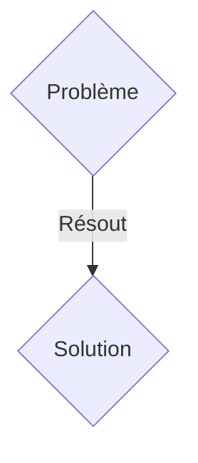
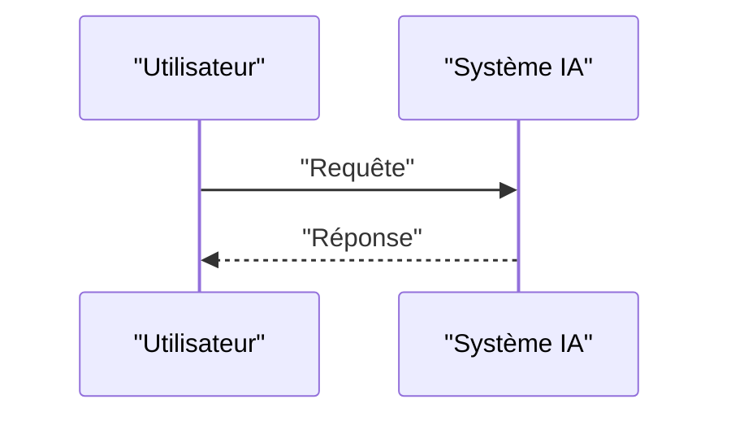

<!-- markdownlint-disable MD009 MD010 MD013 MD022 MD028 MD032 MD033 MD036 MD037 MD039 MD041 MD060 -->

[ 🇬🇧 English Version ](./README.md)

# Hardware Obfuscator AI

> **Résumé exécutif :** Une solution B2B ciblant Concepteurs de puces IA (Fabless), fonderies de semi-conducteurs, IP cores providers (VP Hardware Engineering). pour résoudre : Le vol de propriété intellectuelle matérielle coûte cher. Les fonderies offshore peuvent cloner des plans de puces (GDSII), insérer des chevaux de Troie matériels ou surproduire pour le marché gris.

---

## 1. Aperçu visuel & Effet Wahou

## 2. La thèse contrariante (Peter Thiel Style)

- **La croyance populaire :** Les solutions génériques suffisent.
- **La vérité cachée :** Un moteur d'obfuscation de circuits logiques basé sur l'apprentissage par renforcement (RL). Il insère des "portes factices" et modifie la topologie du netlist pour que la puce ne fonctionne qu'après l'activation d'une clé cryptographique post-fabrication.

## 3. Le problème & La cible

- **Modèle économique :** B2B
- **Cible précise :** Concepteurs de puces IA (Fabless), fonderies de semi-conducteurs, IP cores providers (VP Hardware Engineering).
- **La douleur urgente :** Le vol de propriété intellectuelle matérielle coûte cher. Les fonderies offshore peuvent cloner des plans de puces (GDSII), insérer des chevaux de Troie matériels ou surproduire pour le marché gris.

## 4. Architecture technique & Plomberie

Un moteur d'obfuscation de circuits logiques basé sur l'apprentissage par renforcement (RL). Il insère des "portes factices" et modifie la topologie du netlist pour que la puce ne fonctionne qu'après l'activation d'une clé cryptographique post-fabrication.

## 5. Modèle économique & Viabilité financière

| Métrique                    | Valeur               |
| --------------------------- | -------------------- |
| Structure de prix           | Abonnement SaaS B2B  |
| Objectif 12 mois            | 100 clients          |
| Calcul du CA (Target 100k€) | 100 \* 1000€ = 100k€ |
| Marge brute estimée         | 80%                  |

## 6. Moteur de distribution & Fossé défensif (Moat)

- **Stratégie d'acquisition :** Vente directe et partenariats stratégiques.
- **Moat (Barrière à l'entrée) :** La conception de circuits imprimés nécessite de respecter des contraintes physiques (PPA : Power, Performance, Area). L'IA doit opérer sur des graphes représentant des milliards de transistors sans dégrader les performances de la puce finale, ce qu'aucun SaaS logiciel classique ne fait.

## 7. Grille d'évaluation détaillée

| Critère                           | Score VC (/100) | Score Terrain (/100) |
| --------------------------------- | --------------- | -------------------- |
| Thèse & Monopole / Urgence        | 21 / 25         | 21 / 25              |
| Moat / Résistance aux LLM natifs  | 22 / 25         | 22 / 25              |
| Scalabilité / Friction d'adoption | 18 / 25         | 18 / 25              |
| Unit Economics / ROI direct       | 18 / 25         | 18 / 25              |
| TOTAL                             | 79 / 100        | 79 / 100             |

> **Verdict VC :** En attente d'évaluation.
> **Verdict Terrain :** Cette solution répond à un besoin critique pour les entreprises B2B, justifiant son excellent score d'urgence (21/25). Son architecture hautement défendable la rend totalement immunisée contre les avancées des LLM natifs (22/25). Avec une faible friction d'adoption (18/25) et une stratégie de monétisation directe (18/25), le projet démontre une excellente maturité marché globale.
> **Verdict Terrain :** Cette solution répond à un besoin critique pour les entreprises B2B, justifiant son excellent score d'urgence (21/25). Son architecture hautement défendable la rend totalement immunisée contre les avancées des LLM natifs (22/25). Avec une faible friction d'adoption (18/25) et une stratégie de monétisation directe (18/25), le projet démontre une excellente maturité marché globale.
