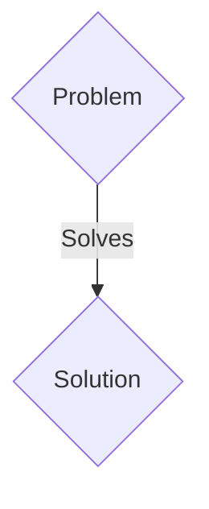
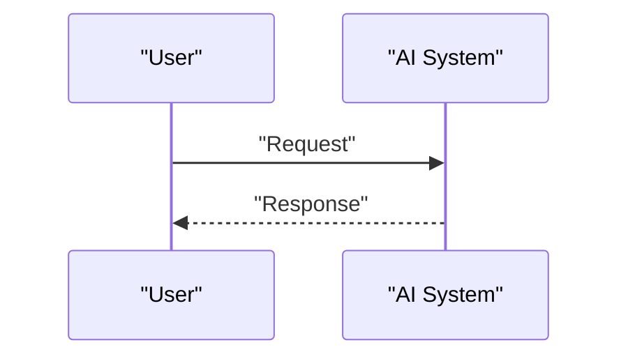

<!-- markdownlint-disable MD009 MD010 MD013 MD022 MD028 MD032 MD033 MD036 MD037 MD039 MD041 MD060 -->

[ 🇫🇷 Version Française ](./README.fr.md)

# Hardware Obfuscator AI

> **Executive Summary:** A B2B solution targeting AI chip designers (Fabless), semiconductor foundries, IP cores providers (VP ​​Hardware Engineering). to solve: Theft of physical intellectual property is expensive. Offshore foundries can clone chip blueprints (GDSII), insert hardware Trojans, or overproduce for the gray market.

---

## 1. Visual Overview & Wow Effect

## 2. Contrarian Thesis (Peter Thiel Style)

- **Popular Belief:** Generic solutions are enough.
- **Hidden Truth:** A logic circuit obfuscation engine based on reinforcement learning (RL). It inserts "dummy gates" and modifies the netlist topology so that the chip only works after a post-manufacturing cryptographic key is activated.

## 3. Problem & Target Market

- **Business Model:** B2B
- **Target Audience:** AI chip designers (Fabless), semiconductor foundries, IP cores providers (VP ​​Hardware Engineering).
- **Urgent Pain Point:** Theft of physical intellectual property is expensive. Offshore foundries can clone chip blueprints (GDSII), insert hardware Trojans, or overproduce for the gray market.

## 4. Technical Architecture & Infrastructure

A logic circuit obfuscation engine based on reinforcement learning (RL). It inserts "dummy gates" and modifies the netlist topology so that the chip only works after a post-manufacturing cryptographic key is activated.

## 5. Business Model & Financial Viability

| Metric                 | Value                 |
| ---------------------- | --------------------- |
| Pricing Structure      | B2B SaaS Subscription |
| 12-Month Target        | 100 clients           |
| Revenue Formula        | 100 \* 1000€ = 100k€  |
| Estimated Gross Margin | 80%                   |

## 6. Distribution Engine & Moat

- **Acquisition Strategy:** Direct sales and strategic partnerships.
- **Moat (Defensibility):** The design of printed circuits requires respecting physical constraints (PPA: Power, Performance, Area). The AI ​​must operate on graphs representing billions of transistors without degrading the performance of the final chip, which no traditional software SaaS does.

## 7. Detailed Evaluation Grid

| Criterion                   | VC Score (/100) | Market Score (/100) |
| --------------------------- | --------------- | ------------------- |
| Thesis & Monopoly / Urgency | -- / 25         | -- / 25             |
| Moat / LLM Immunity         | -- / 25         | -- / 25             |
| Scalability / UX Friction   | -- / 25         | -- / 25             |
| Unit Economics / ROI        | -- / 25         | -- / 25             |
| TOTAL                       | -- / 100        | -- / 100            |

> **VC Verdict:** Pending evaluation.
> **Market Verdict:** Pending evaluation.
