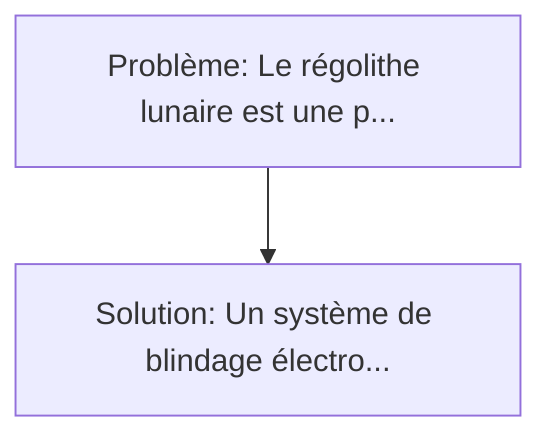
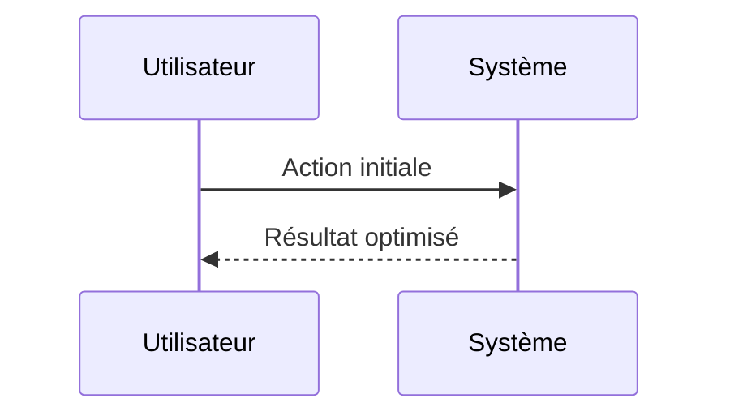

<!-- markdownlint-disable MD013 MD033 -->

[🇬🇧 English Version](./README.md)

# Lunar Dust Electrostatic Shield

> **Résumé exécutif :** Un système de blindage électrodynamique actif. Le régolithe lunaire est une poussière fine, abrasive, hautement chargée électrostatiquement et sans érosion atmosphérique (bords tranchants).

---

## 1. Aperçu visuel & Effet Wahou

## 2. La thèse contrariante (Peter Thiel Style)

**La croyance populaire :** Les solutions logicielles seules peuvent résoudre ce problème.
**La vérité cachée :** C'est un problème pur de science des matériaux et d'électromagnétisme en environnement extrême (vide absolu, radiations, variations thermiques extrêmes). Aucun logiciel ne peut nettoyer une lentille rayée ou un joint grippé par du régolithe.

## 3. Le problème & La cible

- **Modèle économique :** B2B / B2G
- **Cible précise :** Agences spatiales (NASA Artemis, ESA), constructeurs de rovers lunaires, concepteurs d'habitats spatiaux et entreprises d'exploitation des ressources lunaires (ISRU).
- **La douleur urgente :** Le régolithe lunaire est une poussière fine, abrasive, hautement chargée électrostatiquement et sans érosion atmosphérique (bords tranchants). Elle adhère à toutes les surfaces, détruit les joints spatiaux, opacifie les panneaux solaires, enraille la mécanique des rovers et pénètre dans les combinaisons, posant un risque toxique pour les astronautes. Les brosses classiques ne font qu'empirer la charge statique.

## 4. Architecture technique & Plomberie

## 5. Modèle économique & Viabilité financière

| Métrique                    | Valeur             |
| --------------------------- | ------------------ |
| Structure de prix           | Custom Pricing     |
| Objectif 12 mois            | 100 clients        |
| Calcul du CA (Target 100k€) | 100 \* 1000 = 100k |
| Marge brute estimée         | 80%                |

## 6. Moteur de distribution & Fossé défensif (Moat)

- **Stratégie d'acquisition :** Ventes B2B directes
- **Moat (Barrière à l'entrée) :** C'est un problème pur de science des matériaux et d'électromagnétisme en environnement extrême (vide absolu, radiations, variations thermiques extrêmes). Aucun logiciel ne peut nettoyer une lentille rayée ou un joint grippé par du régolithe.

## 7. Grille d'évaluation détaillée

| Critère                           | Score VC (/100) | Score Terrain (/100) |
| --------------------------------- | --------------- | -------------------- |
| Thèse & Monopole / Urgence        | -- / 25         | -- / 25              |
| Moat / Résistance aux LLM natifs  | -- / 25         | -- / 25              |
| Scalabilité / Friction d'adoption | -- / 25         | -- / 25              |
| Unit Economics / ROI direct       | -- / 25         | -- / 25              |
| **TOTAL**                         | **-- / 100**    | **-- / 100**         |

> **Verdict VC :** En attente d'évaluation.

> **Verdict Terrain :** En attente d'évaluation.
