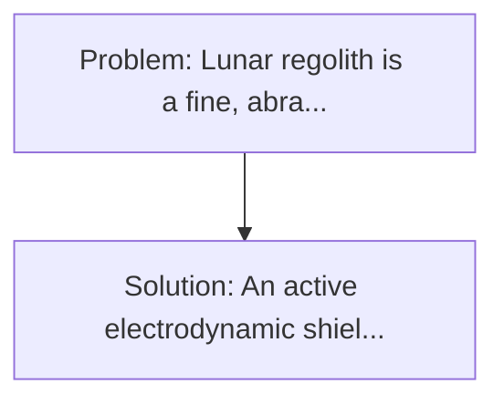
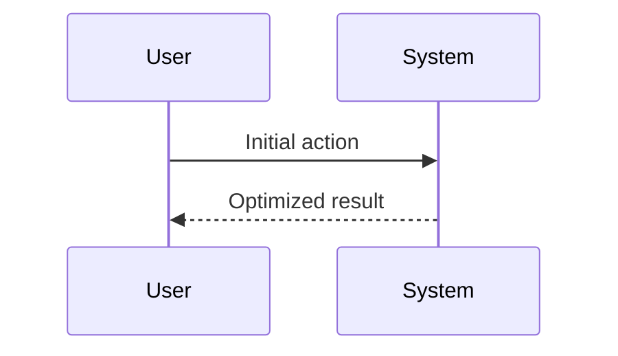

<!-- markdownlint-disable MD013 MD033 -->

[🇫🇷 Version Française](./README.fr.md)

# Lunar Dust Electrostatic Shield

> **Executive Summary:** An active electrodynamic shielding system. Lunar regolith is a fine, abrasive, highly electrostatically charged dust without atmospheric erosion (cut edges).

---

## 1. Visual Overview & Wow Effect

## 2. Contrarian Thesis (Peter Thiel Style)

**Popular Belief:** Generic software solutions can solve this.
**Hidden Truth:** It is a pure problem of material science and electromagnetism in the extreme environment (absolute vacuum, radiation, extreme thermal variations). No software can clean a striped lens or a seal that is fluctuated by regolith.

## 3. Problem & Target Market

- **Business Model:** B2B / B2G
- **Target Audience:** Space agencies (NASA Artemis, ESA), lunar rovers constructors, space habitat designers and lunar resource exploitation companies (ISRU).
- **Urgent Pain Point:** Lunar regolith is a fine, abrasive, highly electrostatically charged dust without atmospheric erosion (cut edges). It adheres to all surfaces, destroys space joints, opacifies solar panels, raizes rovers mechanics and penetrates into combinations, posing a toxic risk to astronauts. Classic brushes only make the static charge worse.

## 4. Technical Architecture & Infrastructure

## 5. Business Model & Financial Viability

| Metric                 | Value              |
| ---------------------- | ------------------ |
| Pricing Structure      | Custom Pricing     |
| 12-Month Target        | 100 customers      |
| Revenue Formula        | 100 \* 1000 = 100k |
| Estimated Gross Margin | 80%                |

## 6. Distribution Engine & Moat

- **Acquisition Strategy:** Direct B2B Sales
- **Moat (Defensibility):** It is a pure problem of material science and electromagnetism in the extreme environment (absolute vacuum, radiation, extreme thermal variations). No software can clean a striped lens or a seal that is fluctuated by regolith.

## 7. Detailed Evaluation Grid

| Criterion                   | VC Score (/100) | Market Score (/100) |
| --------------------------- | --------------- | ------------------- |
| Thesis & Monopoly / Urgency | -- / 25         | -- / 25             |
| Moat / LLM Immunity         | -- / 25         | -- / 25             |
| Scalability / UX Friction   | -- / 25         | -- / 25             |
| Unit Economics / ROI        | -- / 25         | -- / 25             |
| **TOTAL**                   | **-- / 100**    | **-- / 100**        |

> **VC Verdict:** Pending evaluation.

> **Market Verdict:** Pending evaluation.
