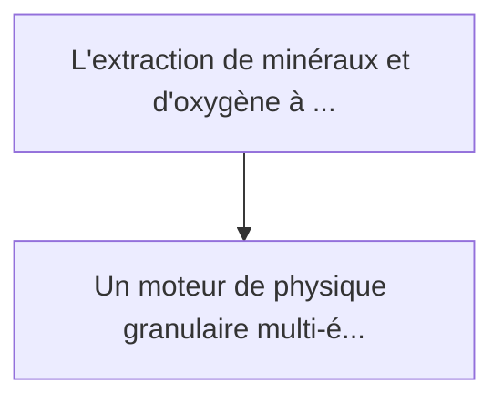
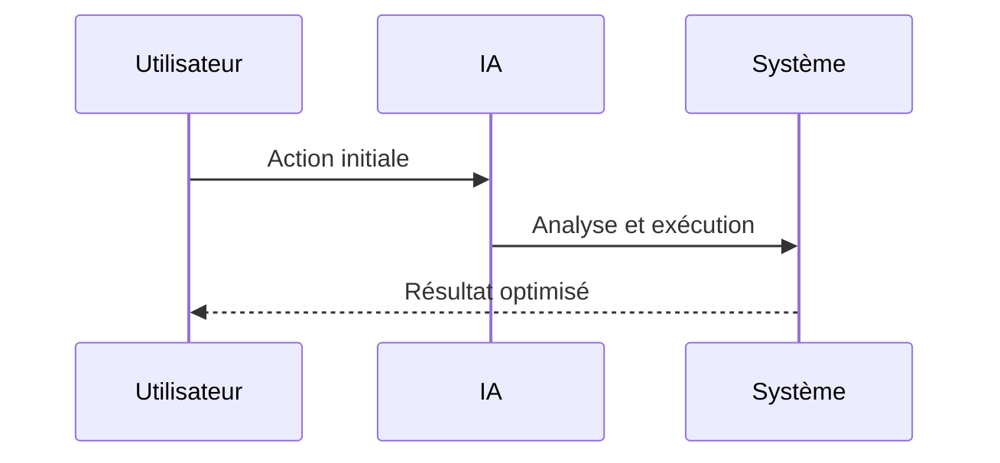

<!-- markdownlint-disable MD013 MD028 MD033 MD039 MD041 -->

[ 🇬🇧 English Version ](./README.md)

# Lunar Regolith Refinery Sim

> **Résumé exécutif :** Un moteur de physique granulaire multi-échelles (Discrete Element Method - DEM) couplé à des modèles thermochimiques fonctionnant sur GPU. Il simul...

---

## 1. Aperçu visuel & Effet Wahou

## 2. La thèse contrariante (Peter Thiel Style)

La croyance populaire : Les solutions génériques peuvent résoudre cela.
La vérité cachée : Les moteurs de jeu physique (Unity, Unreal) font de la physique approchée. Il faut ici une physique d'ingénierie absolue (calculée particule par particule) couplée à des équations d'état thermodynamiques qui n'existent pas dans les outils CAO standards.

## 3. Le problème & La cible

Modèle économique : B2B
Cible précise : Agences spatiales (NASA, ESA), startups minières spatiales, entreprises de construction extra-terrestre
La douleur urgente : L'extraction de minéraux et d'oxygène à partir du régolithe lunaire est essentielle pour l'exploration spatiale à long terme (ISRU - In-Situ Resource Utilization), mais les tests physiques coûtent des milliards (lancement de prototypes) et échouent souvent à cause du comportement imprévu de la poussière lunaire abrasive dans le vide et en faible gravité.

## 4. Architecture technique & Plomberie

## 5. Modèle économique & Viabilité financière

| Métrique                    | Valeur             |
| --------------------------- | ------------------ |
| Structure de prix           | Prix sur mesure    |
| Objectif 12 mois            | 100 clients        |
| Calcul du CA (Target 100k€) | 100 \* 1000 = 100k |
| Marge brute estimée         | 80%                |

## 6. Moteur de distribution & Fossé défensif (Moat)

Stratégie d'acquisition : Vente B2B directe
Moat (Barrière à l'entrée) : Les moteurs de jeu physique (Unity, Unreal) font de la physique approchée. Il faut ici une physique d'ingénierie absolue (calculée particule par particule) couplée à des équations d'état thermodynamiques qui n'existent pas dans les outils CAO standards.

## 7. Grille d'évaluation détaillée

| Critère                           | Score VC (/100) | Score Terrain (/100) |
| --------------------------------- | --------------- | -------------------- |
| Thèse & Monopole / Urgence        | -- / 25         | -- / 25              |
| Moat / Résistance aux LLM natifs  | -- / 25         | -- / 25              |
| Scalabilité / Friction d'adoption | -- / 25         | -- / 25              |
| Unit Economics / ROI direct       | -- / 25         | -- / 25              |
| **TOTAL**                         | **-- / 100**    | **-- / 100**         |

> **Verdict VC :** En attente d'évaluation.

> **Verdict Terrain :** En attente d'évaluation.
