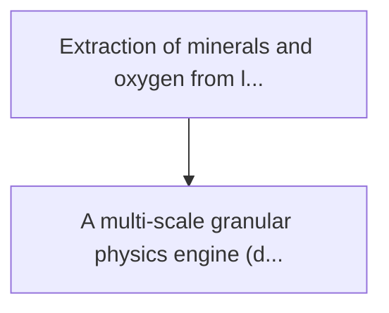
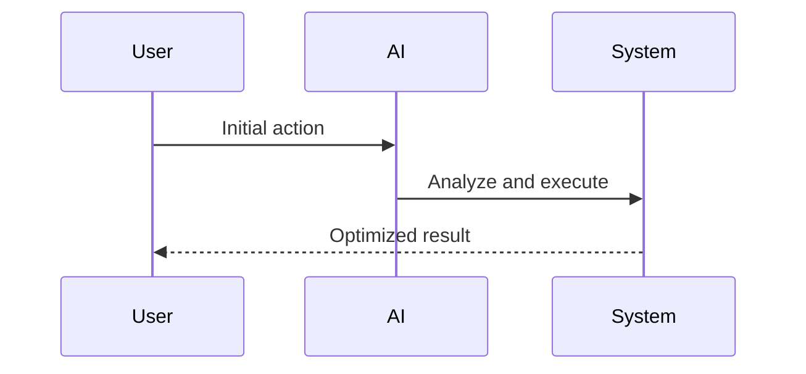

<!-- markdownlint-disable MD013 MD028 MD033 MD039 MD041 -->

[ 🇫🇷 Version Française ](./README.fr.md)

# Lunar regolith refinery sim

> **Executive Summary:** A multi-scale granular physics engine (discrete element method) coupled with thermochemical models running on gpu. he's simulating...

---

## 1. Visual Overview & Wow Effect

## 2. Contrarian Thesis (Peter Thiel Style)

Popular Belief: Generic solutions can solve this.
Hidden Truth: Physical game engines (unity, unreal) make physics approach. this requires an absolute engineering physics (calculated particle per particle) coupled with thermodynamic state equations that do not exist in standard cad tools.

## 3. Problem & Target Market

Business Model: B2B
Target Audience: Space agencies (nasa, esa), space mining startups, offshore construction companies
Urgent Pain Point: Extraction of minerals and oxygen from lunar regolith is essential for long-term space exploration (isru - in-situ resource utilization), but physical tests cost billions (prototype launches) and often fail due to the unforeseen behaviour of abrasive lunar dust in vacuum and in low gravity.

## 4. Technical Architecture & Infrastructure

## 5. Business Model & Financial Viability

| Metric                 | Value              |
| ---------------------- | ------------------ |
| Pricing Structure      | Custom Pricing     |
| 12-Month Target        | 100 customers      |
| Revenue Formula        | 100 \* 1000 = 100k |
| Estimated Gross Margin | 80%                |

## 6. Distribution Engine & Moat

Acquisition Strategy: Direct B2B Sales
Moat (Defensibility): Physical game engines (unity, unreal) make physics approach. this requires an absolute engineering physics (calculated particle per particle) coupled with thermodynamic state equations that do not exist in standard cad tools.

## 7. Detailed Evaluation Grid

| Criterion                   | VC Score (/100) | Market Score (/100) |
| --------------------------- | --------------- | ------------------- |
| Thesis & Monopoly / Urgency | -- / 25         | -- / 25             |
| Moat / LLM Immunity         | -- / 25         | -- / 25             |
| Scalability / UX Friction   | -- / 25         | -- / 25             |
| Unit Economics / ROI        | -- / 25         | -- / 25             |
| **TOTAL**                   | **-- / 100**    | **-- / 100**        |

> **VC Verdict:** Pending evaluation.

> **Market Verdict:** Pending evaluation.
