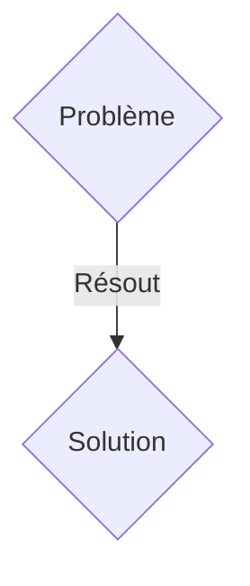
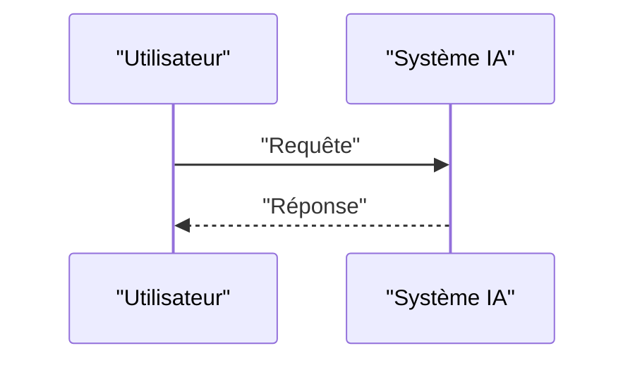

<!-- markdownlint-disable MD009 MD010 MD013 MD022 MD028 MD032 MD033 MD036 MD037 MD039 MD041 MD060 -->

[ 🇬🇧 English Version ](./README.md)

# M2M Bandwidth Broker

> **Résumé exécutif :** Une solution M2M ciblant Flottes de drones autonomes, véhicules autonomes, réseaux IoT industriels (VP of Operations, Fleet Managers). pour résoudre : Avec la prolifération d'agents IA embarqués fonctionnant en essaim, les réseaux de communication (5G, satellite) sont saturés par des échanges de données brutes, entraînant des latences qui paralysent la prise de décision collective en temps réel.

---

## 1. Aperçu visuel & Effet Wahou

## 2. La thèse contrariante (Peter Thiel Style)

- **La croyance populaire :** Les solutions génériques suffisent.
- **La vérité cachée :** Un protocole de marché décentralisé M2M opérant au niveau de la couche réseau (Layer 3/4) où les agents IA "enchérissent" dynamiquement pour la bande passante et le temps de calcul Edge, en compressant sémantiquement les informations critiques via des représentations latentes.

## 3. Le problème & La cible

- **Modèle économique :** M2M
- **Cible précise :** Flottes de drones autonomes, véhicules autonomes, réseaux IoT industriels (VP of Operations, Fleet Managers).
- **La douleur urgente :** Avec la prolifération d'agents IA embarqués fonctionnant en essaim, les réseaux de communication (5G, satellite) sont saturés par des échanges de données brutes, entraînant des latences qui paralysent la prise de décision collective en temps réel.

## 4. Architecture technique & Plomberie

Un protocole de marché décentralisé M2M opérant au niveau de la couche réseau (Layer 3/4) où les agents IA "enchérissent" dynamiquement pour la bande passante et le temps de calcul Edge, en compressant sémantiquement les informations critiques via des représentations latentes.

## 5. Modèle économique & Viabilité financière

| Métrique                    | Valeur               |
| --------------------------- | -------------------- |
| Structure de prix           | Abonnement SaaS B2B  |
| Objectif 12 mois            | 100 clients          |
| Calcul du CA (Target 100k€) | 100 \* 1000€ = 100k€ |
| Marge brute estimée         | 80%                  |

## 6. Moteur de distribution & Fossé défensif (Moat)

- **Stratégie d'acquisition :** Vente directe et partenariats stratégiques.
- **Moat (Barrière à l'entrée) :** Les API REST ou MQTT sont trop bavards et centralisés pour des flottes déconnectées (Edge). Nécessite une orchestration de réseau ad-hoc, du peer-to-peer, et une tarification algorithmique à la milliseconde que le cloud ne peut gérer.

## 7. Grille d'évaluation détaillée

| Critère                           | Score VC (/100) | Score Terrain (/100) |
| --------------------------------- | --------------- | -------------------- |
| Thèse & Monopole / Urgence        | -- / 25         | -- / 25              |
| Moat / Résistance aux LLM natifs  | -- / 25         | -- / 25              |
| Scalabilité / Friction d'adoption | -- / 25         | -- / 25              |
| Unit Economics / ROI direct       | -- / 25         | -- / 25              |
| TOTAL                             | -- / 100        | -- / 100             |

> **Verdict VC :** En attente d'évaluation.
> **Verdict Terrain :** En attente d'évaluation.
