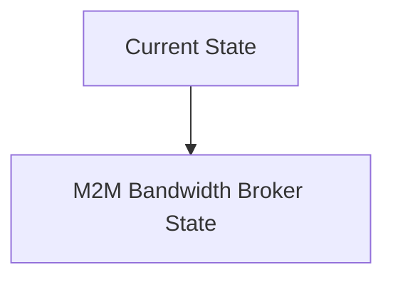
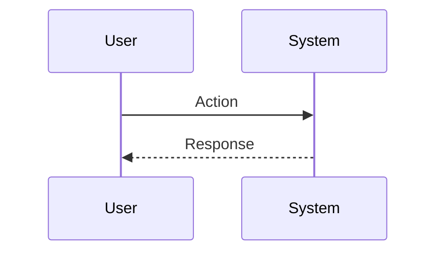

<!-- markdownlint-disable MD009 MD010 MD013 MD022 MD028 MD032 MD033 MD034 MD036 MD037 MD039 MD041 MD060 -->

[ 🇫🇷 Version Française ](./README.fr.md)

# M2M Bandwidth Broker

> **Executive Summary:** A decentralized M2M market protocol operating at the network layer (Layer 3/4) where AI agents dynamically “bid” for bandwidth and Edge computing time, semantically compressing critical information via latent representations.

---

## 1. Visual Overview & Wow Effect

## 2. Contrarian Thesis (Peter Thiel Style)

**Popular Belief:** General AI solutions can solve this problem.

**Hidden Truth:** REST or MQTT APIs are too verbose and centralized for disconnected fleets (Edge). Requires ad-hoc network orchestration, peer-to-peer, and millisecond algorithmic pricing that the cloud cannot handle.

## 3. Problem & Target Market

**Business Model:** M2M

**Target Audience:** Fleets of autonomous drones, autonomous vehicles, industrial IoT networks (VP ​​of Operations, Fleet Managers).

**Urgent Pain Point:** With the proliferation of embedded AI agents operating in swarms, communication networks (5G, satellite) are saturated by raw data exchanges, leading to latencies that paralyze collective decision-making in real time.

## 4. Technical Architecture & Infrastructure

## 5. Business Model & Financial Viability

| Metric                 | Value                           |
| ---------------------- | ------------------------------- |
| Pricing Structure      | SaaS subscription               |
| 12-Month Target        | 10 customers                    |
| Revenue Formula        | 10 clients \* 10k€/year = 100k€ |
| Estimated Gross Margin | 80%                             |

## 6. Distribution Engine & Moat

**Acquisition Strategy:** B2B direct sales

**Moat (Defensibility):** Requires a critical mass of machines adopting the protocol for the market to be liquid, dependence on embedded network hardware, adoption by hardware manufacturers.

## 7. Detailed Evaluation Grid

| Criterion                   | VC Score (/100) | Market Score (/100) |
| --------------------------- | --------------- | ------------------- |
| Thesis & Monopoly / Urgency | -- / 25         | -- / 25             |
| Moat / LLM Immunity         | -- / 25         | -- / 25             |
| Scalability / UX Friction   | -- / 25         | -- / 25             |
| Unit Economics / ROI        | -- / 25         | -- / 25             |
| **TOTAL**                   | **-- / 100**    | **-- / 100**        |

> **VC Verdict:** Pending evaluation.

> **Market Verdict:** Pending evaluation.
