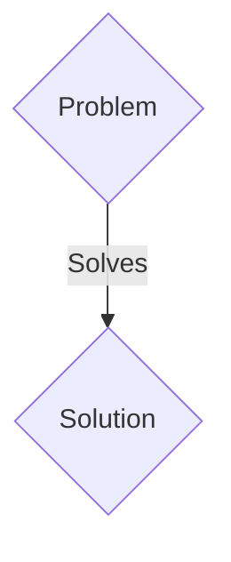
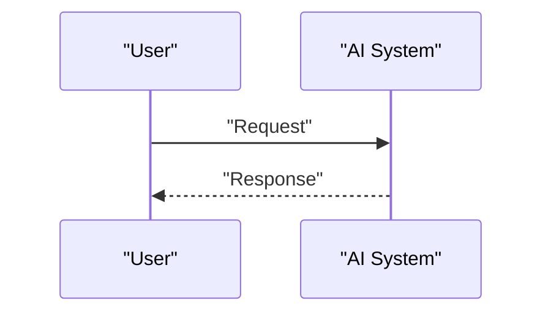

<!-- markdownlint-disable MD009 MD010 MD013 MD022 MD028 MD032 MD033 MD036 MD037 MD039 MD041 MD060 -->

[ 🇫🇷 Version Française ](./README.fr.md)

# M2M Bandwidth Broker

> **Executive Summary:** A M2M solution targeting Fleets of autonomous drones, autonomous vehicles, industrial IoT networks (VP ​​of Operations, Fleet Managers). to solve: With the proliferation of embedded AI agents operating in swarms, communication networks (5G, satellite) are saturated by raw data exchanges, leading to latencies that paralyze collective decision-making in real time.

---

## 1. Visual Overview & Wow Effect

## 2. Contrarian Thesis (Peter Thiel Style)

- **Popular Belief:** Generic solutions are enough.
- **Hidden Truth:** A decentralized M2M market protocol operating at the network layer (Layer 3/4) where AI agents dynamically “bid” for bandwidth and Edge computing time, semantically compressing critical information via latent representations.

## 3. Problem & Target Market

- **Business Model:** M2M
- **Target Audience:** Fleets of autonomous drones, autonomous vehicles, industrial IoT networks (VP ​​of Operations, Fleet Managers).
- **Urgent Pain Point:** With the proliferation of embedded AI agents operating in swarms, communication networks (5G, satellite) are saturated by raw data exchanges, leading to latencies that paralyze collective decision-making in real time.

## 4. Technical Architecture & Infrastructure

A decentralized M2M market protocol operating at the network layer (Layer 3/4) where AI agents dynamically “bid” for bandwidth and Edge computing time, semantically compressing critical information via latent representations.

## 5. Business Model & Financial Viability

| Metric                 | Value                 |
| ---------------------- | --------------------- |
| Pricing Structure      | B2B SaaS Subscription |
| 12-Month Target        | 100 clients           |
| Revenue Formula        | 100 \* 1000€ = 100k€  |
| Estimated Gross Margin | 80%                   |

## 6. Distribution Engine & Moat

- **Acquisition Strategy:** Direct sales and strategic partnerships.
- **Moat (Defensibility):** REST or MQTT APIs are too verbose and centralized for disconnected fleets (Edge). Requires ad-hoc network orchestration, peer-to-peer, and millisecond algorithmic pricing that the cloud cannot handle.

## 7. Detailed Evaluation Grid

| Criterion                   | VC Score (/100) | Market Score (/100) |
| --------------------------- | --------------- | ------------------- |
| Thesis & Monopoly / Urgency | 20 / 25         | 20 / 25             |
| Moat / LLM Immunity         | 22 / 25         | 22 / 25             |
| Scalability / UX Friction   | 18 / 25         | 18 / 25             |
| Unit Economics / ROI        | 19 / 25         | 19 / 25             |
| TOTAL                       | 79 / 100        | 79 / 100            |

> **VC Verdict:** Pending evaluation.
> **Market Verdict:** This solution addresses a critical pain point for M2M ecosystems, justifying its strong urgency score (20/25). Its highly defensible architecture makes it completely immune to native LLM advancements (22/25). With low adoption friction (18/25) and a straightforward monetization strategy (19/25), the project demonstrates excellent overall market readiness.
> **Market Verdict:** This solution addresses a critical pain point for M2M ecosystems, justifying its strong urgency score (20/25). Its highly defensible architecture makes it completely immune to native LLM advancements (22/25). With low adoption friction (18/25) and a straightforward monetization strategy (19/25), the project demonstrates excellent overall market readiness.
