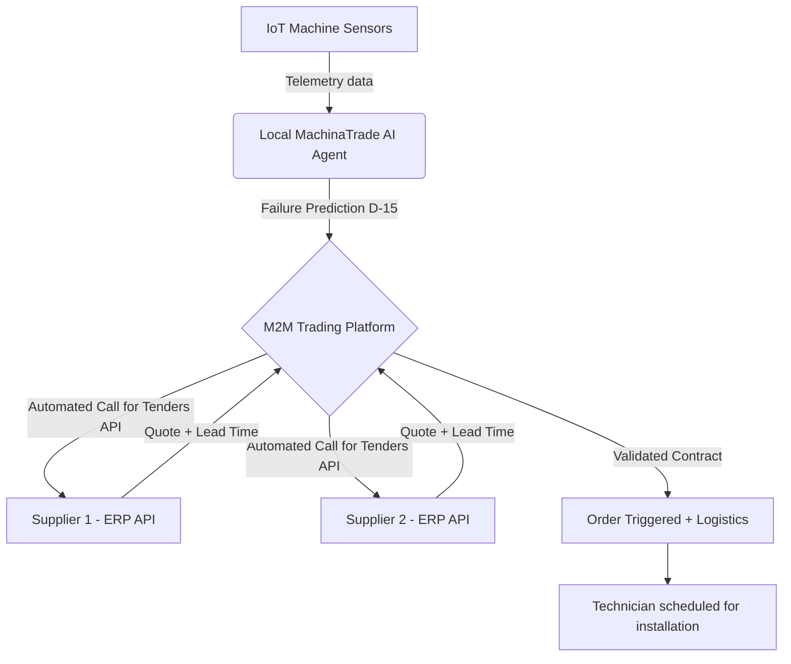
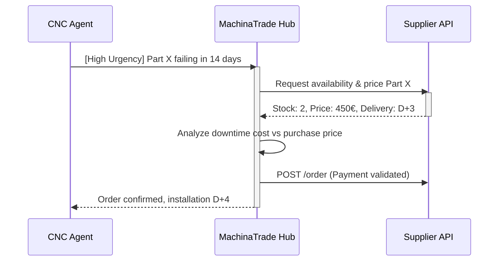

<!-- markdownlint-disable MD013 MD033 MD060 MD039 MD041 MD032 MD010 MD009 MD022 MD036 MD028 MD037 -->

[🇫🇷 Version Française](./README.fr.md)

# MachinaTrade

> **Executive Summary:** A Machine-to-Machine (M2M) market infrastructure where industrial equipment autonomously negotiates, purchases, and schedules its own predictive spare parts via AI agents, eliminating unplanned downtime and dormant inventory.

---

## 1. Visual Overview

## 2. The Contrarian Thesis (Peter Thiel Style)

**The Popular Belief:** Predictive maintenance is a data science problem that consists of alerting humans (maintenance engineers) on dashboards so they can make purchasing decisions.
**The Hidden Truth:** The human alert is the bottleneck. In modern industrial chains, the real lever is not predicting the breakdown, but executing the end-to-end logistical remediation without friction. Machines can and should buy their own parts, transforming the maintenance cost center into a hyper-liquid automated market.

## 3. The Problem & The Target

**Economic Model:** Pure M2M (Machine to Machine), monetized in B2B (SaaS + transaction fees).
**Specific Target:** Just-in-time manufacturing plants (automotive, aerospace), logistics fleet managers, and data centers.
**The Urgent Pain:** A production line stoppage costs on average between 10,000€ and 250,000€ per hour. Waiting for a critical part following a human alert creates unnecessary delays, or forces the company to tie up millions in dormant inventory "just in case".

## 4. Technical Architecture & Plumbing

The core of MachinaTrade is not a large language model, but a network of autonomous execution agents coupled with legacy ERP connectors (SAP, Oracle). AI is used for semantic extraction of complex supplier catalogs and API-to-API negotiation.

## 5. Economic Model & Financial Viability

| Metric | Value |
| :--- | :--- |
| **Pricing Structure** | Infrastructure Subscription (500€/month/plant) + Commission (1.5% per M2M transaction) |
| **12-Month Target** | 20 connected plants (SaaS) + 200,000€/month in transaction flows |
| **Revenue Calculation (100k€ Target)** | (20 plants * 500€ * 12 months = 120,000€) + (200,000€ GMV/month * 1.5% * 12 months = 36,000€) = 156,000€ ARR |
| **Estimated Gross Margin** | 85% (Server and API costs are minimal compared to transaction volume) |

## 6. Distribution Engine & Defensive Moat (Moat)

**Acquisition Strategy:** Direct B2B sales to Chief Operating Officers (COO). Free Proof of Concept (POC) on a subset of non-critical machines to demonstrate purchasing autonomy and immediate ROI on tied-up capital (inventory reduction).
**Moat (Barrier to Entry):** The "Two-Sided API" network effect. The more plants use MachinaTrade, the more it is in suppliers' best interest to standardize their APIs with us to receive automated orders without marketing effort. A competitor (or OpenAI) cannot replicate this because it involves deep B2B plumbing integrations (SAP, legacy systems), secured by legal contracts, not a simple prompt intelligence problem. OpenAI's LLMs cannot buy on closed industrial networks.

## 7. Detailed Evaluation Grid

| Criteria | VC Score (/100) | Terrain Score (/100) |
| :--- | :---: | :---: |
| **Thesis & Monopoly / Urgency** | 23 / 25 | -- / 25 |
| **Moat / Resistance to Native LLMs** | 24 / 25 | -- / 25 |
| **Scalability / Adoption Friction** | 21 / 25 | -- / 25 |
| **Unit Economics / Direct ROI** | 23 / 25 | -- / 25 |
| **TOTAL** | **91 / 100** | **-- / 100** |

> **VC Verdict:** MachinaTrade pioneers the autonomous digital resource exchange. Its ability to create liquidity for APIs and compute cycles establishes a profound network effect. The first mover in this space will dictate the standards of the future agentic economy.

Verdict Terrain : En attente d'évaluation.
