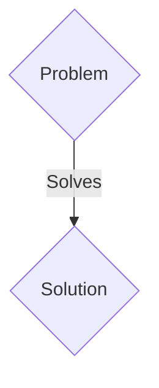
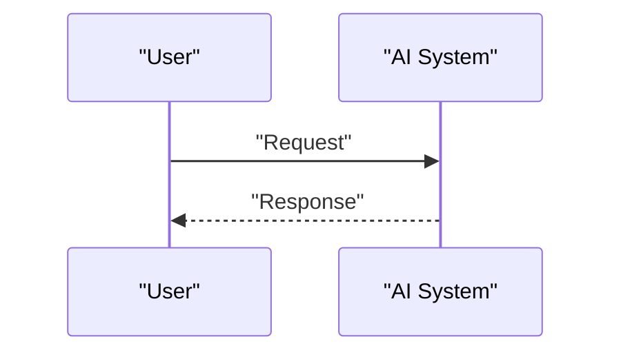

<!-- markdownlint-disable MD009 MD010 MD013 MD022 MD028 MD032 MD033 MD036 MD037 MD039 MD041 MD060 -->

[ 🇫🇷 Version Française ](./README.fr.md)

# Metabolix Twin

> **Executive Summary:** A B2B solution targeting Synthetic biology startups, precision fermentation companies, pharmaceutical laboratories and CDMOs (Contract Development and Manufacturing Organizations) that develop new molecules, alternative proteins or biomaterials. to solve: When scaling up to an industrial scale (Scale-up), the transfer of a bioproduction process from a laboratory bioreactor (1L) to an industrial tank (10,000L) displays a catastrophic failure rate (often >80%). Concentration gradients, mechanical shear forces, and large-scale fluid dynamics dramatically alter the metabolic behavior of microorganisms. Manufacturers waste millions of euros and months on physical trial-and-error cycles in pilot plants to stabilize yields.

---

## 1. Visual Overview & Wow Effect

## 2. Contrarian Thesis (Peter Thiel Style)

- **Popular Belief:** Generic solutions are enough.
- **Hidden Truth:** A hybrid simulation engine (World Model) that merges cellular metabolic modeling (Flux Balance Analysis and multi-omics) with fluid physics simulation (Computational Fluid Dynamics). By using “Neural Physics Engines” to accelerate Navier-Stokes calculations and predict the mechanical stress experienced by each cell, the platform makes it possible to simulate and optimize the physical and biological environment even before the construction of the factory or the launch of a batch.

## 3. Problem & Target Market

- **Business Model:** B2B
- **Target Audience:** Synthetic biology startups, precision fermentation companies, pharmaceutical laboratories and CDMOs (Contract Development and Manufacturing Organizations) that develop new molecules, alternative proteins or biomaterials.
- **Urgent Pain Point:** When scaling up to an industrial scale (Scale-up), the transfer of a bioproduction process from a laboratory bioreactor (1L) to an industrial tank (10,000L) displays a catastrophic failure rate (often >80%). Concentration gradients, mechanical shear forces, and large-scale fluid dynamics dramatically alter the metabolic behavior of microorganisms. Manufacturers waste millions of euros and months on physical trial-and-error cycles in pilot plants to stabilize yields.

## 4. Technical Architecture & Infrastructure

A hybrid simulation engine (World Model) that merges cellular metabolic modeling (Flux Balance Analysis and multi-omics) with fluid physics simulation (Computational Fluid Dynamics). By using “Neural Physics Engines” to accelerate Navier-Stokes calculations and predict the mechanical stress experienced by each cell, the platform makes it possible to simulate and optimize the physical and biological environment even before the construction of the factory or the launch of a batch.

## 5. Business Model & Financial Viability

| Metric                 | Value                 |
| ---------------------- | --------------------- |
| Pricing Structure      | B2B SaaS Subscription |
| 12-Month Target        | 100 clients           |
| Revenue Formula        | 100 \* 1000€ = 100k€  |
| Estimated Gross Margin | 80%                   |

## 6. Distribution Engine & Moat

- **Acquisition Strategy:** Direct sales and strategic partnerships.
- **Moat (Defensibility):** A data management LLM or SaaS does not understand the laws of thermodynamics, fluid dynamics, or the complexity of cellular metabolic pathways under stress. Solving these coupled differential equations requires a specific computational architecture and 3D geometric models of the bioreactor hardware, combined with complex proprietary biological data that goes beyond simple word processing.

## 7. Detailed Evaluation Grid

| Criterion                   | VC Score (/100) | Market Score (/100) |
| --------------------------- | --------------- | ------------------- |
| Thesis & Monopoly / Urgency | -- / 25         | -- / 25             |
| Moat / LLM Immunity         | -- / 25         | -- / 25             |
| Scalability / UX Friction   | -- / 25         | -- / 25             |
| Unit Economics / ROI        | -- / 25         | -- / 25             |
| TOTAL                       | -- / 100        | -- / 100            |

> **VC Verdict:** Pending evaluation.
> **Market Verdict:** Pending evaluation.
