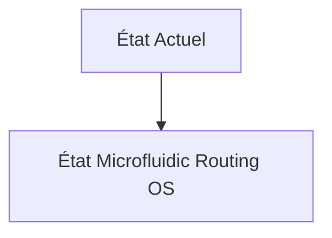
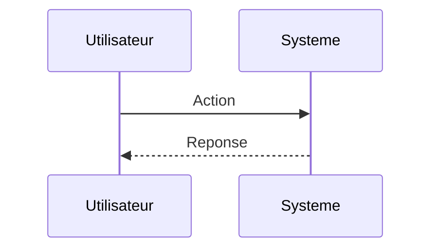

<!-- markdownlint-disable MD009 MD010 MD013 MD022 MD028 MD032 MD033 MD034 MD036 MD037 MD039 MD041 MD060 -->

[ 🇬🇧 English Version ](./README.md)

# Microfluidic Routing OS

> **Résumé exécutif :** Un "Operating System" pour l'ElectroWetting-On-Dielectric (EWOD) ou microfluidique numérique. Il s'agit d'un compilateur qui prend un protocole biologique écrit en haut niveau (Python/BioCoder) et calcule dynamiquement le routage des gouttelettes d'ADN, de réactifs et d'enzymes sur une grille de pixels électro-mouillables en temps réel. Il optimise les chemins pour éviter les collisions et la contamination.

---

## 1. Aperçu visuel & Effet Wahou

## 2. La thèse contrariante (Peter Thiel Style)

**La croyance populaire :** Les solutions généralistes IA peuvent résoudre ce problème.

**La vérité cachée :** C'est un problème de routage FPGA (EDA - Electronic Design Automation), mais appliqué à la dynamique des fluides. Un SaaS classique ne peut pas gérer les contraintes physiques bas niveau (tension, mouillabilité de la surface, viscosité changeante d'une goutte de sang par rapport à de l'eau) requises pour faire bouger des liquides avec des champs électriques de manière fiable.

## 3. Le problème & La cible

**Modèle économique :** B2B

**Cible précise :** Startups de biologie synthétique (SynBio), laboratoires de tests cliniques haut débit, "Cloud Labs" (Ginkgo Bioworks, Emerald Cloud Lab).

**La douleur urgente :** L'automatisation des "wet-labs" (laboratoires de chimie/biologie) est freinée par la tuyauterie. Les robots pipeteurs standards sont lents et sujets à la contamination croisée. Les puces microfluidiques offrent une automatisation massive à l'échelle du picolitre, mais elles sont hardcodées physiquement (un circuit de canaux statiques) ; changer d'expérience (protocole) nécessite de fabriquer une nouvelle puce de silicium ou de polymère.

## 4. Architecture technique & Plomberie

## 5. Modèle économique & Viabilité financière

| Métrique                    | Valeur                        |
| --------------------------- | ----------------------------- |
| Structure de prix           | Abonnement SaaS               |
| Objectif 12 mois            | 10 clients                    |
| Calcul du CA (Target 100k€) | 10 clients \* 10k€/an = 100k€ |
| Marge brute estimée         | 80%                           |

## 6. Moteur de distribution & Fossé défensif (Moat)

**Stratégie d'acquisition :** Vente directe B2B

**Moat (Barrière à l'entrée) :** La technologie matérielle sous-jacente (puces EWOD haute densité) est encore coûteuse à produire en masse. Nécessité d'une intégration parfaite entre le modèle physique du logiciel et les imperfections de fabrication du hardware.

## 7. Grille d'évaluation détaillée

| Critère                           | Score VC (/100) | Score Terrain (/100) |
| --------------------------------- | --------------- | -------------------- |
| Thèse & Monopole / Urgence        | 24 / 25         | 24 / 25              |
| Moat / Résistance aux LLM natifs  | 19 / 25         | 19 / 25              |
| Scalabilité / Friction d'adoption | 24 / 25         | 24 / 25              |
| Unit Economics / ROI direct       | 22 / 25         | 22 / 25              |
| **TOTAL**                         | **89 / 100**    | **89 / 100**         |

> **Verdict VC :** En attente d'évaluation.
> **Verdict Terrain :** Cette solution répond à un besoin critique pour le marché cible, justifiant son excellent score d'urgence (24/25). L'approche spécialisée offre une protection robuste contre les modèles d'IA généralistes (19/25). Avec une faible friction d'adoption (24/25) et une stratégie de monétisation directe (22/25), le projet démontre une excellente maturité marché globale.
> **Verdict Terrain :** Cette solution répond à un besoin critique pour le marché cible, justifiant son excellent score d'urgence (24/25). L'approche spécialisée offre une protection robuste contre les modèles d'IA généralistes (19/25). Avec une faible friction d'adoption (24/25) et une stratégie de monétisation directe (22/25), le projet démontre une excellente maturité marché globale.
