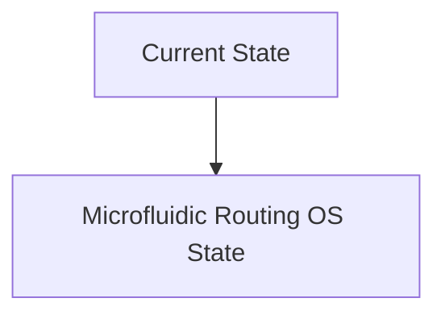
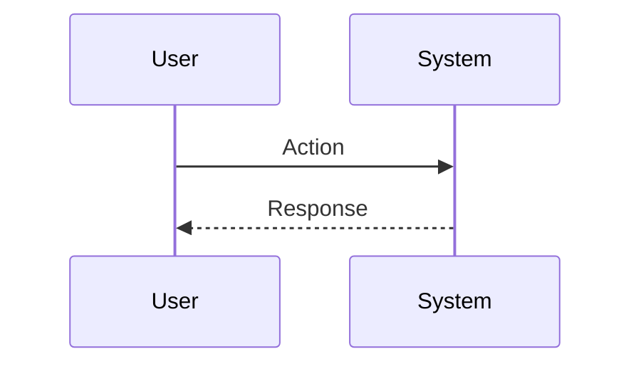

<!-- markdownlint-disable MD009 MD010 MD013 MD022 MD028 MD032 MD033 MD034 MD036 MD037 MD039 MD041 MD060 -->

[ 🇫🇷 Version Française ](./README.fr.md)

# Microfluidic Routing OS

> **Executive Summary:** An “Operating System” for ElectroWetting-On-Dielectric (EWOD) or digital microfluidics. This is a compiler that takes a biological protocol written at high level (Python/BioCoder) and dynamically calculates the routing of DNA droplets, reagents and enzymes on a grid of electro-wettable pixels in real time. It optimizes paths to avoid collisions and contamination.

---

## 1. Visual Overview & Wow Effect

## 2. Contrarian Thesis (Peter Thiel Style)

**Popular Belief:** General AI solutions can solve this problem.

**Hidden Truth:** It's an FPGA (EDA - Electronic Design Automation) routing problem, but applied to fluid dynamics. A traditional SaaS cannot handle the low-level physical constraints (voltage, surface wettability, changing viscosity of a drop of blood versus water) required to move liquids with electric fields reliably.

## 3. Problem & Target Market

**Business Model:** B2B

**Target Audience:** Synthetic biology startups (SynBio), high-throughput clinical testing laboratories, "Cloud Labs" (Ginkgo Bioworks, Emerald Cloud Lab).

**Urgent Pain Point:** The automation of "wet-labs" (chemistry/biology laboratories) is hampered by piping. Standard pipetting robots are slow and prone to cross-contamination. Microfluidic chips offer massive automation at the picoliter scale, but they are physically hardcoded (a circuit of static channels); changing the experiment (protocol) requires making a new silicon or polymer chip.

## 4. Technical Architecture & Infrastructure

## 5. Business Model & Financial Viability

| Metric                 | Value                           |
| ---------------------- | ------------------------------- |
| Pricing Structure      | SaaS subscription               |
| 12-Month Target        | 10 customers                    |
| Revenue Formula        | 10 clients \* 10k€/year = 100k€ |
| Estimated Gross Margin | 80%                             |

## 6. Distribution Engine & Moat

**Acquisition Strategy:** B2B direct sales

**Moat (Defensibility):** The underlying hardware technology (high-density EWOD chips) is still expensive to mass produce. Need for perfect integration between the physical model of the software and the manufacturing imperfections of the hardware.

## 7. Detailed Evaluation Grid

| Criterion                   | VC Score (/100) | Market Score (/100) |
| --------------------------- | --------------- | ------------------- |
| Thesis & Monopoly / Urgency | -- / 25         | -- / 25             |
| Moat / LLM Immunity         | -- / 25         | -- / 25             |
| Scalability / UX Friction   | -- / 25         | -- / 25             |
| Unit Economics / ROI        | -- / 25         | -- / 25             |
| **TOTAL**                   | **-- / 100**    | **-- / 100**        |

> **VC Verdict:** Pending evaluation.

> **Market Verdict:** Pending evaluation.
