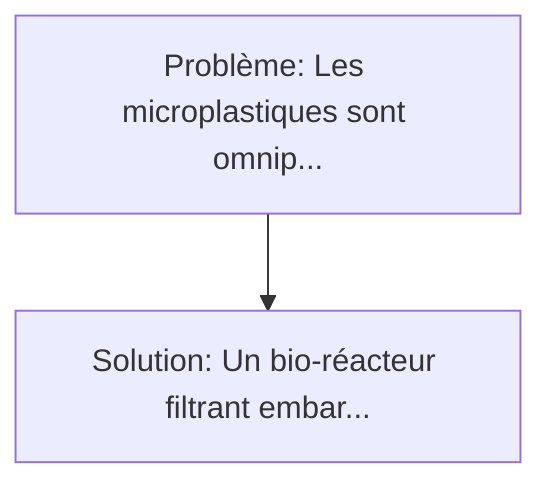
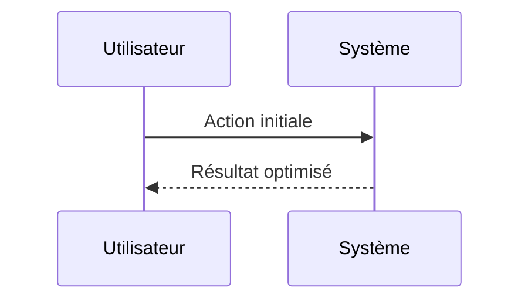

<!-- markdownlint-disable MD013 MD033 -->

[🇬🇧 English Version](./README.md)

# Filtre Enzymatique de Microplastiques (Microplastic Enzyme Filter)

> **Résumé exécutif :** Un bio-réacteur filtrant embarquant des biofilms bactériens génétiquement modifiés sécrétant des enzymes extrémophiles (variantes de PETase/MHETase) conçues pour dégrader activement et en continu les nanoplastiques au niveau moléculaire au fur et à mesure que l'eau coule, transformant le plastique en monomères inoffensifs. Les microplastiques sont omniprésents dans l'eau potable et sont bioaccumulatifs (ils traversent la barrière hémato-encéphalique humaine).

---

## 1. Aperçu visuel & Effet Wahou

## 2. La thèse contrariante (Peter Thiel Style)

**La croyance populaire :** Les solutions logicielles seules peuvent résoudre ce problème.
**La vérité cachée :** C'est de la biologie synthétique (SynBio). Il faut concevoir la séquence ADN de l'enzyme par IA générative, puis la synthétiser en wet-lab, l'intégrer dans une bactérie résiliente, et concevoir la membrane matérielle du réacteur.

## 3. Le problème & La cible

- **Modèle économique :** B2B
- **Cible précise :** Usines de traitement des eaux usées municipales, fabricants de machines à laver industrielles, et usines de dessalement.
- **La douleur urgente :** Les microplastiques sont omniprésents dans l'eau potable et sont bioaccumulatifs (ils traversent la barrière hémato-encéphalique humaine). Les filtres mécaniques actuels (osmose inverse, charbon) ne peuvent pas capturer les nanoplastiques en dessous d'une certaine taille sans se boucher instantanément ou consommer une pression énergétique monstrueuse.

## 4. Architecture technique & Plomberie

## 5. Modèle économique & Viabilité financière

| Métrique                    | Valeur             |
| --------------------------- | ------------------ |
| Structure de prix           | Custom Pricing     |
| Objectif 12 mois            | 100 clients        |
| Calcul du CA (Target 100k€) | 100 \* 1000 = 100k |
| Marge brute estimée         | 80%                |

## 6. Moteur de distribution & Fossé défensif (Moat)

- **Stratégie d'acquisition :** Ventes B2B directes
- **Moat (Barrière à l'entrée) :** C'est de la biologie synthétique (SynBio). Il faut concevoir la séquence ADN de l'enzyme par IA générative, puis la synthétiser en wet-lab, l'intégrer dans une bactérie résiliente, et concevoir la membrane matérielle du réacteur.

## 7. Grille d'évaluation détaillée

| Critère                           | Score VC (/100) | Score Terrain (/100) |
| --------------------------------- | --------------- | -------------------- |
| Thèse & Monopole / Urgence        | -- / 25         | -- / 25              |
| Moat / Résistance aux LLM natifs  | -- / 25         | -- / 25              |
| Scalabilité / Friction d'adoption | -- / 25         | -- / 25              |
| Unit Economics / ROI direct       | -- / 25         | -- / 25              |
| **TOTAL**                         | **-- / 100**    | **-- / 100**         |

> **Verdict VC :** En attente d'évaluation.

> **Verdict Terrain :** En attente d'évaluation.
