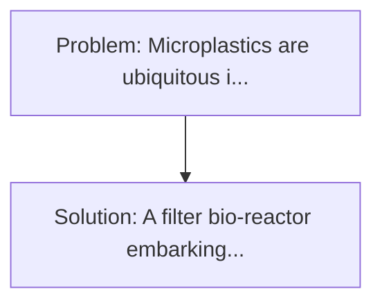
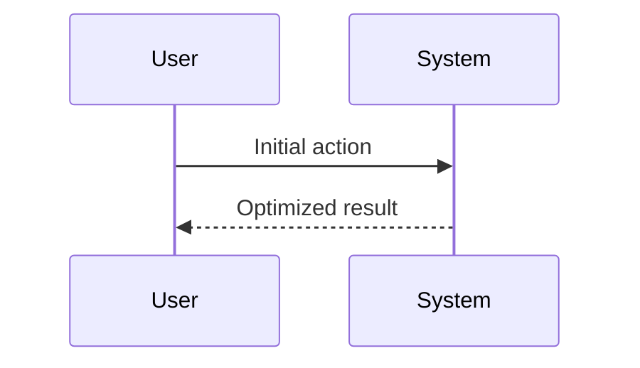

<!-- markdownlint-disable MD013 MD033 -->

[🇫🇷 Version Française](./README.fr.md)

# Microplastic Enzymatic Filter (Microplastic Enzyme Filter)

> **Executive Summary:** A filter bio-reactor embarking genetically modified bacterial biofilms secreting extremophile enzymes (PETase/MHETase variants) designed to actively and continuously degrade nanoplastics at the molecular level as water flows, transforming plastic into harmless monomers. Microplastics are ubiquitous in drinking water and bioaccumulative (they cross the human blood-brain barrier).

---

## 1. Visual Overview & Wow Effect

## 2. Contrarian Thesis (Peter Thiel Style)

**Popular Belief:** Generic software solutions can solve this.
**Hidden Truth:** It's synthetic biology (SynBio). The DNA sequence of the enzyme should be designed by generative AI, synthesized into wet-lab, incorporated into a resilient bacterium, and designed the physical membrane of the reactor.

## 3. Problem & Target Market

- **Business Model:** B2B
- **Target Audience:** Municipal wastewater treatment plants, industrial washing machine manufacturers, and desalination plants.
- **Urgent Pain Point:** Microplastics are ubiquitous in drinking water and bioaccumulative (they cross the human blood-brain barrier). Current mechanical filters (inverse osmosis, coal) cannot capture nanoplastics below a certain size without instantly plugging in or consuming monstrous energy pressure.

## 4. Technical Architecture & Infrastructure

## 5. Business Model & Financial Viability

| Metric                 | Value              |
| ---------------------- | ------------------ |
| Pricing Structure      | Custom Pricing     |
| 12-Month Target        | 100 customers      |
| Revenue Formula        | 100 \* 1000 = 100k |
| Estimated Gross Margin | 80%                |

## 6. Distribution Engine & Moat

- **Acquisition Strategy:** Direct B2B Sales
- **Moat (Defensibility):** It's synthetic biology (SynBio). The DNA sequence of the enzyme should be designed by generative AI, synthesized into wet-lab, incorporated into a resilient bacterium, and designed the physical membrane of the reactor.

## 7. Detailed Evaluation Grid

| Criterion                   | VC Score (/100) | Market Score (/100) |
| --------------------------- | --------------- | ------------------- |
| Thesis & Monopoly / Urgency | -- / 25         | -- / 25             |
| Moat / LLM Immunity         | -- / 25         | -- / 25             |
| Scalability / UX Friction   | -- / 25         | -- / 25             |
| Unit Economics / ROI        | -- / 25         | -- / 25             |
| **TOTAL**                   | **-- / 100**    | **-- / 100**        |

> **VC Verdict:** Pending evaluation.

> **Market Verdict:** Pending evaluation.
