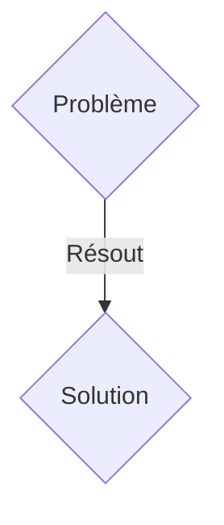
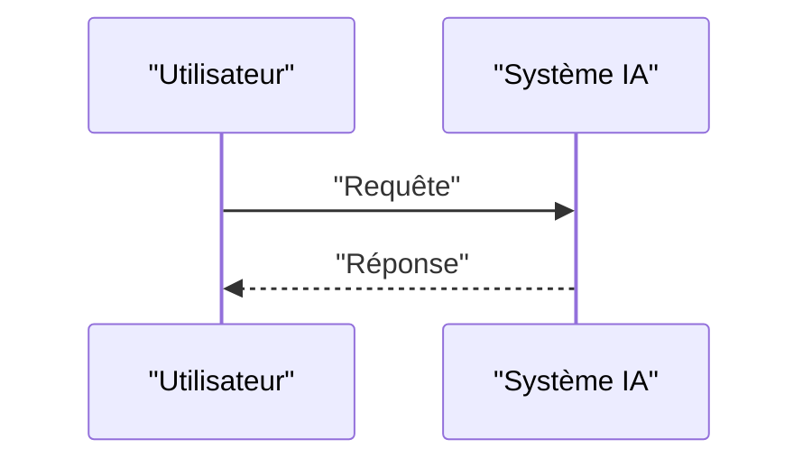

<!-- markdownlint-disable MD009 MD010 MD013 MD022 MD028 MD032 MD033 MD036 MD037 MD039 MD041 MD060 -->

[ 🇬🇧 English Version ](./README.md)

# Model Weight Provenance

> **Résumé exécutif :** Une solution B2B ciblant Plateformes cloud (AWS, Azure), fournisseurs de modèles (OpenAI, Anthropic), entreprises d'IA critique (santé, défense, finance). pour résoudre : L'attaque par "Model Poisoning" ou l'altération subreptice des poids (weights) d'un modèle open-source (ex: Llama). Si un attaquant modifie subtilement un checkpoint de modèle diffusé sur Hugging Face pour introduire une backdoor indétectable, les entreprises téléchargeant et déployant ce modèle héritent d'une vulnérabilité critique impossible à auditer via du code source.

---

## 1. Aperçu visuel & Effet Wahou

## 2. La thèse contrariante (Peter Thiel Style)

- **La croyance populaire :** Les solutions génériques suffisent.
- **La vérité cachée :** Un système de traçabilité cryptographique et d'analyse de gradient de bout en bout pour les modèles d'apprentissage profond. Il combine le hachage cryptographique des tenseurs de poids à chaque étape de l'entraînement, des preuves à divulgation nulle de connaissance (Zero-Knowledge Proofs - ZKP) pour attester du dataset utilisé, et une analyse topologique des réseaux de neurones pour détecter les anomalies de poids post-téléchargement.

## 3. Le problème & La cible

- **Modèle économique :** B2B
- **Cible précise :** Plateformes cloud (AWS, Azure), fournisseurs de modèles (OpenAI, Anthropic), entreprises d'IA critique (santé, défense, finance).
- **La douleur urgente :** L'attaque par "Model Poisoning" ou l'altération subreptice des poids (weights) d'un modèle open-source (ex: Llama). Si un attaquant modifie subtilement un checkpoint de modèle diffusé sur Hugging Face pour introduire une backdoor indétectable, les entreprises téléchargeant et déployant ce modèle héritent d'une vulnérabilité critique impossible à auditer via du code source.

## 4. Architecture technique & Plomberie

Un système de traçabilité cryptographique et d'analyse de gradient de bout en bout pour les modèles d'apprentissage profond. Il combine le hachage cryptographique des tenseurs de poids à chaque étape de l'entraînement, des preuves à divulgation nulle de connaissance (Zero-Knowledge Proofs - ZKP) pour attester du dataset utilisé, et une analyse topologique des réseaux de neurones pour détecter les anomalies de poids post-téléchargement.

## 5. Modèle économique & Viabilité financière

| Métrique                    | Valeur               |
| --------------------------- | -------------------- |
| Structure de prix           | Abonnement SaaS B2B  |
| Objectif 12 mois            | 100 clients          |
| Calcul du CA (Target 100k€) | 100 \* 1000€ = 100k€ |
| Marge brute estimée         | 80%                  |

## 6. Moteur de distribution & Fossé défensif (Moat)

- **Stratégie d'acquisition :** Vente directe et partenariats stratégiques.
- **Moat (Barrière à l'entrée) :** Les scanners de vulnérabilités traditionnels (SAST/DAST) ne comprennent que le code (Python/C++), pas les matrices de millions de poids flottants. L'audit de modèles nécessite une expertise en sécurité ML, l'application de cryptographie avancée (ZKP) sur des structures de données massives (Go/TB de tenseurs), dépassant de loin les capacités d'un outil de cybersécurité standard ou d'un wrapper LLM.

## 7. Grille d'évaluation détaillée

| Critère                           | Score VC (/100) | Score Terrain (/100) |
| --------------------------------- | --------------- | -------------------- |
| Thèse & Monopole / Urgence        | 23 / 25         | 23 / 25              |
| Moat / Résistance aux LLM natifs  | 19 / 25         | 19 / 25              |
| Scalabilité / Friction d'adoption | 23 / 25         | 23 / 25              |
| Unit Economics / ROI direct       | 24 / 25         | 24 / 25              |
| TOTAL                             | 89 / 100        | 89 / 100             |

> **Verdict VC :** En attente d'évaluation.
> **Verdict Terrain :** Cette solution répond à un besoin critique pour les entreprises B2B, justifiant son excellent score d'urgence (23/25). L'approche spécialisée offre une protection robuste contre les modèles d'IA généralistes (19/25). Avec une faible friction d'adoption (23/25) et une stratégie de monétisation directe (24/25), le projet démontre une excellente maturité marché globale.
> **Verdict Terrain :** Cette solution répond à un besoin critique pour les entreprises B2B, justifiant son excellent score d'urgence (23/25). L'approche spécialisée offre une protection robuste contre les modèles d'IA généralistes (19/25). Avec une faible friction d'adoption (23/25) et une stratégie de monétisation directe (24/25), le projet démontre une excellente maturité marché globale.
