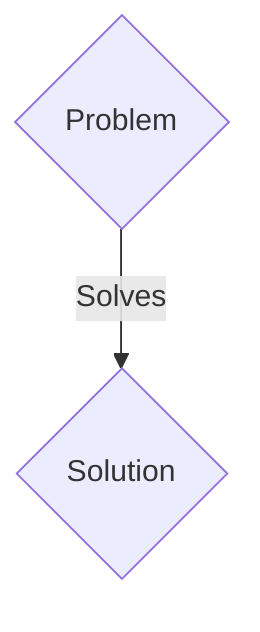
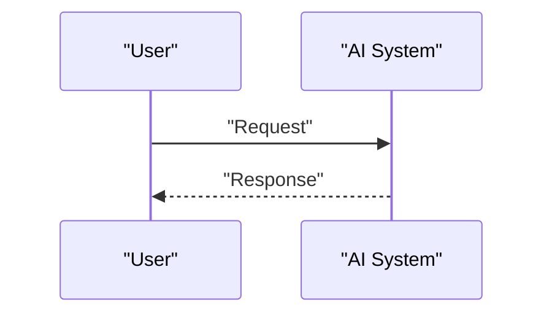

<!-- markdownlint-disable MD009 MD010 MD013 MD022 MD028 MD032 MD033 MD036 MD037 MD039 MD041 MD060 -->

[ 🇫🇷 Version Française ](./README.fr.md)

# Model Weight Provenance

> **Executive Summary:** A B2B solution targeting Cloud platforms (AWS, Azure), model providers (OpenAI, Anthropic), critical AI companies (health, defense, finance). to solve: The attack by "Model Poisoning" or the surreptitious alteration of the weights of an open-source model (eg: Llama). If an attacker subtly modifies a template checkpoint distributed on Hugging Face to introduce an undetectable backdoor, companies downloading and deploying this template inherit a critical vulnerability that cannot be audited via source code.

---

## 1. Visual Overview & Wow Effect

## 2. Contrarian Thesis (Peter Thiel Style)

- **Popular Belief:** Generic solutions are enough.
- **Hidden Truth:** An end-to-end cryptographic traceability and gradient analysis system for deep learning models. It combines cryptographic hashing of weight tensors at each training step, Zero-Knowledge Proofs (ZKP) to attest to the dataset used, and topological analysis of neural networks to detect post-download weight anomalies.

## 3. Problem & Target Market

- **Business Model:** B2B
- **Target Audience:** Cloud platforms (AWS, Azure), model providers (OpenAI, Anthropic), critical AI companies (health, defense, finance).
- **Urgent Pain Point:** The attack by "Model Poisoning" or the surreptitious alteration of the weights of an open-source model (eg: Llama). If an attacker subtly modifies a template checkpoint distributed on Hugging Face to introduce an undetectable backdoor, companies downloading and deploying this template inherit a critical vulnerability that cannot be audited via source code.

## 4. Technical Architecture & Infrastructure

An end-to-end cryptographic traceability and gradient analysis system for deep learning models. It combines cryptographic hashing of weight tensors at each training step, Zero-Knowledge Proofs (ZKP) to attest to the dataset used, and topological analysis of neural networks to detect post-download weight anomalies.

## 5. Business Model & Financial Viability

| Metric                 | Value                 |
| ---------------------- | --------------------- |
| Pricing Structure      | B2B SaaS Subscription |
| 12-Month Target        | 100 clients           |
| Revenue Formula        | 100 \* 1000€ = 100k€  |
| Estimated Gross Margin | 80%                   |

## 6. Distribution Engine & Moat

- **Acquisition Strategy:** Direct sales and strategic partnerships.
- **Moat (Defensibility):** Traditional vulnerability scanners (SAST/DAST) only understand code (Python/C++), not matrices of millions of floating weights. Model auditing requires expertise in ML security, applying advanced cryptography (ZKP) on massive data structures (GB/TB of tensors), far beyond the capabilities of a standard cybersecurity tool or LLM wrapper.

## 7. Detailed Evaluation Grid

| Criterion                   | VC Score (/100) | Market Score (/100) |
| --------------------------- | --------------- | ------------------- |
| Thesis & Monopoly / Urgency | 23 / 25         | 23 / 25             |
| Moat / LLM Immunity         | 19 / 25         | 19 / 25             |
| Scalability / UX Friction   | 23 / 25         | 23 / 25             |
| Unit Economics / ROI        | 24 / 25         | 24 / 25             |
| TOTAL                       | 89 / 100        | 89 / 100            |

> **VC Verdict:** Pending evaluation.
> **Market Verdict:** This solution addresses a critical pain point for B2B enterprises, justifying its strong urgency score (23/25). The specialized approach provides robust protection against generalist AI models (19/25). With low adoption friction (23/25) and a straightforward monetization strategy (24/25), the project demonstrates excellent overall market readiness.
> **Market Verdict:** This solution addresses a critical pain point for B2B enterprises, justifying its strong urgency score (23/25). The specialized approach provides robust protection against generalist AI models (19/25). With low adoption friction (23/25) and a straightforward monetization strategy (24/25), the project demonstrates excellent overall market readiness.
