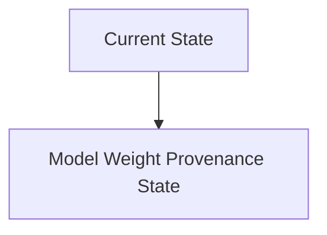
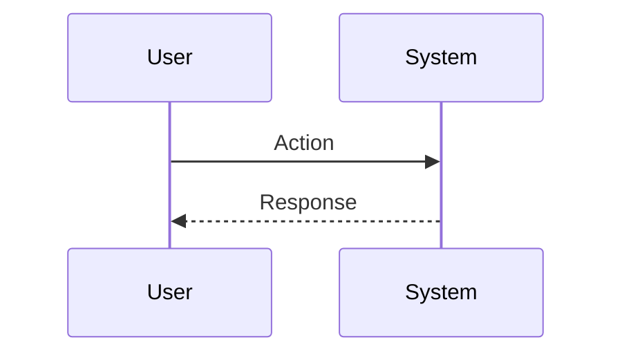

<!-- markdownlint-disable MD009 MD010 MD013 MD022 MD028 MD032 MD033 MD034 MD036 MD037 MD039 MD041 MD060 -->

[ 🇫🇷 Version Française ](./README.fr.md)

# Model Weight Provenance

> **Executive Summary:** An end-to-end cryptographic traceability and gradient analysis system for deep learning models. It combines cryptographic hashing of weight tensors at each training step, Zero-Knowledge Proofs (ZKP) to attest to the dataset used, and topological analysis of neural networks to detect post-download weight anomalies.

---

## 1. Visual Overview & Wow Effect

## 2. Contrarian Thesis (Peter Thiel Style)

**Popular Belief:** General AI solutions can solve this problem.

**Hidden Truth:** Traditional vulnerability scanners (SAST/DAST) only understand code (Python/C++), not matrices of millions of floating weights. Model auditing requires expertise in ML security, applying advanced cryptography (ZKP) on massive data structures (GB/TB of tensors), far beyond the capabilities of a standard cybersecurity tool or LLM wrapper.

## 3. Problem & Target Market

**Business Model:** B2B

**Target Audience:** Cloud platforms (AWS, Azure), model providers (OpenAI, Anthropic), critical AI companies (health, defense, finance).

**Urgent Pain Point:** The attack by "Model Poisoning" or the surreptitious alteration of the weights of an open-source model (eg: Llama). If an attacker subtly modifies a template checkpoint distributed on Hugging Face to introduce an undetectable backdoor, companies downloading and deploying this template inherit a critical vulnerability that cannot be audited via source code.

## 4. Technical Architecture & Infrastructure

## 5. Business Model & Financial Viability

| Metric                 | Value                           |
| ---------------------- | ------------------------------- |
| Pricing Structure      | SaaS subscription               |
| 12-Month Target        | 10 customers                    |
| Revenue Formula        | 10 clients \* 10k€/year = 100k€ |
| Estimated Gross Margin | 80%                             |

## 6. Distribution Engine & Moat

**Acquisition Strategy:** B2B direct sales

**Moat (Defensibility):** Computational overhead linked to the generation of ZKP proofs on large models, lack of standardization in the ML supply chain (SBOM for incipient AI), difficulty of deep integration with training frameworks (PyTorch/JAX).

## 7. Detailed Evaluation Grid

| Criterion                   | VC Score (/100) | Market Score (/100) |
| --------------------------- | --------------- | ------------------- |
| Thesis & Monopoly / Urgency | -- / 25         | -- / 25             |
| Moat / LLM Immunity         | -- / 25         | -- / 25             |
| Scalability / UX Friction   | -- / 25         | -- / 25             |
| Unit Economics / ROI        | -- / 25         | -- / 25             |
| **TOTAL**                   | **-- / 100**    | **-- / 100**        |

> **VC Verdict:** Pending evaluation.

> **Market Verdict:** Pending evaluation.
