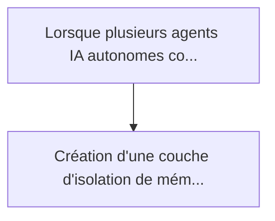
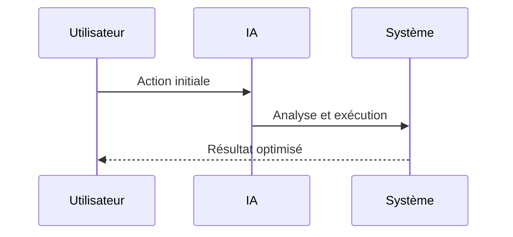

<!-- markdownlint-disable MD013 MD028 MD033 MD039 MD041 -->

[ 🇬🇧 English Version ](./README.md)

# Multi-Agent Memory Isolation

> **Résumé exécutif :** Création d'une couche d'isolation de mémoire vectorielle basée sur le chiffrement homomorphe partiel (FHE) ou des environnements d'exécution de con...

---

## 1. Aperçu visuel & Effet Wahou

## 2. La thèse contrariante (Peter Thiel Style)

La croyance populaire : Les solutions génériques peuvent résoudre cela.
La vérité cachée : L'IAM classique (Identity and Access Management) fonctionne sur des fichiers ou des bases SQL structurées. Il est inopérant sur les plongements vectoriels (embeddings) flous et sémantiques. Les LLMs ne peuvent pas "oublier" ou garantir l'isolement sans une architecture cryptographique bas niveau sur leur couche de mémoire à long terme.

## 3. Le problème & La cible

Modèle économique : B2B
Cible précise : Grandes entreprises déployant des flottes d'agents IA autonomes internes (RH, Finance, Legal) et fournisseurs d'infrastructures d'IA (Hyperscalers).
La douleur urgente : Lorsque plusieurs agents IA autonomes collaborent et partagent des mémoires contextuelles (Vector Databases) au sein d'une entreprise, les frontières de confidentialité explosent. Un agent "Support" pourrait accidentellement accéder et fuiter des données salariales mémorisées par un agent "RH", créant un cauchemar de conformité (RGPD, HIPAA).

## 4. Architecture technique & Plomberie

## 5. Modèle économique & Viabilité financière

| Métrique                    | Valeur             |
| --------------------------- | ------------------ |
| Structure de prix           | Prix sur mesure    |
| Objectif 12 mois            | 100 clients        |
| Calcul du CA (Target 100k€) | 100 \* 1000 = 100k |
| Marge brute estimée         | 80%                |

## 6. Moteur de distribution & Fossé défensif (Moat)

Stratégie d'acquisition : Vente B2B directe
Moat (Barrière à l'entrée) : L'IAM classique (Identity and Access Management) fonctionne sur des fichiers ou des bases SQL structurées. Il est inopérant sur les plongements vectoriels (embeddings) flous et sémantiques. Les LLMs ne peuvent pas "oublier" ou garantir l'isolement sans une architecture cryptographique bas niveau sur leur couche de mémoire à long terme.

## 7. Grille d'évaluation détaillée

| Critère                           | Score VC (/100) | Score Terrain (/100) |
| --------------------------------- | --------------- | -------------------- |
| Thèse & Monopole / Urgence        | -- / 25         | -- / 25              |
| Moat / Résistance aux LLM natifs  | -- / 25         | -- / 25              |
| Scalabilité / Friction d'adoption | -- / 25         | -- / 25              |
| Unit Economics / ROI direct       | -- / 25         | -- / 25              |
| **TOTAL**                         | **-- / 100**    | **-- / 100**         |

> **Verdict VC :** En attente d'évaluation.

> **Verdict Terrain :** En attente d'évaluation.
