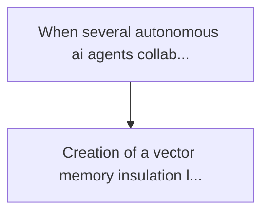
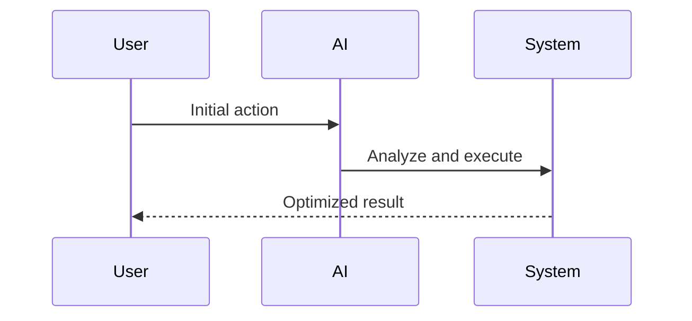

<!-- markdownlint-disable MD013 MD028 MD033 MD039 MD041 -->

[🇫🇷 Version Française](./README.fr.md)

# Multi-agent memory isolation

> **Executive Summary:** Creation of a vector memory insulation layer based on partial homomorphic encryption (fhe) or runtime environments for the creation of a...

---

## 1. Visual Overview & Wow Effect

## 2. Contrarian Thesis (Peter Thiel Style)

Popular Belief: Generic solutions can solve this.
Hidden Truth: The iam (identity and access management) works on structured sql files or databases. it is inoperative on blurred and semantic embeddings. llms cannot "forget" or guarantee isolation without a low-level cryptographic architecture on their long-term memory layer.

## 3. Problem & Target Market

Business Model: B2B
Target Audience: Large companies deploying internal autonomous ai agents (hr, finance, legal) and ai infrastructure providers (hyperscalers).
Urgent Pain Point: When several autonomous ai agents collaborate and share context memories (vector databases) within a company, the privacy boundaries explode. a "support" agent could accidentally access and leak salary data stored by a "hr" agent, creating a compliance nightmare (gdpr, hipaa).

## 4. Technical Architecture & Infrastructure

## 5. Business Model & Financial Viability

| Metric                 | Value              |
| ---------------------- | ------------------ |
| Pricing Structure      | Custom Pricing     |
| 12-Month Target        | 100 customers      |
| Revenue Formula        | 100 \* 1000 = 100k |
| Estimated Gross Margin | 80%                |

## 6. Distribution Engine & Moat

Acquisition Strategy: Direct B2B Sales
Moat (Defensibility): The iam (identity and access management) works on structured sql files or databases. it is inoperative on blurred and semantic embeddings. llms cannot "forget" or guarantee isolation without a low-level cryptographic architecture on their long-term memory layer.

## 7. Detailed Evaluation Grid

| Criterion                   | VC Score (/100) | Market Score (/100) |
| --------------------------- | --------------- | ------------------- |
| Thesis & Monopoly / Urgency | -- / 25         | -- / 25             |
| Moat / LLM Immunity         | -- / 25         | -- / 25             |
| Scalability / UX Friction   | -- / 25         | -- / 25             |
| Unit Economics / ROI        | -- / 25         | -- / 25             |
| **TOTAL**                   | **-- / 100**    | **-- / 100**        |

> **VC Verdict:** Pending evaluation.

> **Market Verdict:** Pending evaluation.
