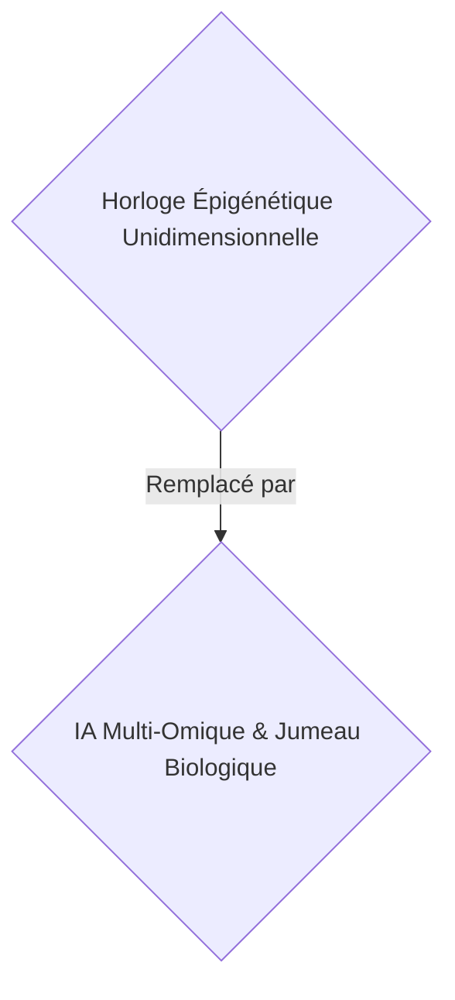
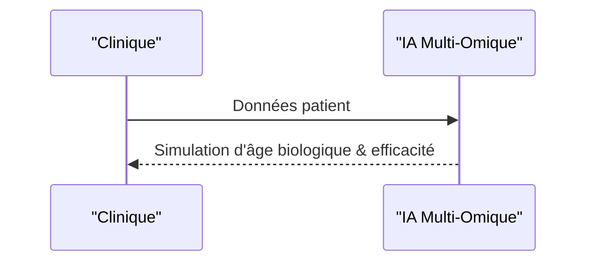

<!-- markdownlint-disable MD009 MD010 MD013 MD022 MD028 MD032 MD033 MD034 MD036 MD037 MD039 MD041 MD058 MD060 -->

[ 🇬🇧 English Version ](./README.md)

# Deep Omic Clock

> **Résumé exécutif :** Une IA d'apprentissage profond multi-omique B2B pour simuler et valider précisément l'âge biologique et l'efficacité des thérapies anti-âge.

---

## 1. Aperçu visuel & Effet Wahou

## 2. La thèse contrariante (Peter Thiel Style)

- **La croyance populaire :** Les horloges épigénétiques standards suffisent pour la géroscience.
- **La vérité cachée :** L'intégration multi-omique confronte au fléau de la dimensionnalité. Nécessite des architectures d'IA spécialisées (Transformers biologiques) pour extraire des signaux causaux complexes, impossibles avec un outil d'analyse de données standard.

## 3. Le problème & La cible

- **Modèle économique :** B2B
- **Cible précise :** Cliniques de longévité, compagnies d'assurance vie, chercheurs en géroscience (CMO, Actuaires).
- **La douleur urgente :** L'âge chronologique est un mauvais indicateur de risque. Les horloges épigénétiques actuelles sont unidimensionnelles et manquent de précision pour cibler des interventions cliniques personnalisées ou valider l'efficacité de thérapies anti-âge.

## 4. Architecture technique & Plomberie

Un modèle d'apprentissage profond multimodal intégrant l'épigénome, le protéome, le microbiome et les données cliniques longitudinales pour créer un World Model de vieillissement biologique, capable de simuler l'effet de molécules géroprotectrices.

## 5. Modèle économique & Viabilité financière

| Métrique                    | Valeur                             |
| --------------------------- | ---------------------------------- |
| Structure de prix           | Abonnement B2B / Frais par analyse |
| Objectif 12 mois            | 100 cliniques                      |
| Calcul du CA (Target 100k€) | 100 \* 1000€ = 100k€               |
| Marge brute estimée         | 85%                                |

## 6. Moteur de distribution & Fossé défensif (Moat)

- **Stratégie d'acquisition :** Vente directe B2B aux cliniques et instituts.
- **Moat (Barrière à l'entrée) :** L'intégration multi-omique confronte au fléau de la dimensionnalité. Nécessite des Transformers biologiques spécialisés et des données longitudinales propriétaires coûteuses et difficiles à obtenir.

## 7. Grille d'évaluation détaillée

| Critère                           | Score VC (/100) | Score Terrain (/100) |
| --------------------------------- | --------------- | -------------------- |
| Thèse & Monopole / Urgence        | -- / 25         | 18 / 25              |
| Moat / Résistance aux LLM natifs  | -- / 25         | 24 / 25              |
| Scalabilité / Friction d'adoption | -- / 25         | 21 / 25              |
| Unit Economics / ROI direct       | -- / 25         | 23 / 25              |
| **TOTAL**                         | -- / 100        | **86 / 100**         |

> **Verdict VC :** En attente d'évaluation.
> **Verdict Terrain :** Bien que les assurances et les cliniques recherchent de meilleurs biomarqueurs, les simulations d'âge biologique doivent surmonter des obstacles réglementaires avant de devenir une nécessité urgente (18/25). Les transformers biologiques profonds traitant des données omiques complexes sont robustes face aux LLMs standards (24/25). Le modèle SaaS B2B offre une monétisation claire et très scalable une fois adopté (23/25).
