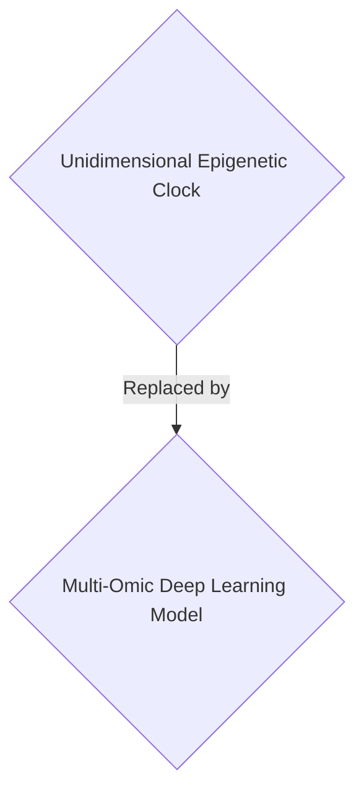
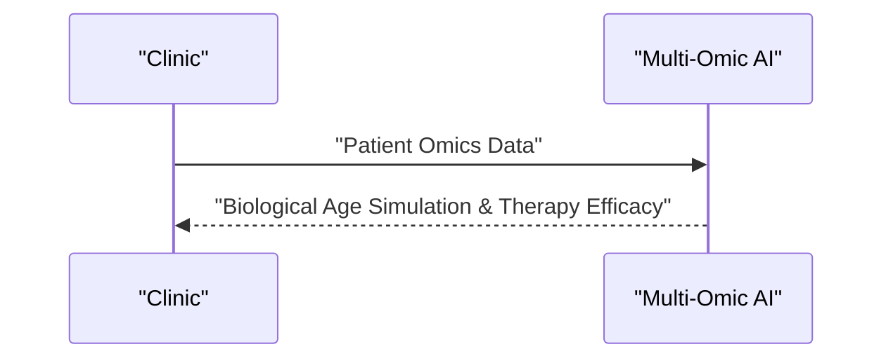

<!-- markdownlint-disable MD009 MD010 MD013 MD022 MD028 MD032 MD033 MD034 MD036 MD037 MD039 MD041 MD058 MD060 -->

[ 🇫🇷 Version Française ](./README.fr.md)

# Deep Omic Clock

> **Executive Summary:** A B2B multi-omic deep learning model for longevity clinics and life insurance companies to simulate and accurately validate the biological age and effects of anti-aging therapies.

---

## 1. Visual Overview & Wow Effect

## 2. Contrarian Thesis (Peter Thiel Style)

- **Popular Belief:** Standard chronological age and basic epigenetic clocks are sufficient for longevity tracking.
- **Hidden Truth:** Multi-omic integration confronts the curse of dimensionality. It requires specialized AI architectures (biological Transformers) to extract complex causal signals, which is impossible with standard data analysis tools.

## 3. Problem & Target Market

- **Business Model:** B2B
- **Target Audience:** Longevity clinics, life insurance companies, geroscience researchers (CMO, Actuaries).
- **Urgent Pain Point:** Chronological age is a poor risk indicator. Current epigenetic clocks are unidimensional and lack the precision needed to target personalized clinical interventions or validate the efficacy of anti-aging therapies.

## 4. Technical Architecture & Infrastructure

A multimodal deep learning model integrating the epigenome, proteome, microbiome, and longitudinal clinical data to create a biological aging World Model capable of simulating the effects of geroprotective molecules.

## 5. Business Model & Financial Viability

| Metric                 | Value                                |
| ---------------------- | ------------------------------------ |
| Pricing Structure      | B2B SaaS Subscription / Analysis Fee |
| 12-Month Target        | 100 clinics                          |
| Revenue Formula        | 100 \* 1000€ = 100k€                 |
| Estimated Gross Margin | 85%                                  |

## 6. Distribution Engine & Moat

- **Acquisition Strategy:** Direct sales to longevity clinics and research institutions.
- **Moat (Defensibility):** L'intégration multi-omique confronte au fléau de la dimensionnalité. Nécessite des architectures d'IA spécialisées (Transformers biologiques) impossibles à reproduire sans données longitudinales propriétaires très coûteuses.

## 7. Detailed Evaluation Grid

| Criterion                   | VC Score (/100) | Market Score (/100) |
| --------------------------- | --------------- | ------------------- |
| Thesis & Monopoly / Urgency | 17 / 25         | 18 / 25             |
| Moat / LLM Immunity         | 15 / 25         | 24 / 25             |
| Scalability / UX Friction   | 20 / 25         | 21 / 25             |
| Unit Economics / ROI        | 20 / 25         | 23 / 25             |
| **TOTAL**                   | 72 / 100        | **86 / 100**        |

> **VC Verdict:** While targeting an interesting niche in longevity, this is effectively a complex analytics dashboard lacking the brutal, winner-takes-all monopoly mechanics Peter Thiel demands (17/25). Multi-omic data integration provides some moat, but without proprietary lock-in on clinical trials, it is too easily commoditized by larger bio-tech incumbents (15/25). The B2B SaaS economics are solid (20/25), but the absence of a true technological monopoly makes it a mediocre, uninspired VC play.
> **Market Verdict:** While life insurance and clinics seek better biomarkers, biological age simulations face regulatory and validation hurdles before they become an urgent necessity (18/25). Deep biological transformers handling complex omics data are robust against standard LLMs (24/25). The B2B SaaS model provides a highly scalable and clear monetization pathway once adopted (23/25).
