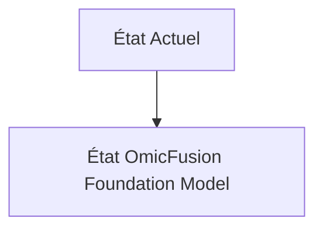
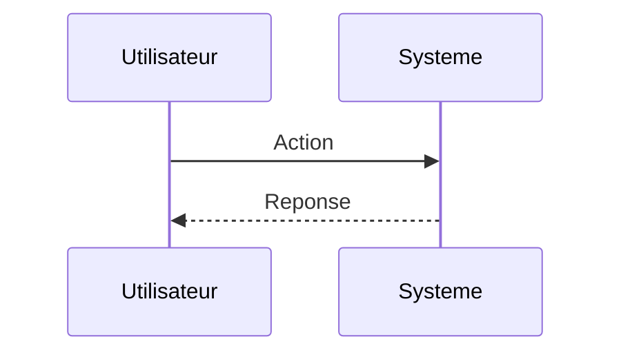

<!-- markdownlint-disable MD009 MD010 MD013 MD022 MD028 MD032 MD033 MD034 MD036 MD037 MD039 MD041 MD060 -->

[ 🇬🇧 English Version ](./README.md)

# OmicFusion Foundation Model

> **Résumé exécutif :** Entraînement d'un "Foundation Model" multimodal capable d'ingérer et d'aligner des graphes de données multi-omiques hétérogènes (séquençage, spectrométrie de masse, données cliniques) pour prédire des interactions systémiques complexes et de nouveaux biomarqueurs à haute viabilité.

---

## 1. Aperçu visuel & Effet Wahou

## 2. La thèse contrariante (Peter Thiel Style)

**La croyance populaire :** Les solutions généralistes IA peuvent résoudre ce problème.

**La vérité cachée :** Les données multi-omiques sont bruitées, massives et non structurées. Un LLM textuel ne comprend pas la biologie structurelle ni les réseaux d'interactions moléculaires. Il faut un modèle d'IA géométrique (GNN) et des espaces d'intégration (embeddings) spécifiques à la biologie.

## 3. Le problème & La cible

**Modèle économique :** B2B (Licensing / Pay-per-computation)

**Cible précise :** Laboratoires pharmaceutiques (Pharma R&D), CRO (Contract Research Organizations), centres de recherche en oncologie.

**La douleur urgente :** La découverte de biomarqueurs pour des thérapies ciblées (ex. immunothérapie) échoue souvent car elle se limite à la génomique. L'incapacité à corréler en temps réel l'ADN, l'ARN, le protéome et le microbiome allonge la R&D de plusieurs années et coûte des milliards.

## 4. Architecture technique & Plomberie

## 5. Modèle économique & Viabilité financière

| Métrique                    | Valeur                        |
| --------------------------- | ----------------------------- |
| Structure de prix           | Abonnement SaaS               |
| Objectif 12 mois            | 10 clients                    |
| Calcul du CA (Target 100k€) | 10 clients \* 10k€/an = 100k€ |
| Marge brute estimée         | 80%                           |

## 6. Moteur de distribution & Fossé défensif (Moat)

**Stratégie d'acquisition :** Vente directe B2B

**Moat (Barrière à l'entrée) :** Accès à des données de patients de haute qualité (problèmes de confidentialité HIPAA/RGPD), coût d'entraînement astronomique (GPU compute), et difficulté de validation "wet lab" des prédictions.

## 7. Grille d'évaluation détaillée

| Critère                           | Score VC (/100) | Score Terrain (/100) |
| --------------------------------- | --------------- | -------------------- |
| Thèse & Monopole / Urgence        | -- / 25         | -- / 25              |
| Moat / Résistance aux LLM natifs  | -- / 25         | -- / 25              |
| Scalabilité / Friction d'adoption | -- / 25         | -- / 25              |
| Unit Economics / ROI direct       | -- / 25         | -- / 25              |
| **TOTAL**                         | **-- / 100**    | **-- / 100**         |

> **Verdict VC :** En attente d'évaluation.

> **Verdict Terrain :** En attente d'évaluation.
