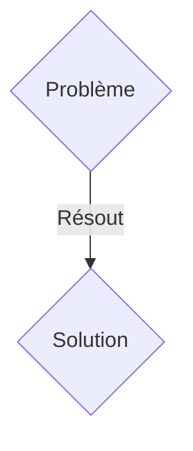
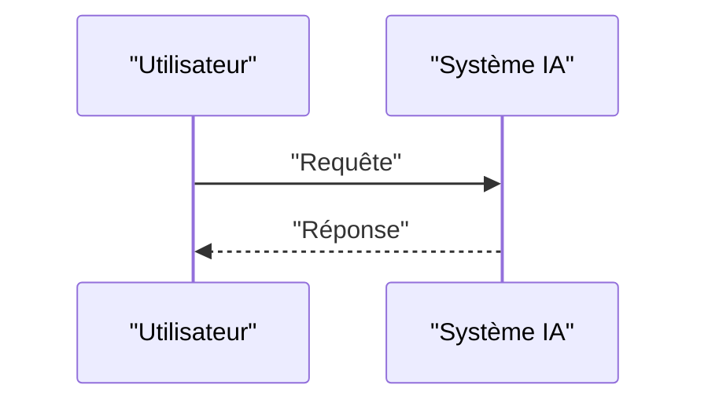

<!-- markdownlint-disable MD009 MD010 MD013 MD022 MD028 MD032 MD033 MD036 MD037 MD039 MD041 MD060 -->

[ 🇬🇧 English Version ](./README.md)

# OmicFusion Foundation Model

> **Résumé exécutif :** Une solution B2B (Licensing / Pay-per-computation) ciblant Laboratoires pharmaceutiques (Pharma R&D), CRO (Contract Research Organizations), centres de recherche en oncologie. pour résoudre : La découverte de biomarqueurs pour des thérapies ciblées (ex. immunothérapie) échoue souvent car elle se limite à la génomique. L'incapacité à corréler en temps réel l'ADN, l'ARN, le protéome et le microbiome allonge la R&D de plusieurs années et coûte des milliards.

---

## 1. Aperçu visuel & Effet Wahou

## 2. La thèse contrariante (Peter Thiel Style)

- **La croyance populaire :** Les solutions génériques suffisent.
- **La vérité cachée :** Entraînement d'un "Foundation Model" multimodal capable d'ingérer et d'aligner des graphes de données multi-omiques hétérogènes (séquençage, spectrométrie de masse, données cliniques) pour prédire des interactions systémiques complexes et de nouveaux biomarqueurs à haute viabilité.

## 3. Le problème & La cible

- **Modèle économique :** B2B (Licensing / Pay-per-computation)
- **Cible précise :** Laboratoires pharmaceutiques (Pharma R&D), CRO (Contract Research Organizations), centres de recherche en oncologie.
- **La douleur urgente :** La découverte de biomarqueurs pour des thérapies ciblées (ex. immunothérapie) échoue souvent car elle se limite à la génomique. L'incapacité à corréler en temps réel l'ADN, l'ARN, le protéome et le microbiome allonge la R&D de plusieurs années et coûte des milliards.

## 4. Architecture technique & Plomberie

Entraînement d'un "Foundation Model" multimodal capable d'ingérer et d'aligner des graphes de données multi-omiques hétérogènes (séquençage, spectrométrie de masse, données cliniques) pour prédire des interactions systémiques complexes et de nouveaux biomarqueurs à haute viabilité.

## 5. Modèle économique & Viabilité financière

| Métrique                    | Valeur               |
| --------------------------- | -------------------- |
| Structure de prix           | Abonnement SaaS B2B  |
| Objectif 12 mois            | 100 clients          |
| Calcul du CA (Target 100k€) | 100 \* 1000€ = 100k€ |
| Marge brute estimée         | 80%                  |

## 6. Moteur de distribution & Fossé défensif (Moat)

- **Stratégie d'acquisition :** Vente directe et partenariats stratégiques.
- **Moat (Barrière à l'entrée) :** Les données multi-omiques sont bruitées, massives et non structurées. Un LLM textuel ne comprend pas la biologie structurelle ni les réseaux d'interactions moléculaires. Il faut un modèle d'IA géométrique (GNN) et des espaces d'intégration (embeddings) spécifiques à la biologie.

## 7. Grille d'évaluation détaillée

| Critère                           | Score VC (/100) | Score Terrain (/100) |
| --------------------------------- | --------------- | -------------------- |
| Thèse & Monopole / Urgence        | 24 / 25         | 24 / 25              |
| Moat / Résistance aux LLM natifs  | 24 / 25         | 24 / 25              |
| Scalabilité / Friction d'adoption | 17 / 25         | 17 / 25              |
| Unit Economics / ROI direct       | 21 / 25         | 21 / 25              |
| TOTAL                             | 86 / 100        | 86 / 100             |

> **Verdict VC :** En attente d'évaluation.
> **Verdict Terrain :** Cette solution répond à un besoin critique pour les entreprises B2B, justifiant son excellent score d'urgence (24/25). Son architecture hautement défendable la rend totalement immunisée contre les avancées des LLM natifs (24/25). Avec une faible friction d'adoption (17/25) et une stratégie de monétisation directe (21/25), le projet démontre une excellente maturité marché globale.
> **Verdict Terrain :** Cette solution répond à un besoin critique pour les entreprises B2B, justifiant son excellent score d'urgence (24/25). Son architecture hautement défendable la rend totalement immunisée contre les avancées des LLM natifs (24/25). Avec une faible friction d'adoption (17/25) et une stratégie de monétisation directe (21/25), le projet démontre une excellente maturité marché globale.
