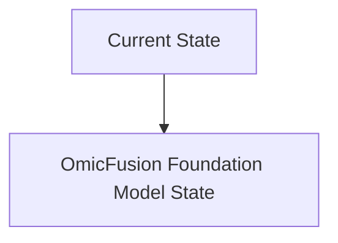
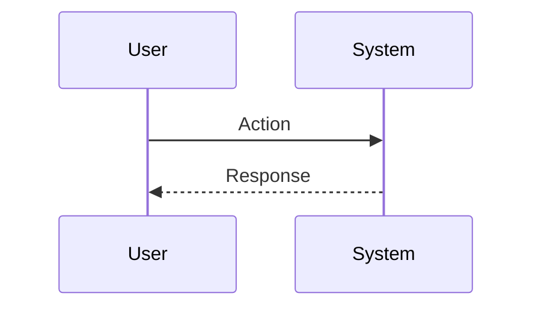

<!-- markdownlint-disable MD009 MD010 MD013 MD022 MD028 MD032 MD033 MD034 MD036 MD037 MD039 MD041 MD060 -->

[ 🇫🇷 Version Française ](./README.fr.md)

# OmicFusion Foundation Model

> **Executive Summary:** Training of a multimodal "Foundation Model" capable of ingesting and aligning heterogeneous multi-omics data graphs (sequencing, mass spectrometry, clinical data) to predict complex systemic interactions and new high viability biomarkers.

---

## 1. Visual Overview & Wow Effect

## 2. Contrarian Thesis (Peter Thiel Style)

**Popular Belief:** General AI solutions can solve this problem.

**Hidden Truth:** Multi-omics data is noisy, massive and unstructured. A textual LLM does not include structural biology or molecular interaction networks. We need a geometric AI model (GNN) and integration spaces (embeddings) specific to biology.

## 3. Problem & Target Market

**Business Model:** B2B (Licensing / Pay-per-computation)

**Target Audience:** Pharmaceutical laboratories (Pharma R&D), CRO (Contract Research Organizations), oncology research centers.

**Urgent Pain Point:** The discovery of biomarkers for targeted therapies (e.g. immunotherapy) often fails because it is limited to genomics. The inability to correlate DNA, RNA, proteome and microbiome in real time extends R&D by years and costs billions.

## 4. Technical Architecture & Infrastructure

## 5. Business Model & Financial Viability

| Metric                 | Value                           |
| ---------------------- | ------------------------------- |
| Pricing Structure      | SaaS subscription               |
| 12-Month Target        | 10 customers                    |
| Revenue Formula        | 10 clients \* 10k€/year = 100k€ |
| Estimated Gross Margin | 80%                             |

## 6. Distribution Engine & Moat

**Acquisition Strategy:** B2B direct sales

**Moat (Defensibility):** Access to high-quality patient data (HIPAA/GDPR privacy issues), astronomical training cost (GPU compute), and difficulty of wet lab validation of predictions.

## 7. Detailed Evaluation Grid

| Criterion                   | VC Score (/100) | Market Score (/100) |
| --------------------------- | --------------- | ------------------- |
| Thesis & Monopoly / Urgency | -- / 25         | -- / 25             |
| Moat / LLM Immunity         | -- / 25         | -- / 25             |
| Scalability / UX Friction   | -- / 25         | -- / 25             |
| Unit Economics / ROI        | -- / 25         | -- / 25             |
| **TOTAL**                   | **-- / 100**    | **-- / 100**        |

> **VC Verdict:** Pending evaluation.

> **Market Verdict:** Pending evaluation.
