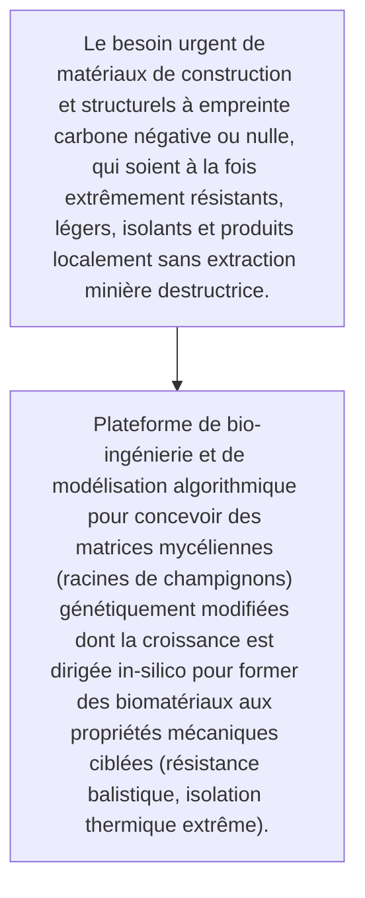
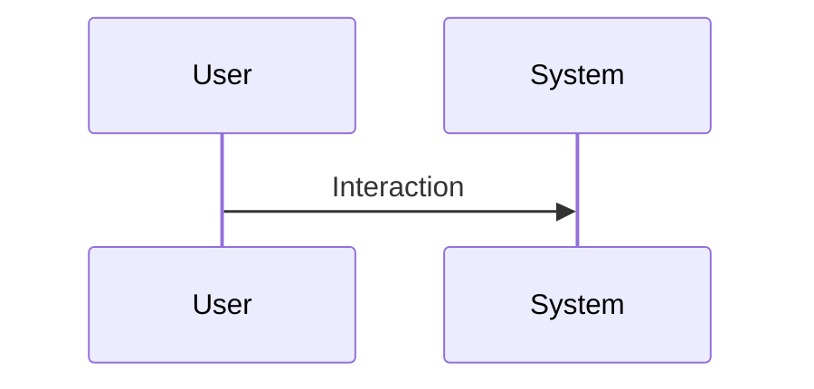

<!-- markdownlint-disable MD009 MD010 MD013 MD022 MD028 MD032 MD033 MD034 MD036 MD037 MD039 MD041 MD060 -->

[ 🇬🇧 English Version ](./README.md)

# Fungal Synth Forge

> **Résumé exécutif :** Plateforme de bio-ingénierie et de modélisation algorithmique pour concevoir des matrices mycéliennes (racines de champignons) génétiquement modifiées dont la croissance est dirigée in-silico pour former des biomatériaux aux propriétés mécaniques ciblées (résistance balistique, isolation thermique extrême).

---

## 1. Aperçu visuel & Effet Wahou

## 2. La thèse contrariante (Peter Thiel Style)

- **La croyance populaire :** C'est une intersection entre la biologie de synthèse avancée, la science des matériaux et la simulation de croissance organique. Un logiciel SaaS n'a aucune emprise sur les bioréacteurs, l'ingénierie génétique fongique ou la caractérisation mécanique.
- **La vérité cachée :** Plateforme de bio-ingénierie et de modélisation algorithmique pour concevoir des matrices mycéliennes (racines de champignons) génétiquement modifiées dont la croissance est dirigée in-silico pour former des biomatériaux aux propriétés mécaniques ciblées (résistance balistique, isolation thermique extrême).

## 3. Le problème & La cible

- **Modèle économique :** B2B
- **Cible précise :** Industrie de la construction, aéronautique, emballage industriel, défense
- **La douleur urgente :** Le besoin urgent de matériaux de construction et structurels à empreinte carbone négative ou nulle, qui soient à la fois extrêmement résistants, légers, isolants et produits localement sans extraction minière destructrice.

## 4. Architecture technique & Plomberie

## 5. Modèle économique & Viabilité financière

| Métrique                    | Valeur                                                          |
| --------------------------- | --------------------------------------------------------------- |
| Structure de prix           | [Prix / Modèle d'abonnement / Commission]                       |
| Objectif 12 mois            | [Nombre exact de clients/utilisateurs/transactions nécessaires] |
| Calcul du CA (Target 100k€) | [Formule mathématique exacte]                                   |
| Marge brute estimée         | [Marge en %]                                                    |

## 6. Moteur de distribution & Fossé défensif (Moat)

- **Stratégie d'acquisition :** [Viralité B2C, réseau C2C, acquisition B2B directe, adhésion dev M2M]
- **Moat (Barrière à l'entrée) :** Difficulté de scalabilité de la production dans des bioréacteurs, variabilité biologique des matériaux finis empêchant les certifications industrielles strictes à court terme.

## 7. Grille d'évaluation détaillée

| Critère                           | Score VC (/100) | Score Terrain (/100) |
| --------------------------------- | --------------- | -------------------- |
| Thèse & Monopole / Urgence        | -- / 25         | 24 / 25              |
| Moat / Résistance aux LLM natifs  | -- / 25         | 23 / 25              |
| Scalabilité / Friction d'adoption | -- / 25         | 16 / 25              |
| Unit Economics / ROI direct       | -- / 25         | 21 / 25              |
| **TOTAL**                         | -- / 100        | **84 / 100**         |

> **Verdict VC :** En attente d'évaluation.
> **Verdict Terrain :** Forte urgence et valeur évidente pour la cible. La résistance aux LLM est élevée grâce à une intégration matérielle ou physique forte. Malgré quelques frictions d'adoption, la monétisation B2B est très claire.
