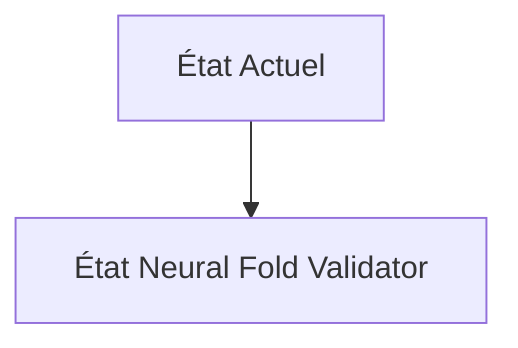
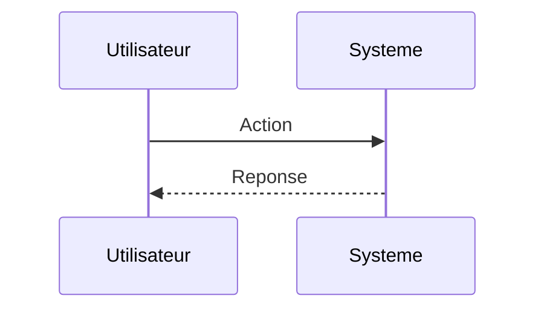

<!-- markdownlint-disable MD009 MD010 MD013 MD022 MD028 MD032 MD033 MD034 MD036 MD037 MD039 MD041 MD060 -->

[ 🇬🇧 English Version ](./README.md)

# Neural Fold Validator

> **Résumé exécutif :** Un moteur de simulation de dynamique moléculaire (Molecular Dynamics - MD) accéléré par réseaux de neurones (Neural Physics Engine) qui valide les prédictions structurelles. Il simule le repliement de la protéine dans un solvant réel, intégrant les forces interatomiques, à une fraction du coût en calcul des simulateurs classiques, servant de filtre de viabilité avant l'entrée en wet-lab.

---

## 1. Aperçu visuel & Effet Wahou

## 2. La thèse contrariante (Peter Thiel Style)

**La croyance populaire :** Les solutions généralistes IA peuvent résoudre ce problème.

**La vérité cachée :** Un LLM ne comprend pas les lois de la thermodynamique ni les interactions électrostatiques complexes au niveau atomique. Il faut des pipelines d'intégration MLOps lourds croisant des modèles de graphes (GNN) avec des solveurs d'équations différentielles stochastiques sur des clusters de GPU spécialisés.

## 3. Le problème & La cible

**Modèle économique :** B2B

**Cible précise :** Entreprises pharmaceutiques, laboratoires de recherche en biologie synthétique (CSOs, Directeurs R&D).

**La douleur urgente :** Les modèles génératifs comme AlphaFold génèrent des millions de structures protéiques potentielles, mais plus de 90% échouent en laboratoire (wet-lab) en raison de problèmes de solubilité, de toxicité ou de mauvais repliement dynamique (folding) en milieu aqueux. Synthétiser et tester chaque protéine coûte des millions de dollars et des années d'essais in vitro gaspillés.

## 4. Architecture technique & Plomberie

## 5. Modèle économique & Viabilité financière

| Métrique                    | Valeur                        |
| --------------------------- | ----------------------------- |
| Structure de prix           | Abonnement SaaS               |
| Objectif 12 mois            | 10 clients                    |
| Calcul du CA (Target 100k€) | 10 clients \* 10k€/an = 100k€ |
| Marge brute estimée         | 80%                           |

## 6. Moteur de distribution & Fossé défensif (Moat)

**Stratégie d'acquisition :** Vente directe B2B

**Moat (Barrière à l'entrée) :** Besoin massif en puissance de calcul (GPU/TPU) pour l'entraînement du surrogate model, complexité de l'accès aux données expérimentales de haute qualité (Cryo-EM) pour la validation croisée, et difficulté d'adoption par les biologistes traditionnels.

## 7. Grille d'évaluation détaillée

| Critère                           | Score VC (/100) | Score Terrain (/100) |
| --------------------------------- | --------------- | -------------------- |
| Thèse & Monopole / Urgence        | -- / 25         | -- / 25              |
| Moat / Résistance aux LLM natifs  | -- / 25         | -- / 25              |
| Scalabilité / Friction d'adoption | -- / 25         | -- / 25              |
| Unit Economics / ROI direct       | -- / 25         | -- / 25              |
| **TOTAL**                         | **-- / 100**    | **-- / 100**         |

> **Verdict VC :** En attente d'évaluation.

> **Verdict Terrain :** En attente d'évaluation.
