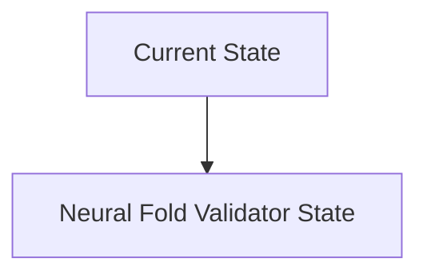
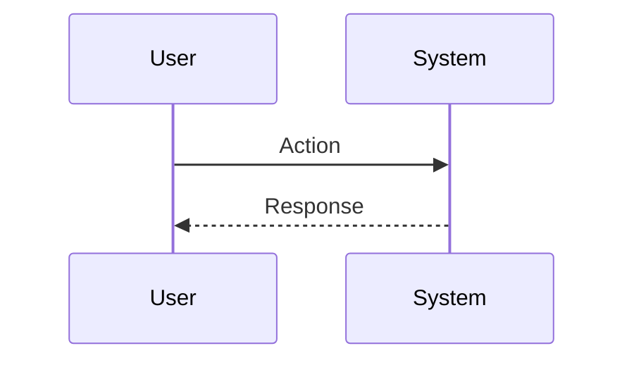

<!-- markdownlint-disable MD009 MD010 MD013 MD022 MD028 MD032 MD033 MD034 MD036 MD037 MD039 MD041 MD060 -->

[ 🇫🇷 Version Française ](./README.fr.md)

# Neural Fold Validator

> **Executive Summary:** A molecular dynamics simulation engine (Molecular Dynamics - MD) accelerated by neural networks (Neural Physics Engine) which validates structural predictions. It simulates the folding of the protein in a real solvent, integrating interatomic forces, at a fraction of the computational cost of conventional simulators, serving as a viability filter before entering the wet-lab.

---

## 1. Visual Overview & Wow Effect

## 2. Contrarian Thesis (Peter Thiel Style)

**Popular Belief:** General AI solutions can solve this problem.

**Hidden Truth:** An LLM does not understand the laws of thermodynamics or complex electrostatic interactions at the atomic level. It requires heavy MLOps integration pipelines crossing graph models (GNN) with stochastic differential equation solvers on specialized GPU clusters.

## 3. Problem & Target Market

**Business Model:** B2B

**Target Audience:** Pharmaceutical companies, synthetic biology research laboratories (CSOs, R&D Directors).

**Urgent Pain Point:** Generative models like AlphaFold generate millions of potential protein structures, but more than 90% fail in the wet lab due to solubility problems, toxicity or dynamic misfolding in an aqueous environment. Synthesizing and testing each protein costs millions of dollars and years of wasted in vitro testing.

## 4. Technical Architecture & Infrastructure

## 5. Business Model & Financial Viability

| Metric                 | Value                           |
| ---------------------- | ------------------------------- |
| Pricing Structure      | SaaS subscription               |
| 12-Month Target        | 10 customers                    |
| Revenue Formula        | 10 clients \* 10k€/year = 100k€ |
| Estimated Gross Margin | 80%                             |

## 6. Distribution Engine & Moat

**Acquisition Strategy:** B2B direct sales

**Moat (Defensibility):** Massive need for computing power (GPU/TPU) for training the surrogate model, complexity of accessing high-quality experimental data (Cryo-EM) for cross-validation, and difficulty of adoption by traditional biologists.

## 7. Detailed Evaluation Grid

| Criterion                   | VC Score (/100) | Market Score (/100) |
| --------------------------- | --------------- | ------------------- |
| Thesis & Monopoly / Urgency | -- / 25         | -- / 25             |
| Moat / LLM Immunity         | -- / 25         | -- / 25             |
| Scalability / UX Friction   | -- / 25         | -- / 25             |
| Unit Economics / ROI        | -- / 25         | -- / 25             |
| **TOTAL**                   | **-- / 100**    | **-- / 100**        |

> **VC Verdict:** Pending evaluation.

> **Market Verdict:** Pending evaluation.
