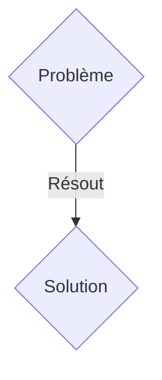
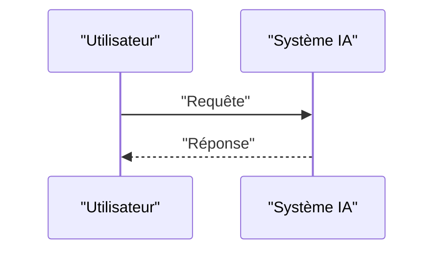

<!-- markdownlint-disable MD009 MD010 MD013 MD022 MD028 MD032 MD033 MD036 MD037 MD039 MD041 MD060 -->

[ 🇬🇧 English Version ](./README.md)

# Neural Physics Forge

> **Résumé exécutif :** Une solution B2B ciblant Constructeurs automobiles, entreprises aérospatiales, fabricants de robotique industrielle. pour résoudre : Les simulations physiques traditionnelles (CFD, FEA) nécessitent des clusters HPC massifs et prennent des jours pour calculer l'aérodynamique, la résistance des matériaux ou la dynamique des fluides, ralentissant considérablement le cycle de R&D.

---

## 1. Aperçu visuel & Effet Wahou

## 2. La thèse contrariante (Peter Thiel Style)

- **La croyance populaire :** Les solutions génériques suffisent.
- **La vérité cachée :** Moteur de "Neural Physics" utilisant des Graph Neural Networks (GNN) et des Physics-Informed Neural Networks (PINN) entraînés sur des données de solveurs exacts, pour inférer des résultats de simulation avec une précision de 99% mais 10 000 fois plus rapidement.

## 3. Le problème & La cible

- **Modèle économique :** B2B
- **Cible précise :** Constructeurs automobiles, entreprises aérospatiales, fabricants de robotique industrielle.
- **La douleur urgente :** Les simulations physiques traditionnelles (CFD, FEA) nécessitent des clusters HPC massifs et prennent des jours pour calculer l'aérodynamique, la résistance des matériaux ou la dynamique des fluides, ralentissant considérablement le cycle de R&D.

## 4. Architecture technique & Plomberie

Moteur de "Neural Physics" utilisant des Graph Neural Networks (GNN) et des Physics-Informed Neural Networks (PINN) entraînés sur des données de solveurs exacts, pour inférer des résultats de simulation avec une précision de 99% mais 10 000 fois plus rapidement.

## 5. Modèle économique & Viabilité financière

| Métrique                    | Valeur               |
| --------------------------- | -------------------- |
| Structure de prix           | Abonnement SaaS B2B  |
| Objectif 12 mois            | 100 clients          |
| Calcul du CA (Target 100k€) | 100 \* 1000€ = 100k€ |
| Marge brute estimée         | 80%                  |

## 6. Moteur de distribution & Fossé défensif (Moat)

- **Stratégie d'acquisition :** Vente directe et partenariats stratégiques.
- **Moat (Barrière à l'entrée) :** Un LLM textuel ne comprend pas la géométrie 3D, les lois de Navier-Stokes ou les tenseurs de contrainte. Il faut une architecture de modèle spécifique, optimisée pour des maillages non structurés 3D et des formats de CAO complexes.

## 7. Grille d'évaluation détaillée

| Critère                           | Score VC (/100) | Score Terrain (/100) |
| --------------------------------- | --------------- | -------------------- |
| Thèse & Monopole / Urgence        | -- / 25         | -- / 25              |
| Moat / Résistance aux LLM natifs  | -- / 25         | -- / 25              |
| Scalabilité / Friction d'adoption | -- / 25         | -- / 25              |
| Unit Economics / ROI direct       | -- / 25         | -- / 25              |
| TOTAL                             | -- / 100        | -- / 100             |

> **Verdict VC :** En attente d'évaluation.
> **Verdict Terrain :** En attente d'évaluation.
