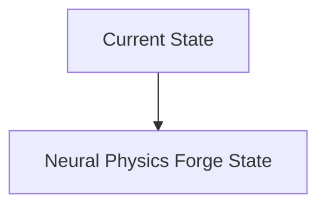
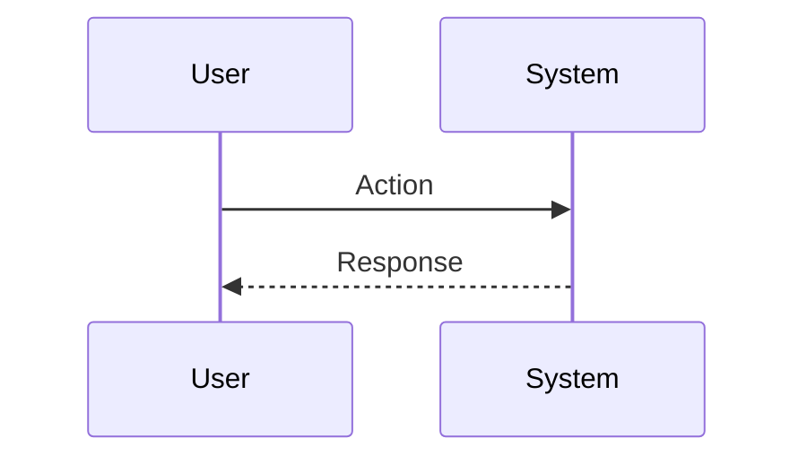

<!-- markdownlint-disable MD009 MD010 MD013 MD022 MD028 MD032 MD033 MD034 MD036 MD037 MD039 MD041 MD060 -->

[ 🇫🇷 Version Française ](./README.fr.md)

# Neural Physics Forge

> **Executive Summary:** “Neural Physics” engine using Graph Neural Networks (GNN) and Physics-Informed Neural Networks (PINN) trained on exact solver data, to infer simulation results with 99% accuracy but 10,000 times faster.

---

## 1. Visual Overview & Wow Effect

## 2. Contrarian Thesis (Peter Thiel Style)

**Popular Belief:** General AI solutions can solve this problem.

**Hidden Truth:** A textual LLM does not include 3D geometry, Navier-Stokes laws, or stress tensors. It requires a specific model architecture, optimized for 3D unstructured meshes and complex CAD formats.

## 3. Problem & Target Market

**Business Model:** B2B

**Target Audience:** Automotive manufacturers, aerospace companies, industrial robotics manufacturers.

**Urgent Pain Point:** Traditional physics simulations (CFD, FEA) require massive HPC clusters and take days to calculate aerodynamics, material strength or fluid dynamics, significantly slowing down the R&D cycle.

## 4. Technical Architecture & Infrastructure

## 5. Business Model & Financial Viability

| Metric                 | Value                           |
| ---------------------- | ------------------------------- |
| Pricing Structure      | SaaS subscription               |
| 12-Month Target        | 10 customers                    |
| Revenue Formula        | 10 clients \* 10k€/year = 100k€ |
| Estimated Gross Margin | 80%                             |

## 6. Distribution Engine & Moat

**Acquisition Strategy:** B2B direct sales

**Moat (Defensibility):** Initial need for high quality and extremely expensive simulation data to generate for training; skepticism of mainstream engineers about accuracy ("physical hallucinations").

## 7. Detailed Evaluation Grid

| Criterion                   | VC Score (/100) | Market Score (/100) |
| --------------------------- | --------------- | ------------------- |
| Thesis & Monopoly / Urgency | -- / 25         | -- / 25             |
| Moat / LLM Immunity         | -- / 25         | -- / 25             |
| Scalability / UX Friction   | -- / 25         | -- / 25             |
| Unit Economics / ROI        | -- / 25         | -- / 25             |
| **TOTAL**                   | **-- / 100**    | **-- / 100**        |

> **VC Verdict:** Pending evaluation.

> **Market Verdict:** Pending evaluation.
