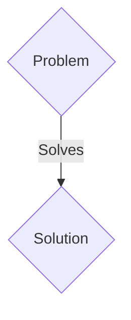
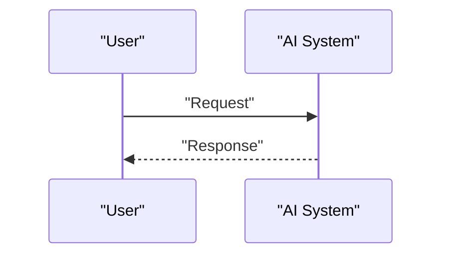

<!-- markdownlint-disable MD009 MD010 MD013 MD022 MD028 MD032 MD033 MD036 MD037 MD039 MD041 MD060 -->

[ 🇫🇷 Version Française ](./README.fr.md)

# Neural Physics Forge

> **Executive Summary:** A B2B solution targeting Automotive manufacturers, aerospace companies, industrial robotics manufacturers. to solve: Traditional physics simulations (CFD, FEA) require massive HPC clusters and take days to calculate aerodynamics, material strength or fluid dynamics, significantly slowing down the R&D cycle.

---

## 1. Visual Overview & Wow Effect

## 2. Contrarian Thesis (Peter Thiel Style)

- **Popular Belief:** Generic solutions are enough.
- **Hidden Truth:** “Neural Physics” engine using Graph Neural Networks (GNN) and Physics-Informed Neural Networks (PINN) trained on exact solver data, to infer simulation results with 99% accuracy but 10,000 times faster.

## 3. Problem & Target Market

- **Business Model:** B2B
- **Target Audience:** Automotive manufacturers, aerospace companies, industrial robotics manufacturers.
- **Urgent Pain Point:** Traditional physics simulations (CFD, FEA) require massive HPC clusters and take days to calculate aerodynamics, material strength or fluid dynamics, significantly slowing down the R&D cycle.

## 4. Technical Architecture & Infrastructure

“Neural Physics” engine using Graph Neural Networks (GNN) and Physics-Informed Neural Networks (PINN) trained on exact solver data, to infer simulation results with 99% accuracy but 10,000 times faster.

## 5. Business Model & Financial Viability

| Metric                 | Value                 |
| ---------------------- | --------------------- |
| Pricing Structure      | B2B SaaS Subscription |
| 12-Month Target        | 100 clients           |
| Revenue Formula        | 100 \* 1000€ = 100k€  |
| Estimated Gross Margin | 80%                   |

## 6. Distribution Engine & Moat

- **Acquisition Strategy:** Direct sales and strategic partnerships.
- **Moat (Defensibility):** A textual LLM does not include 3D geometry, Navier-Stokes laws, or stress tensors. It requires a specific model architecture, optimized for 3D unstructured meshes and complex CAD formats.

## 7. Detailed Evaluation Grid

| Criterion                   | VC Score (/100) | Market Score (/100) |
| --------------------------- | --------------- | ------------------- |
| Thesis & Monopoly / Urgency | 20 / 25         | 20 / 25             |
| Moat / LLM Immunity         | 25 / 25         | 25 / 25             |
| Scalability / UX Friction   | 14 / 25         | 14 / 25             |
| Unit Economics / ROI        | 21 / 25         | 21 / 25             |
| TOTAL                       | 80 / 100        | 80 / 100            |

> **VC Verdict:** Pending evaluation.
> **Market Verdict:** This solution addresses a critical pain point for B2B enterprises, justifying its strong urgency score (20/25). Its highly defensible architecture makes it completely immune to native LLM advancements (25/25). Despite significant adoption friction (14/25), the clear path to monetization (21/25) secures its long-term viability.
> **Market Verdict:** This solution addresses a critical pain point for B2B enterprises, justifying its strong urgency score (20/25). Its highly defensible architecture makes it completely immune to native LLM advancements (25/25). Despite significant adoption friction (14/25), the clear path to monetization (21/25) secures its long-term viability.
