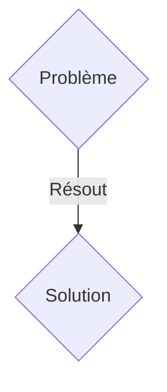
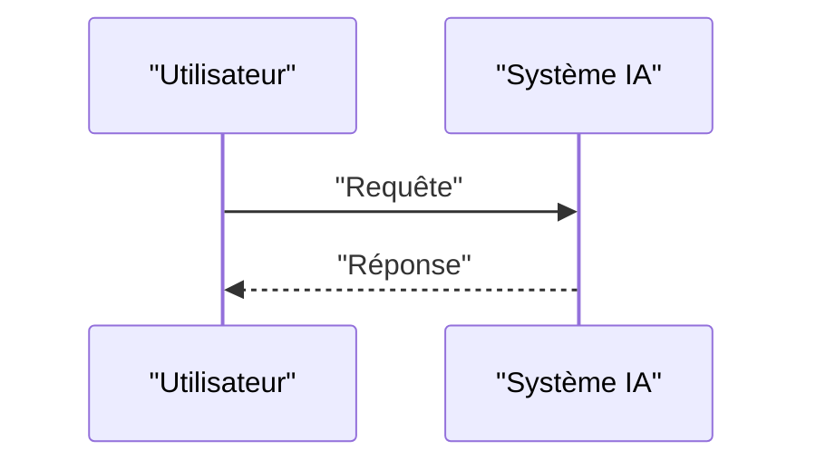

<!-- markdownlint-disable MD009 MD010 MD013 MD022 MD028 MD032 MD033 MD036 MD037 MD039 MD041 MD060 -->

[ 🇬🇧 English Version ](./README.md)

# Foundation Physics Engine for Autonomy

> **Résumé exécutif :** Une solution B2B ciblant Constructeurs de robots humanoïdes (Boston Dynamics, Figure), opérateurs d'entrepôts automatisés, fabricants de drones industriels. pour résoudre : Entraîner des robots dans le monde réel (Sim2Real gap) est dangereux, lent et coûteux (casser des bras robotiques à 100k$). Les simulateurs classiques (MuJoCo, Isaac Gym) sont trop rigides, déterministes et peinent à modéliser la physique molle (tissus, liquides, poudres) ou les micro-frictions, rendant le transfert vers la réalité chaotique.

---

## 1. Aperçu visuel & Effet Wahou

## 2. La thèse contrariante (Peter Thiel Style)

- **La croyance populaire :** Les solutions génériques suffisent.
- **La vérité cachée :** Un moteur physique 100% neuronal (Neural Physics Engine). Au lieu de résoudre des équations rigides, le système utilise des graphes neuronaux spatio-temporels pré-entraînés sur des milliers d'heures de vidéos du monde réel pour générer des simulations infinies, photoréalistes, obéissant à la physique de manière émergente.

## 3. Le problème & La cible

- **Modèle économique :** B2B
- **Cible précise :** Constructeurs de robots humanoïdes (Boston Dynamics, Figure), opérateurs d'entrepôts automatisés, fabricants de drones industriels.
- **La douleur urgente :** Entraîner des robots dans le monde réel (Sim2Real gap) est dangereux, lent et coûteux (casser des bras robotiques à 100k$). Les simulateurs classiques (MuJoCo, Isaac Gym) sont trop rigides, déterministes et peinent à modéliser la physique molle (tissus, liquides, poudres) ou les micro-frictions, rendant le transfert vers la réalité chaotique.

## 4. Architecture technique & Plomberie

Un moteur physique 100% neuronal (Neural Physics Engine). Au lieu de résoudre des équations rigides, le système utilise des graphes neuronaux spatio-temporels pré-entraînés sur des milliers d'heures de vidéos du monde réel pour générer des simulations infinies, photoréalistes, obéissant à la physique de manière émergente.

## 5. Modèle économique & Viabilité financière

| Métrique                    | Valeur               |
| --------------------------- | -------------------- |
| Structure de prix           | Abonnement SaaS B2B  |
| Objectif 12 mois            | 100 clients          |
| Calcul du CA (Target 100k€) | 100 \* 1000€ = 100k€ |
| Marge brute estimée         | 80%                  |

## 6. Moteur de distribution & Fossé défensif (Moat)

- **Stratégie d'acquisition :** Vente directe et partenariats stratégiques.
- **Moat (Barrière à l'entrée) :** Les moteurs de jeu (Unreal, Unity) sont faits pour paraître beaux, pas pour être physiquement précis au micron pour des capteurs haptiques ou des actuateurs haute fréquence. Un LLM textuel ne sait pas coordonner la proprioception d'un robot à 20 degrés de liberté attrapant un objet glissant.

## 7. Grille d'évaluation détaillée

| Critère                           | Score VC (/100) | Score Terrain (/100) |
| --------------------------------- | --------------- | -------------------- |
| Thèse & Monopole / Urgence        | -- / 25         | -- / 25              |
| Moat / Résistance aux LLM natifs  | -- / 25         | -- / 25              |
| Scalabilité / Friction d'adoption | -- / 25         | -- / 25              |
| Unit Economics / ROI direct       | -- / 25         | -- / 25              |
| TOTAL                             | -- / 100        | -- / 100             |

> **Verdict VC :** En attente d'évaluation.
> **Verdict Terrain :** En attente d'évaluation.
