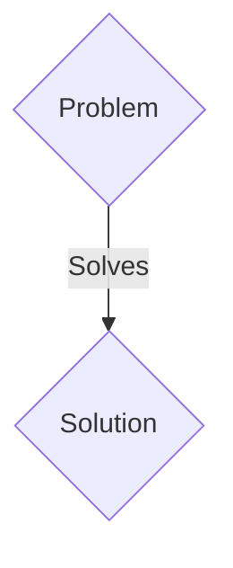
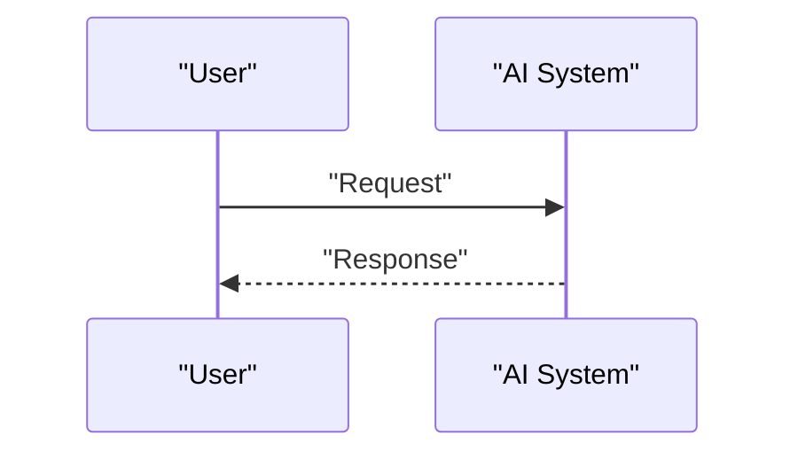

<!-- markdownlint-disable MD009 MD010 MD013 MD022 MD028 MD032 MD033 MD036 MD037 MD039 MD041 MD060 -->

[ 🇫🇷 Version Française ](./README.fr.md)

# Foundation Physics Engine for Autonomy

> **Executive Summary:** A B2B solution targeting Manufacturers of humanoid robots (Boston Dynamics, Figure), operators of automated warehouses, manufacturers of industrial drones. to solve: Training robots in the real world (Sim2Real gap) is dangerous, slow and expensive (breaking $100k robotic arms). Classic simulators (MuJoCo, Isaac Gym) are too rigid, deterministic and struggle to model soft physics (tissues, liquids, powders) or micro-frictions, making the transfer to reality chaotic.

---

## 1. Visual Overview & Wow Effect

## 2. Contrarian Thesis (Peter Thiel Style)

- **Popular Belief:** Generic solutions are enough.
- **Hidden Truth:** A 100% neural physics engine (Neural Physics Engine). Instead of solving rigid equations, the system uses spatiotemporal neural graphs pre-trained on thousands of hours of real-world video to generate infinite, photorealistic simulations that obey physics in an emergent way.

## 3. Problem & Target Market

- **Business Model:** B2B
- **Target Audience:** Manufacturers of humanoid robots (Boston Dynamics, Figure), operators of automated warehouses, manufacturers of industrial drones.
- **Urgent Pain Point:** Training robots in the real world (Sim2Real gap) is dangerous, slow and expensive (breaking $100k robotic arms). Classic simulators (MuJoCo, Isaac Gym) are too rigid, deterministic and struggle to model soft physics (tissues, liquids, powders) or micro-frictions, making the transfer to reality chaotic.

## 4. Technical Architecture & Infrastructure

A 100% neural physics engine (Neural Physics Engine). Instead of solving rigid equations, the system uses spatiotemporal neural graphs pre-trained on thousands of hours of real-world video to generate infinite, photorealistic simulations that obey physics in an emergent way.

## 5. Business Model & Financial Viability

| Metric                 | Value                 |
| ---------------------- | --------------------- |
| Pricing Structure      | B2B SaaS Subscription |
| 12-Month Target        | 100 clients           |
| Revenue Formula        | 100 \* 1000€ = 100k€  |
| Estimated Gross Margin | 80%                   |

## 6. Distribution Engine & Moat

- **Acquisition Strategy:** Direct sales and strategic partnerships.
- **Moat (Defensibility):** Game engines (Unreal, Unity) are made to look good, not to be physically micron accurate for haptic sensors or high frequency actuators. A textual LLM cannot coordinate the proprioception of a robot with 20 degrees of freedom catching a sliding object.

## 7. Detailed Evaluation Grid

| Criterion                   | VC Score (/100) | Market Score (/100) |
| --------------------------- | --------------- | ------------------- |
| Thesis & Monopoly / Urgency | 20 / 25         | 20 / 25             |
| Moat / LLM Immunity         | 24 / 25         | 24 / 25             |
| Scalability / UX Friction   | 15 / 25         | 15 / 25             |
| Unit Economics / ROI        | 20 / 25         | 20 / 25             |
| TOTAL                       | 79 / 100        | 79 / 100            |

> **VC Verdict:** Pending evaluation.
> **Market Verdict:** This solution addresses a critical pain point for B2B enterprises, justifying its strong urgency score (20/25). Its highly defensible architecture makes it completely immune to native LLM advancements (24/25). Despite significant adoption friction (15/25), the clear path to monetization (20/25) secures its long-term viability.
> **Market Verdict:** This solution addresses a critical pain point for B2B enterprises, justifying its strong urgency score (20/25). Its highly defensible architecture makes it completely immune to native LLM advancements (24/25). Despite significant adoption friction (15/25), the clear path to monetization (20/25) secures its long-term viability.
