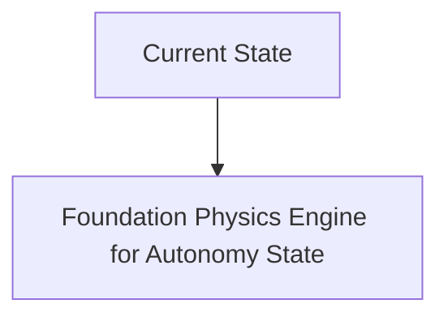
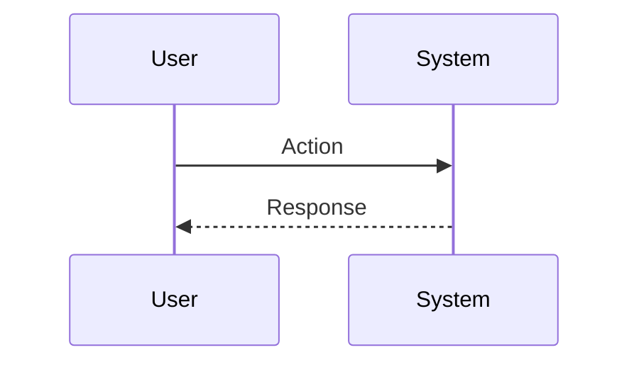

<!-- markdownlint-disable MD009 MD010 MD013 MD022 MD028 MD032 MD033 MD034 MD036 MD037 MD039 MD041 MD060 -->

[ 🇫🇷 Version Française ](./README.fr.md)

# Foundation Physics Engine for Autonomy

> **Executive Summary:** A 100% neural physics engine (Neural Physics Engine). Instead of solving rigid equations, the system uses spatiotemporal neural graphs pre-trained on thousands of hours of real-world video to generate infinite, photorealistic simulations that obey physics in an emergent way.

---

## 1. Visual Overview & Wow Effect

## 2. Contrarian Thesis (Peter Thiel Style)

**Popular Belief:** General AI solutions can solve this problem.

**Hidden Truth:** Game engines (Unreal, Unity) are made to look good, not to be physically micron accurate for haptic sensors or high frequency actuators. A textual LLM cannot coordinate the proprioception of a robot with 20 degrees of freedom catching a sliding object.

## 3. Problem & Target Market

**Business Model:** B2B

**Target Audience:** Manufacturers of humanoid robots (Boston Dynamics, Figure), operators of automated warehouses, manufacturers of industrial drones.

**Urgent Pain Point:** Training robots in the real world (Sim2Real gap) is dangerous, slow and expensive (breaking $100k robotic arms). Classic simulators (MuJoCo, Isaac Gym) are too rigid, deterministic and struggle to model soft physics (tissues, liquids, powders) or micro-frictions, making the transfer to reality chaotic.

## 4. Technical Architecture & Infrastructure

## 5. Business Model & Financial Viability

| Metric                 | Value                           |
| ---------------------- | ------------------------------- |
| Pricing Structure      | SaaS subscription               |
| 12-Month Target        | 10 customers                    |
| Revenue Formula        | 10 clients \* 10k€/year = 100k€ |
| Estimated Gross Margin | 80%                             |

## 6. Distribution Engine & Moat

**Acquisition Strategy:** B2B direct sales

**Moat (Defensibility):** Massive computing requirement (GPU clusters) for training the fundamental model. Prove that “hallucinatory physics” does not create critical safety biases when deployed in real conditions (safety alignment of physics).

## 7. Detailed Evaluation Grid

| Criterion                   | VC Score (/100) | Market Score (/100) |
| --------------------------- | --------------- | ------------------- |
| Thesis & Monopoly / Urgency | -- / 25         | -- / 25             |
| Moat / LLM Immunity         | -- / 25         | -- / 25             |
| Scalability / UX Friction   | -- / 25         | -- / 25             |
| Unit Economics / ROI        | -- / 25         | -- / 25             |
| **TOTAL**                   | **-- / 100**    | **-- / 100**        |

> **VC Verdict:** Pending evaluation.

> **Market Verdict:** Pending evaluation.
