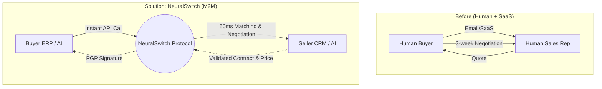
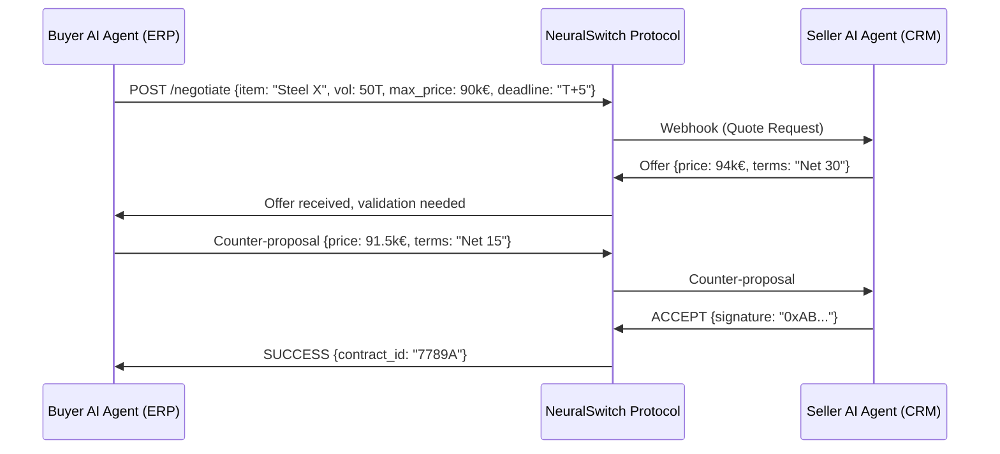

<!-- markdownlint-disable MD013 MD033 MD060 MD039 MD041 MD032 MD010 MD009 MD022 MD036 MD028 MD037 -->

[🇫🇷 Version Française](./README.fr.md)

# NeuralSwitch

> **Executive Summary:** The first M2M B2B negotiation and procurement router and protocol where buyer AI agents negotiate directly with supplier AI agents in milliseconds, without a human interface.

---

## 1. Visual Overview

## 2. The Contrarian Thesis (Peter Thiel Style)

**The Popular Belief:** AI will help humans write better negotiation emails and analyze B2B contracts faster via copilots integrated into ERPs.
**The Hidden Truth:** Standardized B2B purchasing will become 100% Machine-to-Machine. User interfaces (UI) for procurement are doomed to disappear; maximum efficiency is reached when the buyer's AI agent negotiates directly via API with the supplier's AI agent based on mathematical parameters (price, volume, deadlines).

## 3. The Problem & The Target

**Economic Model:** M2M
**Specific Target:** Supply Chain and Procurement departments of Mid-Market and large industrial groups, and their recurring suppliers.
**The Urgent Pain:** The traditional B2B negotiation cycle takes weeks and costs thousands of euros in human time for recurring orders of raw materials or supplies. This friction paralyzes supply chain reactivity and inflates general overhead costs.

## 4. Technical Architecture & Plumbing

**Code Snippet**

## 5. Economic Model & Financial Viability

| Metric                                 | Value                                                              |
| -------------------------------------- | ------------------------------------------------------------------ |
| **Pricing Structure**                  | 0.5% commission per transaction + 0.05€ per negotiation API call   |
| **12-Month Target**                    | 20M€ in volume routed through the protocol and 20,000 transactions |
| **Revenue Calculation (100k€ Target)** | (20M€ × 0.005) = 100,000€ ARR                                      |
| **Estimated Gross Margin**             | 92% (Very low server and API costs)                                |

## 6. Distribution Engine & Defensive Moat (Moat)

**Acquisition Strategy:** M2M dev adoption and B2B network effect. Integration is done as an SDK into existing ERPs (SAP, Odoo). As soon as a large buyer installs it, it "forces" its suppliers to expose a NeuralSwitch endpoint to continue receiving automated orders.
**Moat (Barrier to Entry):** The data exchange standard. OpenAI or Google's AI generates text, but does not provide a cryptographic consensus protocol for B2B transactions. The Moat lies in the network effect: the more buyers on the protocol, the more suppliers must connect to it. It is the "Visa" of AI-to-AI transactions.

## 7. Detailed Evaluation Grid

| Criteria                             | VC Score (/100) | Terrain Score (/100) |
| :----------------------------------- | :-------------: | :------------------: |
| **Thesis & Monopoly / Urgency**      |     22 / 25     |       22 / 25        |
| **Moat / Resistance to Native LLMs** |     23 / 25     |       25 / 25        |
| **Scalability / Adoption Friction**  |     23 / 25     |       18 / 25        |
| **Unit Economics / Direct ROI**      |     21 / 25     |       20 / 25        |
| **TOTAL**                            |  **89 / 100**   |     **85 / 100**     |

> **Verdict Terrain :** Dynamic routing of AI requests is an acute pain point as models proliferate. The ROI is immediate through cost savings and performance optimization. It fits seamlessly into existing developer workflows with low friction.

> **VC Verdict:** NeuralSwitch pioneers the M2M procurement space by enabling direct API-to-API negotiation between buyers and sellers. This protocol approach removes the human bottleneck entirely, establishing a standard that forces network compliance.
