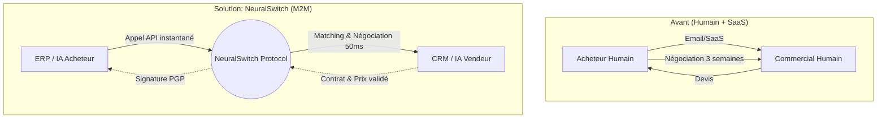
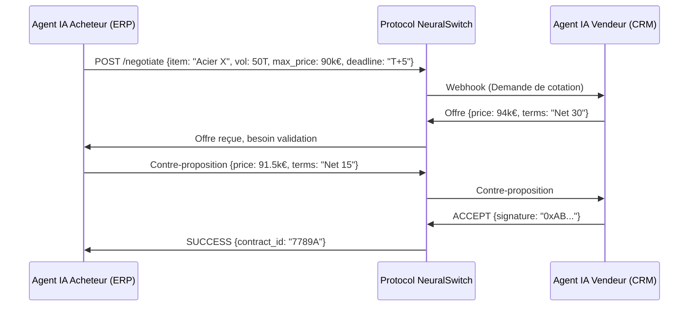

<!-- markdownlint-disable MD013 MD033 MD060 MD036 -->

# NeuralSwitch

> **Résumé exécutif :** Le premier routeur et protocole M2M de négociation et d'approvisionnement B2B où les agents IA des acheteurs négocient directement avec les agents IA des fournisseurs en millisecondes, sans interface humaine.

---

## 1. Aperçu visuel

## 2. La thèse contrariante (Peter Thiel Style)

**La croyance populaire :** L'IA va aider les humains à rédiger de meilleurs emails de négociation et à analyser les contrats B2B plus rapidement via des copilotes intégrés aux ERP.
**La vérité cachée :** L'achat B2B standardisé va devenir 100% Machine-to-Machine. Les interfaces utilisateurs (UI) pour l'approvisionnement sont vouées à disparaître ; l'efficience maximale est atteinte lorsque l'agent IA de l'acheteur négocie directement via API avec l'agent IA du fournisseur sur la base de paramètres mathématiques (prix, volume, délais).

## 3. Le problème & La cible

**Modèle économique :** M2M
**Cible précise :** Les départements Supply Chain et Achats (Procurement) des ETI et grands groupes industriels, et leurs fournisseurs récurrents.
**La douleur urgente :** Le cycle de négociation B2B classique prend des semaines et coûte des milliers d'euros en temps humain pour des commandes récurrentes de matières premières ou de fournitures. Cette friction paralyse la réactivité de la supply chain et gonfle les frais généraux.

## 4. Architecture technique & Plomberie

**Extrait de code**

## 5. Modèle économique & Viabilité financière

| Métrique                    | Valeur                                                                    |
| --------------------------- | ------------------------------------------------------------------------- |
| Structure de prix           | 0,5% de commission par transaction + 0.05€ par appel d'API de négociation |
| Objectif 12 mois            | 20M€ de volume transité via le protocole et 20 000 transactions           |
| Calcul du CA (Target 100k€) | (20M€ × 0,005) = 100 000€ ARR                                             |
| Marge brute estimée         | 92% (Coûts serveurs et API très faibles)                                  |

## 6. Moteur de distribution & Fossé défensif (Moat)

**Stratégie d'acquisition :** Adhésion dev M2M et effet réseau B2B. L'intégration se fait sous forme de SDK dans les ERP existants (SAP, Odoo). Dès qu'un grand donneur d'ordre l'installe, il "force" ses fournisseurs à exposer un endpoint NeuralSwitch pour continuer à recevoir des commandes automatiques.
**Moat (Barrière à l'entrée) :** Le standard d'échange de données. L'IA d'OpenAI ou Google génère du texte, mais ne fournit pas de protocole cryptographique de consensus de transaction B2B. Le Moat réside dans l'effet de réseau : plus il y a d'acheteurs sur le protocole, plus les fournisseurs doivent s'y connecter. C'est le "Visa" des transactions d'IA à IA.

## 7. Grille d'évaluation détaillée

| Critère                               | Score VC (/100) | Score Terrain (/100) |
| :------------------------------------ | :-------------: | :------------------: |
| **Thèse & Monopole / Urgence**        |     -- / 25     |       -- / 25        |
| **Moat / Résistance aux LLM natifs**  |     -- / 25     |       -- / 25        |
| **Scalabilité / Friction d'adoption** |     -- / 25     |       -- / 25        |
| **Unit Economics / ROI direct**       |     -- / 25     |       -- / 25        |
| **TOTAL**                             |  **-- / 100**   |     **-- / 100**     |

Verdict VC : En attente d'évaluation.

Verdict Terrain : En attente d'évaluation.
