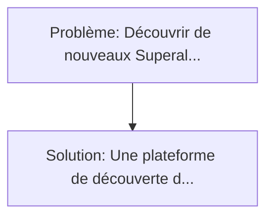
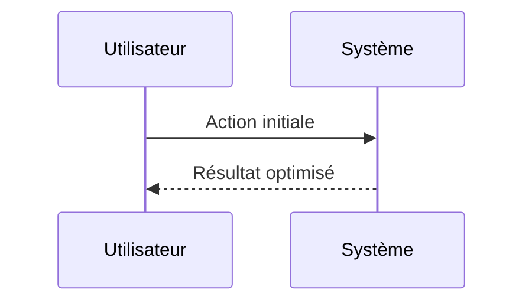

<!-- markdownlint-disable MD013 MD033 -->

[🇬🇧 English Version](./README.md)

# Neuro-symbolic Alloy Forge

> **Résumé exécutif :** Une plateforme de découverte de matériaux combinant l'IA générative (GNN - Graph Neural Networks) avec des solveurs symboliques de thermodynamique (CALPHAD). Découvrir de nouveaux "Superalliages" (High-Entropy Alloys - HEA) capables de résister à la corrosion, aux températures extrêmes (turbines à hydrogène, hypersonique) tout en restant légers prend des décennies de tests empiriques d'essais-erreurs en fonderie.

---

## 1. Aperçu visuel & Effet Wahou

## 2. La thèse contrariante (Peter Thiel Style)

**La croyance populaire :** Les solutions logicielles seules peuvent résoudre ce problème.
**La vérité cachée :** L'IA générative pure (comme AlphaFold) hallucine souvent des métaux impossibles à fabriquer (qui se séparent en plusieurs phases au refroidissement). Il est impératif d'ancrer le réseau de neurones dans les lois fondamentales de la thermodynamique métallurgique symbolique pour garantir la viabilité physique des alliages proposés.

## 3. Le problème & La cible

- **Modèle économique :** B2B
- **Cible précise :** Aéronautique, aérospatial, constructeurs de moteurs (Rolls-Royce, Safran), et métallurgie de pointe.
- **La douleur urgente :** Découvrir de nouveaux "Superalliages" (High-Entropy Alloys - HEA) capables de résister à la corrosion, aux températures extrêmes (turbines à hydrogène, hypersonique) tout en restant légers prend des décennies de tests empiriques d'essais-erreurs en fonderie. L'espace chimique combinatoire des alliages métalliques est infiniment vaste.

## 4. Architecture technique & Plomberie

## 5. Modèle économique & Viabilité financière

| Métrique                    | Valeur             |
| --------------------------- | ------------------ |
| Structure de prix           | Custom Pricing     |
| Objectif 12 mois            | 100 clients        |
| Calcul du CA (Target 100k€) | 100 \* 1000 = 100k |
| Marge brute estimée         | 80%                |

## 6. Moteur de distribution & Fossé défensif (Moat)

- **Stratégie d'acquisition :** Ventes B2B directes
- **Moat (Barrière à l'entrée) :** L'IA générative pure (comme AlphaFold) hallucine souvent des métaux impossibles à fabriquer (qui se séparent en plusieurs phases au refroidissement). Il est impératif d'ancrer le réseau de neurones dans les lois fondamentales de la thermodynamique métallurgique symbolique pour garantir la viabilité physique des alliages proposés.

## 7. Grille d'évaluation détaillée

| Critère                           | Score VC (/100) | Score Terrain (/100) |
| --------------------------------- | --------------- | -------------------- |
| Thèse & Monopole / Urgence        | -- / 25         | -- / 25              |
| Moat / Résistance aux LLM natifs  | -- / 25         | -- / 25              |
| Scalabilité / Friction d'adoption | -- / 25         | -- / 25              |
| Unit Economics / ROI direct       | -- / 25         | -- / 25              |
| **TOTAL**                         | **-- / 100**    | **-- / 100**         |

> **Verdict VC :** En attente d'évaluation.

> **Verdict Terrain :** En attente d'évaluation.
