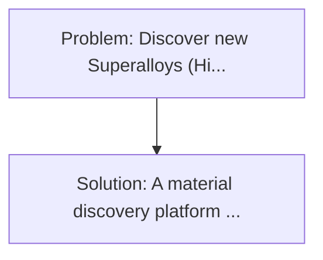
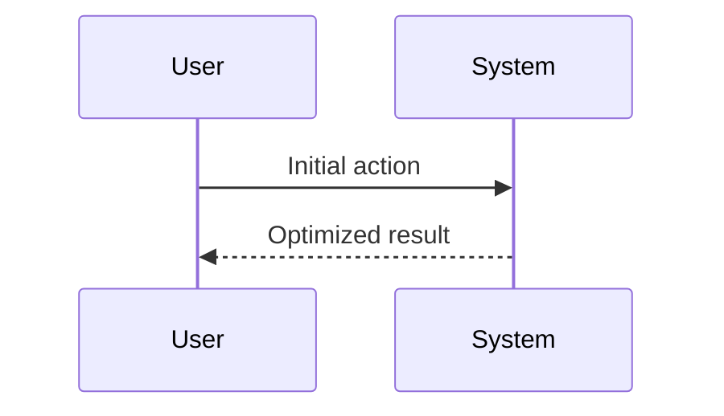

<!-- markdownlint-disable MD013 MD033 -->

[🇫🇷 Version Française](./README.fr.md)

# Neuro-symbolic Alloy Forge

> **Executive Summary:** A material discovery platform combining the GNN (Graph Neural Networks) with symbolic thermodynamic solvers (CALPHAD). Discover new "Superalloys" (High-Entropy Alloys - HEA) capable of resisting corrosion, extreme temperatures (hydrogen turbines, hypersonics) while remaining light takes decades of empirical testing of foundry error tests.

---

## 1. Visual Overview & Wow Effect

## 2. Contrarian Thesis (Peter Thiel Style)

**Popular Belief:** Generic software solutions can solve this.
**Hidden Truth:** Generative pure AI (like AlphaFold) often hallucinate metals that are impossible to manufacture (which split into several phases at cooling). It is imperative to anchor the network of neurons in the fundamental laws of symbolic metallurgical thermodynamics to ensure the physical viability of the proposed alloys.

## 3. Problem & Target Market

- **Business Model:** B2B
- **Target Audience:** Aerospace, aerospace, engine manufacturers (Rolls-Royce, Safran), and advanced metallurgy.
- **Urgent Pain Point:** Discover new "Superalloys" (High-Entropy Alloys - HEA) capable of resisting corrosion, extreme temperatures (hydrogen turbines, hypersonics) while remaining light takes decades of empirical testing of foundry error tests. The combinatory chemical space of metal alloys is infinitely vast.

## 4. Technical Architecture & Infrastructure

## 5. Business Model & Financial Viability

| Metric                 | Value              |
| ---------------------- | ------------------ |
| Pricing Structure      | Custom Pricing     |
| 12-Month Target        | 100 customers      |
| Revenue Formula        | 100 \* 1000 = 100k |
| Estimated Gross Margin | 80%                |

## 6. Distribution Engine & Moat

- **Acquisition Strategy:** Direct B2B Sales
- **Moat (Defensibility):** Generative pure AI (like AlphaFold) often hallucinate metals that are impossible to manufacture (which split into several phases at cooling). It is imperative to anchor the network of neurons in the fundamental laws of symbolic metallurgical thermodynamics to ensure the physical viability of the proposed alloys.

## 7. Detailed Evaluation Grid

| Criterion                   | VC Score (/100) | Market Score (/100) |
| --------------------------- | --------------- | ------------------- |
| Thesis & Monopoly / Urgency | -- / 25         | -- / 25             |
| Moat / LLM Immunity         | -- / 25         | -- / 25             |
| Scalability / UX Friction   | -- / 25         | -- / 25             |
| Unit Economics / ROI        | -- / 25         | -- / 25             |
| **TOTAL**                   | **-- / 100**    | **-- / 100**        |

> **VC Verdict:** Pending evaluation.

> **Market Verdict:** Pending evaluation.
