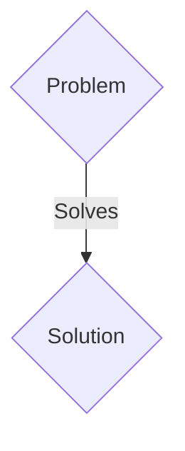
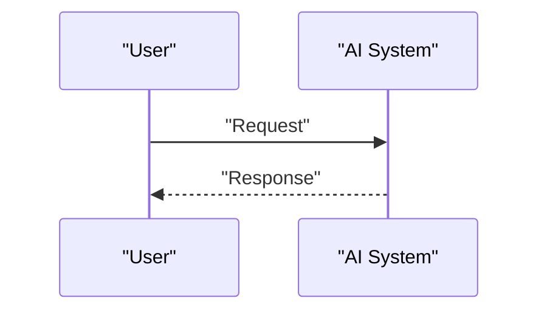

<!-- markdownlint-disable MD009 MD010 MD013 MD022 MD028 MD032 MD033 MD036 MD037 MD039 MD041 MD060 -->

[ 🇫🇷 Version Française ](./README.fr.md)

# SpikingSight Robotics

> **Executive Summary:** A B2B (Sale of hardware/modules + software license) solution targeting Manufacturers of collaborative robots (cobots), autonomous industrial drones, ultra-fast warehouse logistics. to solve: Computer vision systems based on standard (RGB) cameras generate 30 to 60 full frames per second, saturating bandwidth and on-board computing power. For robots evolving very quickly in dynamic environments, this induces fatal latency (motion blur, reaction delays) and drains the batteries due to heavy GPU processing.

---

## 1. Visual Overview & Wow Effect

## 2. Contrarian Thesis (Peter Thiel Style)

- **Popular Belief:** Generic solutions are enough.
- **Hidden Truth:** The integration of event-based vision sensors (Event-based cameras / Neuromorphic sensors) where each pixel is independent and only signals a change in brightness (micros-seconds). Coupled with asynchronous Spiking Neural Networks (SNNs) running on neuromorphic chips (e.g. Akida, Loihi) to process sparse data flow with milliwatt power consumption and near-zero latency.

## 3. Problem & Target Market

- **Business Model:** B2B (Sale of hardware/modules + software license)
- **Target Audience:** Manufacturers of collaborative robots (cobots), autonomous industrial drones, ultra-fast warehouse logistics.
- **Urgent Pain Point:** Computer vision systems based on standard (RGB) cameras generate 30 to 60 full frames per second, saturating bandwidth and on-board computing power. For robots evolving very quickly in dynamic environments, this induces fatal latency (motion blur, reaction delays) and drains the batteries due to heavy GPU processing.

## 4. Technical Architecture & Infrastructure

The integration of event-based vision sensors (Event-based cameras / Neuromorphic sensors) where each pixel is independent and only signals a change in brightness (micros-seconds). Coupled with asynchronous Spiking Neural Networks (SNNs) running on neuromorphic chips (e.g. Akida, Loihi) to process sparse data flow with milliwatt power consumption and near-zero latency.

## 5. Business Model & Financial Viability

| Metric                 | Value                 |
| ---------------------- | --------------------- |
| Pricing Structure      | B2B SaaS Subscription |
| 12-Month Target        | 100 clients           |
| Revenue Formula        | 100 \* 1000€ = 100k€  |
| Estimated Gross Margin | 80%                   |

## 6. Distribution Engine & Moat

- **Acquisition Strategy:** Direct sales and strategic partnerships.
- **Moat (Defensibility):** Current AI frameworks (PyTorch, TensorFlow) are designed for dense and synchronous tensors on GPU. Cloud SaaS adds network latency preventing any reactive control of a robotic arm. Innovation requires a complete overhaul of the software stack (towards event-driven asynchronous) as close as possible to the sensor.

## 7. Detailed Evaluation Grid

| Criterion                   | VC Score (/100) | Market Score (/100) |
| --------------------------- | --------------- | ------------------- |
| Thesis & Monopoly / Urgency | -- / 25         | -- / 25             |
| Moat / LLM Immunity         | -- / 25         | -- / 25             |
| Scalability / UX Friction   | -- / 25         | -- / 25             |
| Unit Economics / ROI        | -- / 25         | -- / 25             |
| TOTAL                       | -- / 100        | -- / 100            |

> **VC Verdict:** Pending evaluation.
> **Market Verdict:** Pending evaluation.
