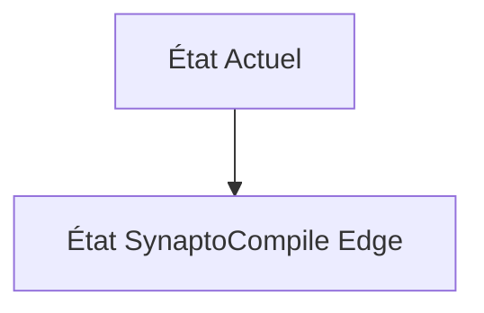
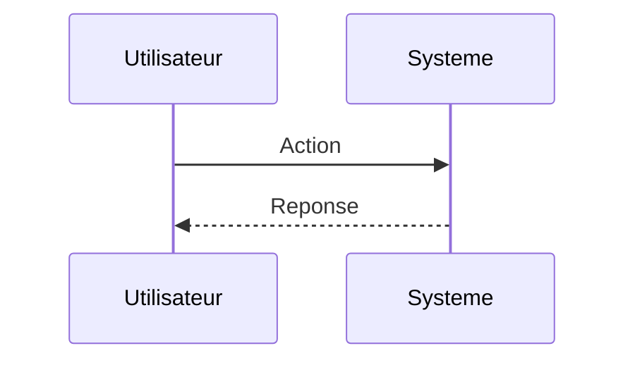

<!-- markdownlint-disable MD009 MD010 MD013 MD022 MD028 MD032 MD033 MD034 MD036 MD037 MD039 MD041 MD060 -->

[ 🇬🇧 English Version ](./README.md)

# SynaptoCompile Edge

> **Résumé exécutif :** Un compilateur logiciel universel qui traduit automatiquement les modèles d'apprentissage profond standard (PyTorch/TensorFlow) en Réseaux de Neurones à Impulsions (Spiking Neural Networks - SNN), optimisés pour s'exécuter sur des puces neuromorphiques à très faible consommation d'énergie fonctionnant par événements (event-based).

---

## 1. Aperçu visuel & Effet Wahou

## 2. La thèse contrariante (Peter Thiel Style)

**La croyance populaire :** Les solutions généralistes IA peuvent résoudre ce problème.

**La vérité cachée :** La compilation vers des SNN est fondamentalement différente du calcul tensoriel dense (GPU/TPU). Elle requiert un routage temporel et asynchrone des "spikes" que les compilateurs ML classiques (TVM, XLA) ne peuvent pas gérer sans perte massive de précision.

## 3. Le problème & La cible

**Modèle économique :** B2B (SaaS / Licensing IP)

**Cible précise :** Concepteurs de puces (Fabless, Intel, BrainChip), fabricants d'appareils IoT autonomes (wearables, capteurs spatiaux).

**La douleur urgente :** L'inférence IA (Computer Vision, Audio) sur des appareils Edge alimentés par batterie (IoT, drones, implants) consomme trop d'énergie. Les réseaux de neurones classiques (CNN/Transformer) sont inadaptés aux contraintes de micro-watts.

## 4. Architecture technique & Plomberie

## 5. Modèle économique & Viabilité financière

| Métrique                    | Valeur                        |
| --------------------------- | ----------------------------- |
| Structure de prix           | Abonnement SaaS               |
| Objectif 12 mois            | 10 clients                    |
| Calcul du CA (Target 100k€) | 10 clients \* 10k€/an = 100k€ |
| Marge brute estimée         | 80%                           |

## 6. Moteur de distribution & Fossé défensif (Moat)

**Stratégie d'acquisition :** Vente directe B2B

**Moat (Barrière à l'entrée) :** Le marché du matériel neuromorphique est encore naissant et très fragmenté. Si des puces classiques (NPU ultra-low power) deviennent suffisamment efficaces, l'avantage compétitif des SNN (et donc du compilateur) pourrait disparaître.

## 7. Grille d'évaluation détaillée

| Critère                           | Score VC (/100) | Score Terrain (/100) |
| --------------------------------- | --------------- | -------------------- |
| Thèse & Monopole / Urgence        | -- / 25         | -- / 25              |
| Moat / Résistance aux LLM natifs  | -- / 25         | -- / 25              |
| Scalabilité / Friction d'adoption | -- / 25         | -- / 25              |
| Unit Economics / ROI direct       | -- / 25         | -- / 25              |
| **TOTAL**                         | **-- / 100**    | **-- / 100**         |

> **Verdict VC :** En attente d'évaluation.

> **Verdict Terrain :** En attente d'évaluation.
