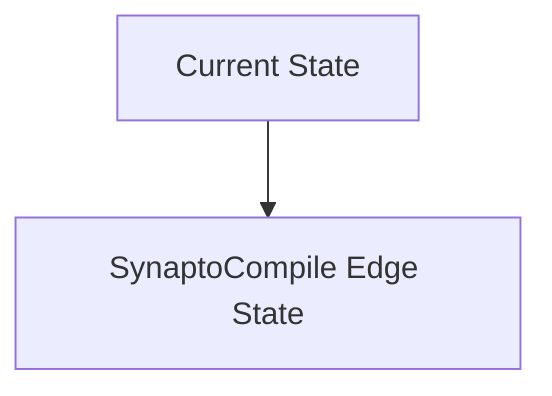
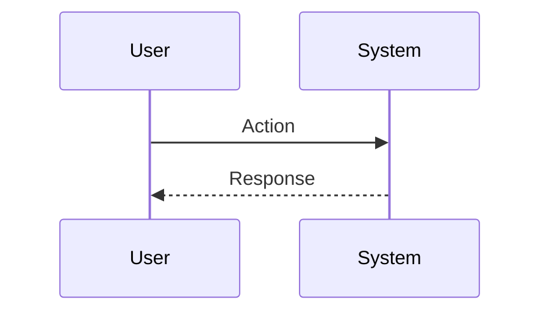

<!-- markdownlint-disable MD009 MD010 MD013 MD022 MD028 MD032 MD033 MD034 MD036 MD037 MD039 MD041 MD060 -->

[ 🇫🇷 Version Française ](./README.fr.md)

# SynaptoCompile Edge

> **Executive Summary:** A universal software compiler that automatically translates standard deep learning models (PyTorch/TensorFlow) into Spiking Neural Networks (SNN), optimized to run on ultra-low power, event-based neuromorphic chips.

---

## 1. Visual Overview & Wow Effect

## 2. Contrarian Thesis (Peter Thiel Style)

**Popular Belief:** General AI solutions can solve this problem.

**Hidden Truth:** Compiling to SNNs is fundamentally different from dense tensor computing (GPU/TPU). It requires temporal and asynchronous routing of spikes that classic ML compilers (TVM, XLA) cannot handle without massive loss of precision.

## 3. Problem & Target Market

**Business Model:** B2B (SaaS / Licensing IP)

**Target Audience:** Chip designers (Fabless, Intel, BrainChip), manufacturers of autonomous IoT devices (wearables, spatial sensors).

**Urgent Pain Point:** AI inference (Computer Vision, Audio) on battery-powered edge devices (IoT, drones, implants) consumes too much power. Classic neural networks (CNN/Transformer) are unsuitable for micro-watt constraints.

## 4. Technical Architecture & Infrastructure

## 5. Business Model & Financial Viability

| Metric                 | Value                           |
| ---------------------- | ------------------------------- |
| Pricing Structure      | SaaS subscription               |
| 12-Month Target        | 10 customers                    |
| Revenue Formula        | 10 clients \* 10k€/year = 100k€ |
| Estimated Gross Margin | 80%                             |

## 6. Distribution Engine & Moat

**Acquisition Strategy:** B2B direct sales

**Moat (Defensibility):** The neuromorphic hardware market is still nascent and very fragmented. If conventional chips (ultra-low power NPUs) become sufficiently efficient, the competitive advantage of SNNs (and therefore of the compiler) could disappear.

## 7. Detailed Evaluation Grid

| Criterion                   | VC Score (/100) | Market Score (/100) |
| --------------------------- | --------------- | ------------------- |
| Thesis & Monopoly / Urgency | -- / 25         | -- / 25             |
| Moat / LLM Immunity         | -- / 25         | -- / 25             |
| Scalability / UX Friction   | -- / 25         | -- / 25             |
| Unit Economics / ROI        | -- / 25         | -- / 25             |
| **TOTAL**                   | **-- / 100**    | **-- / 100**        |

> **VC Verdict:** Pending evaluation.

> **Market Verdict:** Pending evaluation.
